# Unió --> AWS-TERRAFORM-ANSIBLE-KUBERNETES

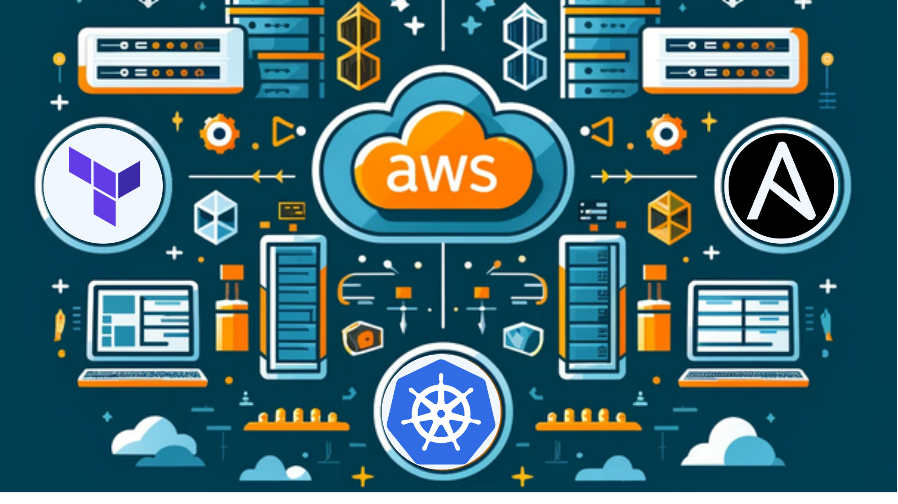

### Introducció
- [Context del Projecte](#context-del-projecte)
- [Descripció del projecte](#descripció-del-projecte)
- [Objectius del Projecte](#objectius-del-projecte)
- [Amazon Web Services (AWS)](#amazon-web-services-aws)
- [Terraform](#terraform)
- [Ansible](#ansible)

### Desenvolupament del Projecte
- [Esquema del Projecte](#esquema-del-projecte)
- [Detall dels Passos de l'Esquema](#detall-dels-passos-de-lesquema)
    - [Clonació de les dependencies necessarias a través del repositori de Terraform](#clonació-de-les-dependencies-necessarias-a-través-del-repositori-de-terraform)
    - [Execució de Comandes Terraform](#execució-de-comandes-terraform)
    - [Creació d'Instàncies AWS](#creació-dinstàncies-aws)
    - [Configuració del Servidor amb Ansible](#configuració-del-servidor-amb-ansible)
    - [Execució de Playbooks d'Ansible](#execució-de-playbooks-dansible)
    - [Desplegament d'Aplicacions i Configuració Addicional](#desplegament-daplicacions-i-configuració-addicional)
- [Fitxers del projecte](#fitxers-del-projecte)
- [Execució de les comandes](#execució-de-les-comandes)
    - [Comprovem que no tenim ninguna instancia creada a AWS](#comprovem-que-no-tenim-ninguna-instancia-creada-a-aws)
    - [Terraform init](#terraform-init)
    - [Terraform plan](#terraform-plan)
    - [Terraform apply](#terraform-apply)
    - [Comprovem que les 3 instancies s'han creat](#comprovem-que-les-3-instancies-shan-creat)
    - [Ens connectem per SSH a les instancies d'AWS](#ens-connectem-per-ssh-a-les-instancies-dAWS)
    - [Comprovem els logs on podem veure que se estan realitzant les instal·lacions](#Comprovem-els-logs-on-podem-veure-que-se-estan-realitzant-les-installacions)
  

# Introducció

## Context del projecte

Aquest projecte final tracta d'integrar i automatitzar la gestió d'infraestructura i desplegament d'aplicacions al núvol (AWS). La combinació de tecnologies com Amazon Web Services (AWS), Terraform, Ansible i Kubernetes ens permet crear una solució eficient, escalable i segura per gestionar aplicacions complexes i els seus entorns d'execució.

 

## Objectius del Projecte

- Automatitzar el desplegament d'infraestructura: Utilitzar Terraform per definir i desplegar la infraestructura necessària a AWS de manera automatitzada i repetible.
- Configuració i gestió d'aplicacions: Utilitzar Ansible per automatitzar la configuració dels servidors i el desplegament de les aplicacions, assegurant una configuració consistent i una gestió eficient.
- Orquestració de contenidors: Utilitzar Kubernetes per gestionar i orquestrar els contenidors d'aplicacions, assegurant l'escalabilitat i la disponibilitat de les aplicacions.

 

## Amazon Web Services (AWS)

[Enllaç a projecte sobre AWS on expliquem detalladament de que trata aquesta tecnòlogia](../6--Cloud/README.md)

 

## Ansible

[Enllaç a projecte sobre Ansible on expliquem detalladament de que trata aquesta tecnòlogia](../6--Cloud/README.md)

 

## Terraform

Terraform és una eina d'infraestructura com a codi infrastructure as a code (IaC) que permet definir i aprovisionar infraestructura a través d'arxius de configuració. Utilitza un llenguatge de configuració declaratiu anomenat HashiCorp Configuration Language (HCL) o JSON. Terraform és capaç de gestionar tant infraestructura local com recursos en múltiples proveïdors de serveis al núvol, com AWS, Azure i Google Cloud Platform.

   

# Desenvolupament del projecte

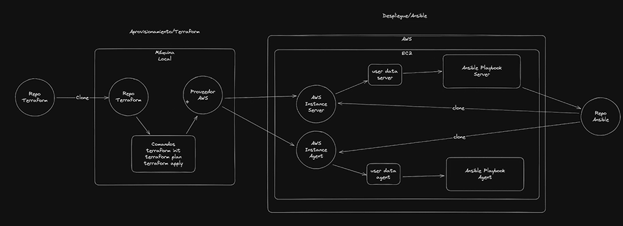

## Esquema del Projecte

L'esquema que hem proporcionat il·lustra com s'integren aquestes tecnologies.

- **Repositori de Terraform** 
    - Conté els arxius de configuració de Terraform per definir la infraestructura.
- **Màquina Local** 
    - On s'executen els comandes de Terraform per planificar i aplicar la infraestructura.
- **Proveïdor AWS** 
    - On es desplega la infraestructura definida per Terraform.
- **Servidor d'Instàncies AWS** 
    - Servidors aprovisionats a AWS on s'executen les aplicacions.
- **Servidor de Playbooks d'Ansible** 
    - Conté els playbooks que defineixen les tasques de configuració i desplegament.
- **Agents d'Ansible i AWS** 
    - Encarregats d'executar els playbooks d'Ansible i manejar les instàncies a AWS.
- **Repositori d'Ansible** 
    - Conté els playbooks i rols necessaris per configurar i desplegar les aplicacions.

  

## Detall dels Passos de l'Esquema

### Clonació de les dependencies necessarias a través del repositori de Terraform

Es clonen les dependencies necessaries a través del repositori de Terraform a la màquina local per obtenir els fitxers de configuració necessaris per definir la infraestructura.

 

### Execució de Comandes Terraform

Des de la màquina local, s'executen les comandes de Terraform per inicialitzar l'entorn (terraform init), planificar els canvis (terraform plan) i aplicar la infraestructura (terraform apply). Això aprovisiona els recursos a AWS.

 

### Creació d'Instàncies AWS
        
Terraform es comunica amb AWS per crear instàncies de servidor i altres recursos definits als fitxers de configuració. Aquestes instàncies són els servidors on es desplegaran les aplicacions.

 

### Configuració del Servidor amb Ansible
        
Es clona el repositori d'Ansible al servidor de playbooks d'Ansible per obtenir els playbooks necessaris per a la configuració dels servidors.

 

### Execució de Playbooks d'Ansible

L'agent d'Ansible a cada instància AWS executa els playbooks d'Ansible per configurar els servidors segons sigui necessari. Això inclou la instal·lació de programari, la configuració de serveis i altres tasques de configuració.

 

### Desplegament d'Aplicacions i Configuració Addicional
        
Les instàncies AWS poden utilitzar dades d'usuari (user data) per realitzar configuracions addicionals o desplegar aplicacions específiques en arrencar. Un agent de dades d'usuari (User Data Agent) aplica aquestes configuracions.

  

## Fitxers del projecte

[id-rsa](./id_rsa) --> Clau privada del client que es conectarà a la màquina.

[id_rsa.pub](./id_rsa.pub) --> Clau pública que copiem a les instancies d'AWS.

[terraform.tfvars](./terraform.tfvars) --> Els valors definits en el fitxer .tfvars són utilitzats per substituir les variables definides en el fitxer principal de Terraform (main.tf). Això permet que les configuracions es puguin personalitzar fàcilment canviant només el fitxer .tfvars sense necessitat de modificar el codi de Terraform.

[userdata_agent.sh](.userdata_agent.sh) i [userdata_server.sh](./config-files/userdata_server.sh) --> Aquests scripts automatitzen la configuració d'una instància EC2 d'AWS per convertir-la en un node agent de RKE (Rancher Kubernetes Engine). Els passos inclouen la instal·lació de Git, Python, Ansible, la clonació d'un repositori de GitHub amb exemples d'Ansible, i l'execució d'un playbook d'Ansible per configurar la instància. 

[main.tf](./main.tf) --> Fitxer principal on s'executen les comandes terraform i es crida als fitxers comentats anteriorment creant tota l'estructura.

  

## Execució de les comandes

### Comprovem que no tenim ninguna instancia creada a AWS

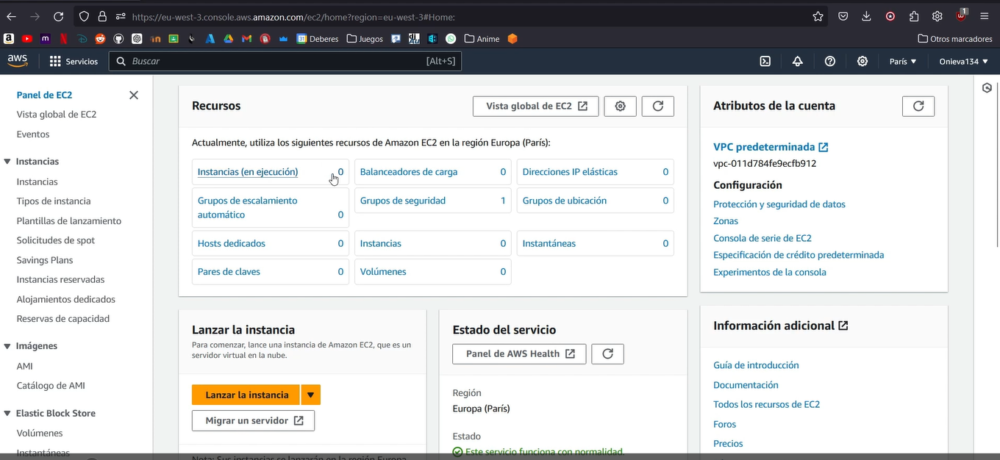

 

### Terraform init 

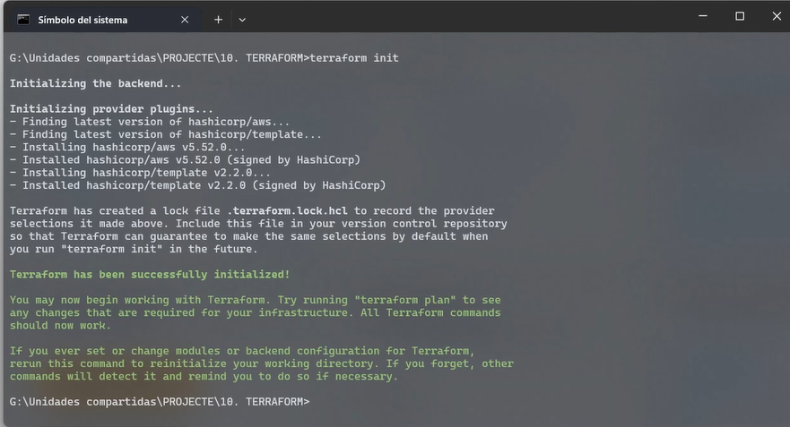

 

### Terraform plan

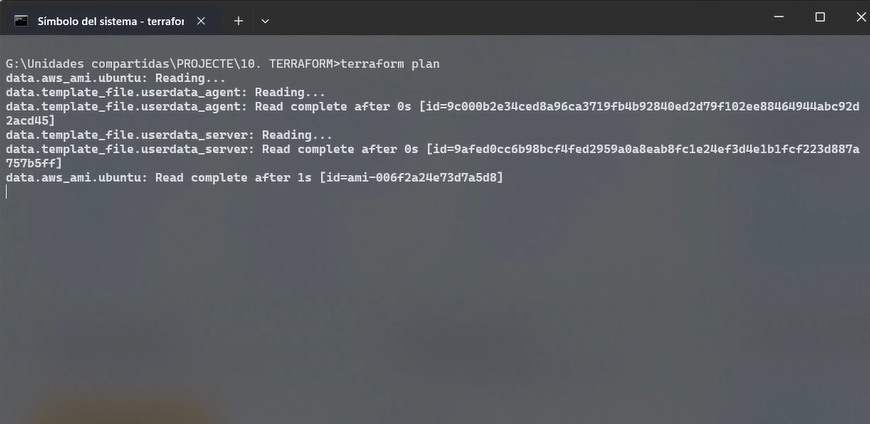

 

### Terraform apply

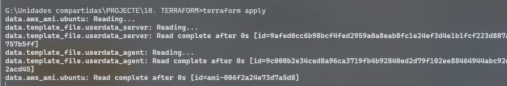
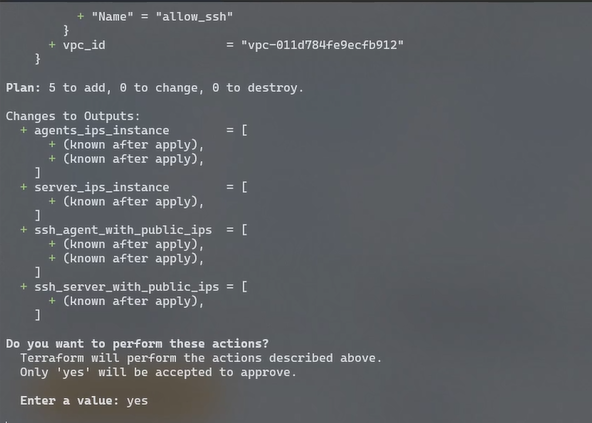
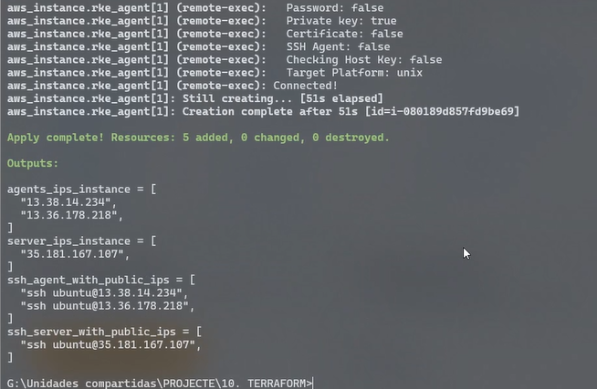

 

### Comprovem que les 3 instancies s'han creat

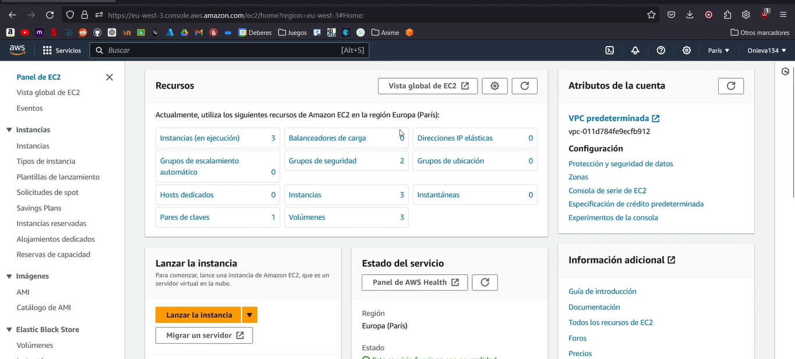

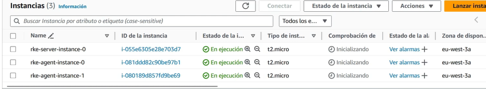

 

### Ens connectem per SSH a les instancies d'AWS

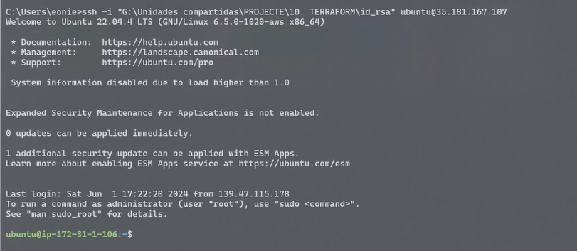

 

### Comprovem els logs on podem veure que se estan realitzant les instal·lacions

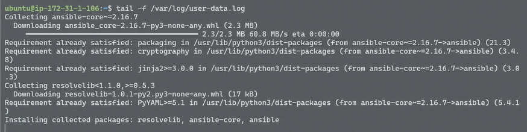
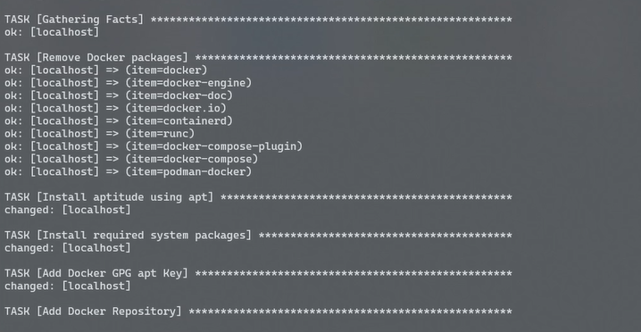

A la penúltima tasca es queda pensant i no hem conseguit avançar.
