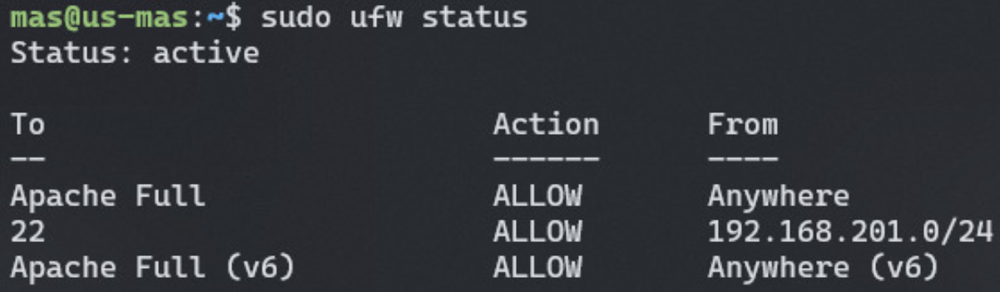

# Instal·lació i configuració pila LAMP

## Linux

- Ubuntu Server (versió 22.04 LTS)

## Apache

### Instal·lació

```bash
sudo apt update
sudo apt upgrade
sudo apt install apache2
```

### Ufw status



### Script de configuració sencer: 

```apache
<VirtualHost *:80>
	ServerName maspr.sapalomera.cat

	RewriteEngine On
	RewriteCond %{HTTPS} !=on
	RewriteRule ^ https://%{HTTP_HOST}%{REQUEST_URI} [R=301]
</VirtualHost>

<VirtualHost *:443>
    ServerName maspr.sapalomera.cat
    ServerAlias mas.cat

    DocumentRoot /var/www/mas
    DirectoryIndex login.php

    SSLEngine On
    SSLCertificateFile /etc/ssl/certs/maspr.sapalomera.cat.crt
    SSLCertificateKeyFile /etc/ssl/private/maspr.sapalomera.cat.key

    Alias /acord /var/www/mas/acord.html
    Alias /conserge/dadesCorrectes /var/www/mas/conserge/dadesCorrectesConserge.html
    Alias /profe/dadesCorrectes /var/www/mas/profe/dadesCorrectesProfe.html
    Alias /errorCodi /var/www/mas/errors/errorCodi.html
    Alias /errorDades /var/www/mas/errors/errorDadesProfe.html
    Alias /errorRepetit /var/www/mas/errors/errorProfeRepetit.html
    Alias /errorRegistrat /var/www/mas/errors/errorProfeRegistrat.html

    <Directory /var/www/mas/conserge>
	    DirectoryIndex crearProfe.html
    </Directory>

    <Directory /var/www/mas/admin>
        DirectoryIndex admin.php
    </Directory>

    <Directory /var/www/mas/profe>
    	DirectoryIndex codiValidacio.html
    </Directory>

    ErrorDocument 404 /errors/404.html

    ErrorLog /var/log/apache2/mas-error.log
    CustomLog /var/log/apache2/mas-access.log "combined"
    LogLevel emerg
</VirtualHost>

```

<p>Aquest script de configuració d'Apache fa diverses coses per gestionar el lloc web maspr.sapalomera.cat. A continuació explicarem detalladament l'script sencer.</p>

### *Bloc 1:*

```apache
<VirtualHost *:80>
    ServerName maspr.sapalomera.cat

    RewriteEngine On
    RewriteCond %{HTTPS} !=on
    RewriteRule ^ https://%{HTTP_HOST}%{REQUEST_URI} [R=301]
</VirtualHost>
```

- ServerName maspr.sapalomera.cat: Especifica el nom del servidor per a aquest host virtual.
- RewriteEngine On: Activa el motor de reescriptura de URL.
- RewriteCond %{HTTPS} !=on: Comprova si la connexió no és HTTPS.
- RewriteRule ^ https://%{HTTP_HOST}%{REQUEST_URI} [R=301]: Redirigeix totes les peticions HTTP a HTTPS. Això assegura que tot el trànsit sigui xifrat.

<br>

### *Bloc 2:*

```apache
<VirtualHost *:443>
    ServerName maspr.sapalomera.cat
    ServerAlias mas.cat

    DocumentRoot /var/www/mas
    DirectoryIndex login.php

    SSLEngine On
    SSLCertificateFile /etc/ssl/certs/maspr.sapalomera.cat.crt
    SSLCertificateKeyFile /etc/ssl/private/maspr.sapalomera.cat.key

    Alias /acord /var/www/mas/acord.html
    Alias /conserge/dadesCorrectes /var/www/mas/conserge/dadesCorrectesConserge.html
    Alias /profe/dadesCorrectes /var/www/mas/profe/dadesCorrectesProfe.html
    Alias /errorCodi /var/www/mas/errors/errorCodi.html
    Alias /errorDades /var/www/mas/errors/errorDadesProfe.html
    Alias /errorRepetit /var/www/mas/errors/errorProfeRepetit.html
    Alias /errorRegistrat /var/www/mas/errors/errorProfeRegistrat.html

    <Directory /var/www/mas/conserge>
        DirectoryIndex crearProfe.html
    </Directory>

    <Directory /var/www/mas/admin>
        DirectoryIndex admin.php
    </Directory>

    <Directory /var/www/mas/profe>
        DirectoryIndex codiValidacio.html
    </Directory>

    ErrorDocument 404 /errors/404.html

    ErrorLog /var/log/apache2/mas-error.log
    CustomLog /var/log/apache2/mas-access.log "combined"
    LogLevel emerg
</VirtualHost>
```

- **ServerName maspr.sapalomera.cat:** Especifica el nom del servidor per a aquest host virtual.
- **ServerAlias mas.cat:** Especifica un àlies addicional per a aquest host virtual.
- **DocumentRoot /var/www/mas:** Defineix el directori arrel del document per a aquest host virtual.
- **DirectoryIndex login.php:** Especifica el fitxer per defecte a carregar quan es visita el directori arrel.
- **SSLEngine On:** Activa el xifrat SSL per a aquest host virtual.
- **SSLCertificateFile /etc/ssl/certs/maspr.sapalomera.cat.crt:** Especifica el fitxer del certificat SSL.
- **SSLCertificateKeyFile /etc/ssl/private/maspr.sapalomera.cat.key:** Especifica el fitxer de la clau privada del certificat SSL.

**Alias**

- **Alias /acord /var/www/mas/acord.html:** Defineix un àlies perquè /acord serveixi el fitxer /var/www/mas/acord.html.
- **Alias /conserge/dadesCorrectes /var/www/mas/conserge/dadesCorrectesConserge.html:** Defineix un àlies per servir el fitxer de confirmació del conserge.
- **Alias /profe/dadesCorrectes /var/www/mas/profe/dadesCorrectesProfe.html:** Defineix un àlies per servir el fitxer de confirmació del professor.
- **Alias /errorCodi /var/www/mas/errors/errorCodi.html:** Defineix un àlies per servir el fitxer d'error de codi.
- **Alias /errorDades /var/www/mas/errors/errorDadesProfe.html:** Defineix un àlies per servir el fitxer d'error de dades del professor.
- **Alias /errorRepetit /var/www/mas/errors/errorProfeRepetit.html:** Defineix un àlies per servir el fitxer d'error de professor repetit.
- **Alias /errorRegistrat /var/www/mas/errors/errorProfeRegistrat.html:** Defineix un àlies per servir el fitxer d'error de professor registrat.

**Directory**

- **`<Directory /var/www/mas/conserge> DirectoryIndex crearProfe.html </Directory>`:** Defineix el fitxer per defecte a carregar en el directori `/var/www/mas/conserge`.
- **`<Directory /var/www/mas/admin> DirectoryIndex admin.php </Directory>`:** Defineix el fitxer per defecte a carregar en el directori `/var/www/mas/admin`.
- **`<Directory /var/www/mas/profe> DirectoryIndex codiValidacio.html </Directory>`:** Defineix el fitxer per defecte a carregar en el directori `/var/www/mas/profe`.


**Gestió d'Errors i Registres**

- **ErrorDocument 404 /errors/404.html:** Defineix la pàgina personalitzada a mostrar per a errors 404 (no trobat).
- **ErrorLog /var/log/apache2/mas-error.log:** Especifica el fitxer de registre d'errors.
- **CustomLog /var/log/apache2/mas-access.log "combined":** Especifica el fitxer de registre d'accessos amb el format combinat.
- **LogLevel emerg:** Defineix el nivell de registre per als missatges d'error.

<br>

## MySql

### Instl·lació 

```bash
sudo apt install mysql-server
sudo mysql_secure_installation
```
### Configuració

```bash
sudo mysql
```

```sql
CREATE DATABASE 'database';

CREATE USER user@% IDENTIFIED BY '<your-password>';

GRANT SELECT,INSERT,UPDATE,DELETE,CREATE,DROP,ALTER
    -> ON 'database'.*
    -> TO user@%;

FLUSH PRIVILEGES;
```

```bash
exit
```

## PHP

### Instal·lació

```bash
sudo apt install php libapache2-mod-php php-mysql
```

