# Projecte ASIX WEBS 1

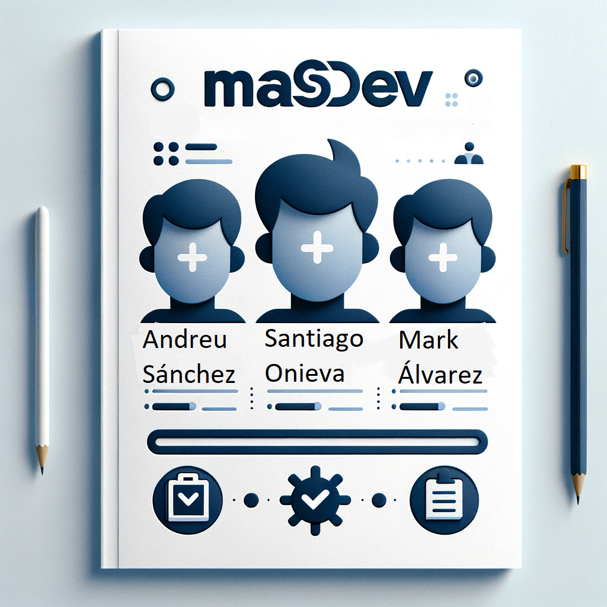

### Introducció
- [Context del Projecte](#context-del-projecte)
- [Descripció del projecte](#descripció-del-projecte)
- [Objectius del Projecte](#objectius-del-projecte)
- [Què és el nostre projecte?](#què-és-el-nostre-projecte)
- [Tecnologies Usades](#tecnologies-usades)
- [Avantatges i Desavantatges](#avantatges-i-desavantatges)

### Desenvolupament del Projecte
  - [Instal·lació i Configuració](#installació-i-configuració)
  - [Configuració de la connexió a la base de dades.](#configuració-de-la-connexió-a-la-base-de-dades)
  - [Estructura de Continguts i Dades](#estructura-de-continguts-i-dades)
    - [Procés d'Inserció d'un Professor per part del Conserge](#procés-dinserció-dun-professor-per-part-del-conserge)
    - [Procés d'Alta d'un Professor](#procés-dalta-dun-professor)
  - [Error 404](#error-404)
    
### Conclusions
- [Resultats Obtinguts](#resultats-obtinguts)
- [Potencials Millores Futures](#potencials-millores-futures)
- [Conclusió final](#conclusió-final)

### Fitxa Tècnica
- [Fitxa Tècnica](#fitxa-tècnica-1)

   

# Introducció

## Context del Projecte

Un centre educatiu ha contractat els serveis de la nostra empresa, MASDEV, per desenvolupar una solució digital que millori la gestió dels professors. Aquesta solució té com a objectiu optimitzar els processos de registre, validació i gestió de les dades personals dels professors. El centre educatiu busca una eina eficient, segura i fàcil d'utilitzar per facilitar aquestes tasques administratives, permetent als conserges gestionar de manera efectiva els professors i garantint la seguretat de la informació.

## Descripció del projecte

El projecte consisteix en una aplicació web que permet al conserge loguejar-se , introduir professors, enviar correus electrònics de validació als professors automàticament, i gestionar les dades personals dels professors de manera segura i eficient.

## Objectius del Projecte

- Facilitar la gestió dels professors per part del conserge.
- Automatitzar el procés de registre i validació dels professors.
- Assegurar la seguretat i privacitat de les dades personals dels professors.
- Millorar l'eficiència administrativa del centre educatiu.

## Què és el nostre projecte?

És una aplicació web dissenyada per gestionar el registre i la validació dels professors, així com per recopilar i emmagatzemar les seves dades personals de manera segura.

## Tecnologies Usades

En aquest projecte hem utilitzat les següents tecnologies:

- **HTML** --> Per a la creació de les pàgines web. HTML (HyperText Markup Language) és el llenguatge estàndard utilitzat per estructurar el contingut d'una pàgina web.
- **CSS** --> Per al disseny i estilització de les pàgines web. CSS (Cascading Style Sheets) s'utilitza per definir l'estil i el disseny de les pàgines HTML.
- **PHP** --> Per al desenvolupament del backend de l'aplicació. PHP és un llenguatge de programació del servidor que permet crear pàgines web dinàmiques i interactives.
- **JavaScript (JS)** --> Per a la interactivitat i funcionalitat del client. JavaScript és un llenguatge de programació del costat del client que permet crear elements interactius dins d'una pàgina web.
- **SQL** --> Per a la gestió de la base de dades. SQL (Structured Query Language) s'utilitza per gestionar i manipular bases de dades.
- **Pila LAMP amb Apache** --> La infraestructura del servidor està basada en la pila LAMP, que inclou:

    - **Linux** --> És el sistema operatiu de base sobre el qual s'executa la resta de la pila LAMP. Linux és conegut per la seva estabilitat i seguretat.
    - **Apache** --> És el servidor web que serveix les pàgines web als usuaris. Apache és un dels servidors web més utilitzats al món i és conegut per la seva fiabilitat i flexibilitat.
    - **MySQL** --> És el sistema de gestió de bases de dades que utilitzem per emmagatzemar les dades dels professors. MySQL és un sistema de bases de dades relacional molt popular per la seva eficiència i robustesa.
    - **PHP** --> És el llenguatge de programació del servidor que hem utilitzat per crear la lògica de la nostra aplicació web.

## Avantatges i Desavantatges

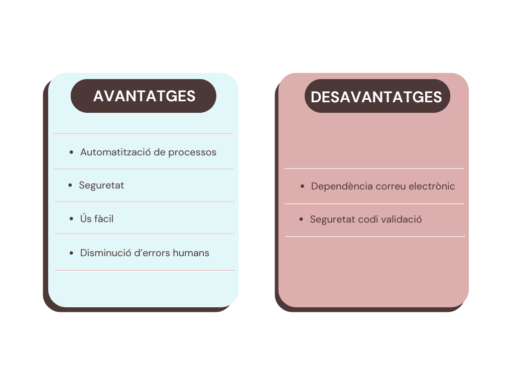  

# Desenvolupament del Projecte

## Instal·lació i Configuració

La nostre aplicació està instal·lada en un Ubuntu Server (versió 22.04 LTS) utilitzant la pila LAMP (Linux, Apache, MySQL, PHP). Al següent enllaç es detalla el procés d'instal·lació:
 

[Procés d'instal·lació](./LAMP.md)

## Configuració de la connexió a la base de dades.

Establir una connexió gestionada a una base de dades MySQL utilitzant PDO (PHP Data Objects), una extensió de PHP.

PDO és una eina poderosa per a la gestió de bases de dades en PHP. Proporciona una interfície consistent, segura i flexible per treballar amb múltiples bases de dades, millorant la seguretat i la portabilitat del codi.

A continuació deixo un enllaç al php: 

[connexio.php](./mas-files/comu/connexio.php)

## Estructura de Continguts i Dades

### Procés d'Inserció d'un Professor per part del Conserge

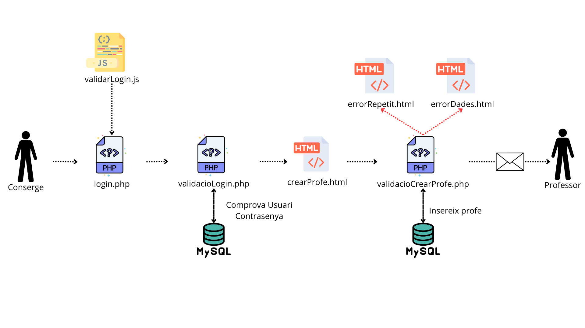

 

Aquest diagrama il·lustra el procés complet d'inserció d'un professor al sistema per part del conserge, des del moment en què el conserge inicia sessió fins que el professor rep una notificació per correu electrònic. A continuació, es descriu detalladament cada pas del procés:

En aquesta primera part de l'aplicació, els usuaris tenen la possibilitat d'iniciar sessió amb credencials específiques que determinen el seu rol. Es pot iniciar sessió com a Administrador o com a Conserge, cadascun amb funcions i responsabilitats distintes.

 

- **Login.php:** L'administrador accedeix a la pàgina de login (login.php) on introdueix el seu nom d'usuari i contrasenya. Aquest formulari de login està validat per un script de JavaScript **(validarLogin.js)** que assegura que els camps requerits estan correctament emplenats abans de permetre l'enviament del formulari. El formulari està enllaçat amb un altre PHP anomenat **(validaciLogin.php)** on es comproven les dades introduïdes pel conserge.

- **Login.php:** El conserge accedeix a la pàgina de login (login.php) on introdueix el seu nom d'usuari i contrasenya. Aquest formulari de login està validat per un script de JavaScript **(validarLogin.js)** que assegura que els camps requerits estan correctament emplenats abans de permetre l'enviament del formulari. El formulari està enllaçat amb un altre PHP anomenat **(validaciLogin.php)** on es comproven les dades introduides per el conserge. 

    - Enllaç on s'explica detalladament aquest fitxer: [login.php](./mas-files/login.php)
    - Imatge de login.php

    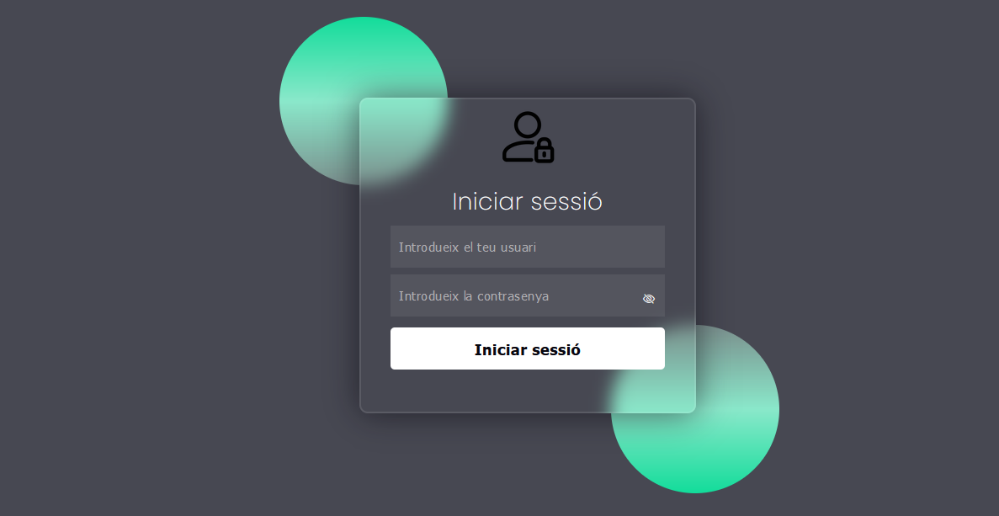

 

- **admin.php:** Dins l'administrador podrà veure els professors inserits i les seves dades en una pàgina per tenir-ho d'una forma visual i fàcil d'entendre.

    - Enllaç on s'explica detalladament aquest fitxer: [admin.php](./mas-files/admin/admin.php)
    - Imatge de admin.php

    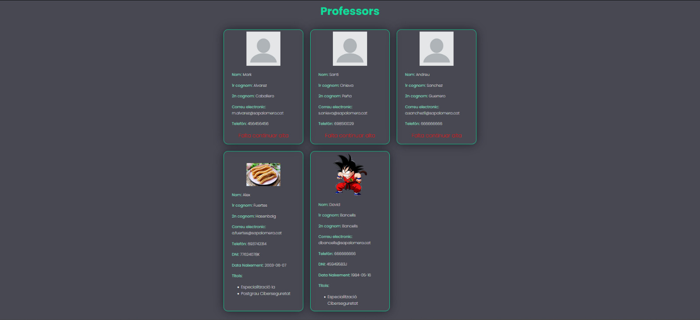

 

- **validacioLogin.js:** Aquest script JavaScript s'encarrega de validar el formulari d'inici de sessió abans que s'enviï al servidor. Comprova que els camps d'usuari i contrasenya no estiguin buits i que l'usuari tingui un format de correu electrònic vàlid. Si es troben errors, es mostren missatges d'error a l'usuari i s'evita l'enviament del formulari fins que tots els camps siguin vàlids.

    - Enllaç on s'explica detalladament aquest fitxer: [validacioLogin.js](./mas-files/validarLogin.js)

 

- **validacioLogin.php:** Quan el conserge envia el formulari, després de pasar per **(validacioLogin.js)** les dades són enviades al servidor a través del fitxer validacioLogin.php. Aquest script PHP comprova les credencials del conserge a la base de dades MySQL per verificar si són correctes. Si les credencials són vàlides, el conserge és redirigit a la pàgina de creació de professors **(crearProfe.html)**. Si hi ha algun error, es mostra un missatge d'error adequat.
    
    - Enllaç on s'explica detalladament aquest fitxer: [validacioLogin.php](./mas-files/validacioLogin.php)

 

- **crearProfe.html:** Un cop autenticat, el conserge accedeix a la pàgina de creació de professors. Aquesta pàgina conté un formulari on el conserge pot introduir les dades del nou professor, com ara el nom, l'email i altres dades pertinents.
    
    - Enllaç on s'explica detalladament aquest fitxer: [crearProfe.html](./mas-files/conserge/crearProfe.html)
    - Imatge de crearProfe.html

    

 

- **validacioCrearProfe.php:** Quan el conserge envia el formulari de creació de professors, les dades són processades per l'script validacioCrearProfe.php. Aquest script valida les dades introduïdes i comprova si ja existeix un professor amb les mateixes dades a la base de dades. Quan les dades introduïdes son valides, insereix aquestes dades a la base de dades, i envia un correu electrònic amb el codi de validació al nou professor.

    - Enllaç a validacióCrearProfe.php: [validacióCrearProfe.php](./mas-files/conserge/validacioCrearProfe.php)

    - Comprovació de Duplicats: Si el professor ja existeix, es redirigeix al conserge a la pàgina errorProfeRepetit.html, que informa de l'error de duplicat.

        - Enllaç a errorProfeRepetit.html: [errorProfeRepetit.html](./mas-files/errors/errorProfeRepetit.html)
        - Imatge de errorProfeRepetit.html

        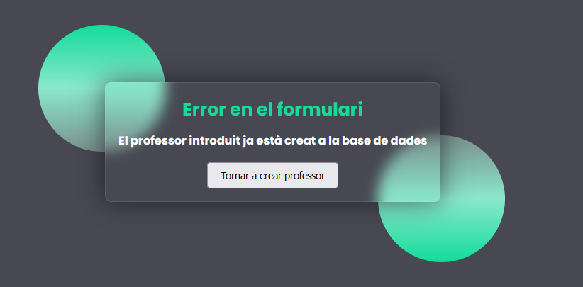
    
    - Validació de Dades: Si les dades introduïdes no són vàlides, es redirigeix al conserge a la pàgina errorDadesProfe.html, que especifica els errors en les dades introduïdes.
        
        - Enllaç a errorDadesProfe.html: [errorDadesProfe.html](./mas-files/errors/errorDadesProfe.html)
        - Imatge de errorDadesProfe.html

        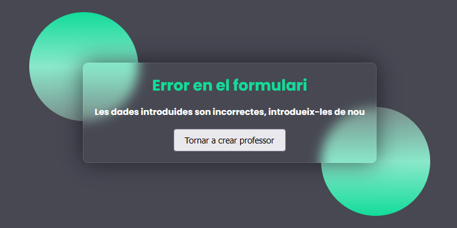

    - En cas de que no hi hagin els errors anomenats, es mostre un missatge conforme s'han introduit correctament les dades amb el fitxer --> dadesCorrectesConserge.html.

        - Enllaç a dadesCorrectesConserge.html: [dadesCorrectesConserge.html](./mas-files/conserge/dadesCorrectesConserge.html)
        - Imatge de dadesCorrectesConserge.html:

        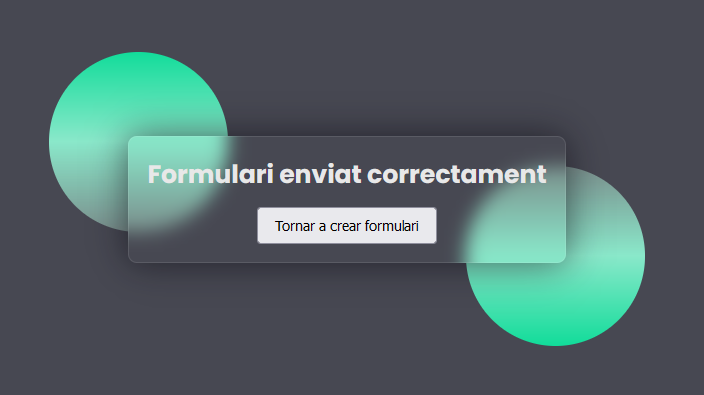

 

Aquest procés garanteix que només els usuaris autoritzats puguin accedir al sistema i crear nous comptes de professor, assegurant la integritat i seguretat de les dades. A més, el sistema de validació i notificació per correu electrònic assegura que els professors completen correctament el seu registre.

  

### Procés d'Alta d'un Professor

Aquest diagrama il·lustra el procés complet que un professor ha de seguir per donar-se d'alta al sistema, des del moment en què rep el codi de validació fins que les seves dades són verificades i registrades correctament.

 

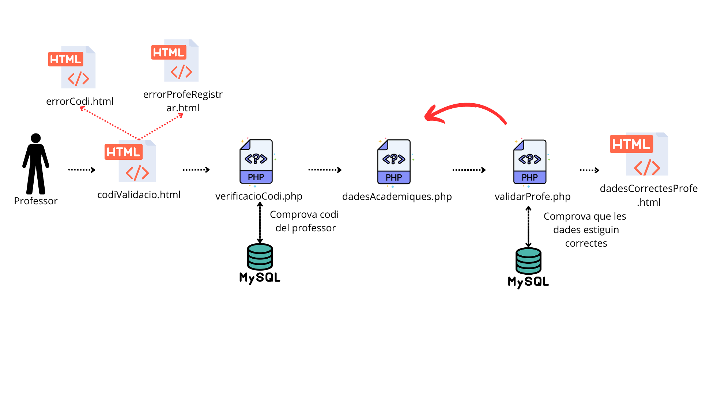

 

- **codiValidacio.html:** El professor accedeix a la pàgina codiValidacio.html, on introdueix el codi de validació que ha rebut per correu electrònic amb l'enllaç incluit per accedir **(codiValidacio.html)**.

    - Enllaç a codiValidacio.html: [codiValidacio.html](./mas-files/profe/codiValidacio.html)

    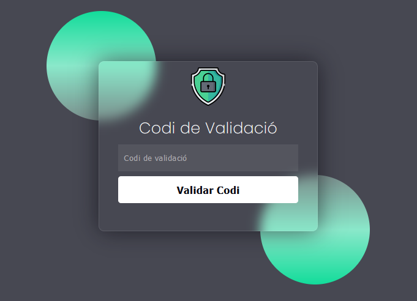

 

- **verificacioCodi.php:** Quan el professor envia el codi de validació, les dades són enviades al servidor a través de **(verificacioCodi.php)**. Aquest script PHP comprova el codi de validació a la base de dades MySQL per verificar si és correcte.

    - Enllaç a verificacioCodi.php: [verificacioCodi.php](./mas-files/profe/verifiacioCodi.php)

    - Codi Incorrecte: Si el codi de validació no és correcte, el professor és redirigit a la pàgina **(errorCodi.html)**, que informa de l'error.
        
        - Enllaç a errorCodi.html: [errorCodi.html](./mas-files/errors/errorCodi.html)
        - Imatge de errorCodi.html: 

        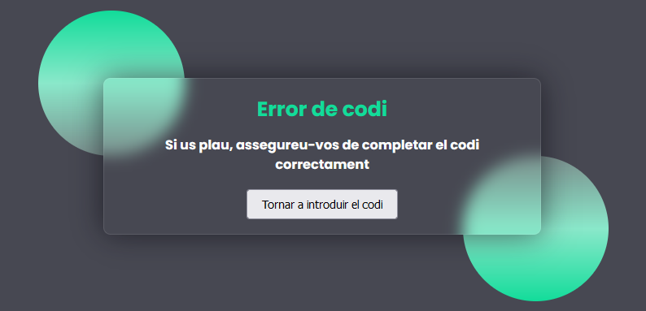

    - Professor Ja Registrat: Si el professor ja està registrat, és redirigit a **(errorProfeRepetit.html)**, indicant que el professor ja ha completat el procés de registre.

        - Enllaç a errorProfeRepetit.html: [errorProfeRepetit.html](./mas-files/errors/errorProfeRepetit.html)
        - Imatge errorProfeRepetit.html:

        

 

- **dadesAcademiques.php:** Aquest codi PHP i HTML combinat és part d'una pàgina web que permet als professors introduir les seves dades personals, de contacte i acadèmiques després d'haver validat el seu codi de validació. 

    - Enllaç a dadesAcademiques.php: [dadesAcademiques.php](./mas-files/profe/dadesAcademiques.php)
    - Imatge de dadesAcademiques.php (té scroll): 
    
    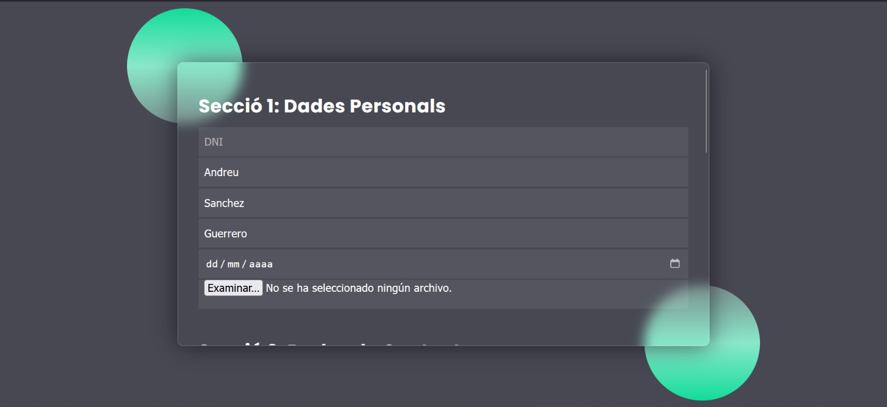 

 

- **validarProfe.php:** Quan el professor envia el formulari de dades acadèmiques, les dades són processades per l'script validarProfe.php. Aquest script valida les dades introduïdes per assegurar que siguin correctes i completes.

    - Enllaç a validarProfe.php: [validarProfe.php](./mas-files/profe/validarProfe.php)

    - Dades Incorrectes: Si les dades introduïdes no són vàlides, es redirigeix el professor a una pàgina d'error específica. Aquest pas no es mostra explícitament al diagrama, però és un comportament esperat en una aplicació ben dissenyada.
    
    - Dades Correctes: Si les dades són correctes, validarProfe.php insereix les dades del professor a la base de dades MySQL.

    - **dadesCorrectesProfe.html:** Un cop les dades acadèmiques són validades i registrades correctament a la base de dades, el professor és redirigit a la pàgina **(dadesCorrectesProfe.html)**. Aquesta pàgina confirma que el procés de registre s'ha completat correctament.

        - Enllaç a dadesCorrectesProfe.html: [dadesCorrectesProfe.html](./mas-files/profe/dadesCorrectesProfe.html)
        - Imatge de dadesCorrectesProfe.html:

        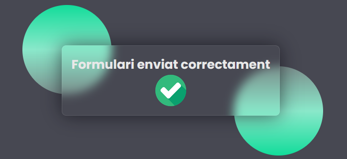 

 

## Error 404

No ens vam matar molt y vam agafar un template per fer l'error 404 i el vam adaptar al nostre estil.

- Enllaç al codi: [Error 404](./mas-files/errors/404.html)
- Imatge del error 404:

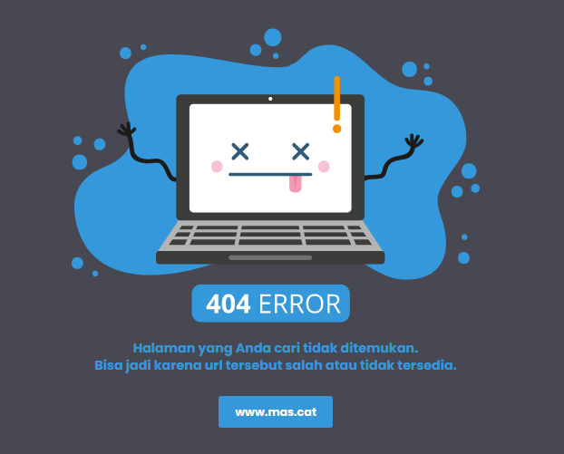

 

## Conclusions

### Resultats Obtinguts

El projecte desenvolupat per MASDEV per al centre educatiu ha demostrat ser una solució eficaç i segura per a la gestió dels professors. L'aplicació web implementada ha permès automatitzar processos que abans es feien manualment, augmentant l'eficiència administrativa i reduint significativament els errors humans.

El procés de registre i validació dels professos, que inclou el login del conserge, la creació de comptes per als professors, i la validació de les dades personals, s'ha optimitzat gràcies a l'ús de tecnologies modernes com PHP, JavaScript, HTML, CSS i una base de dades MySQL. A més, l'ús de la pila LAMP amb Apache ha garantit una infraestructura robusta i fiable.

### Potencials Millores Futures

- **Integració amb altres sistemes educatius**: Connectar l'aplicació amb altres sistemes utilitzats pel centre educatiu per facilitar encara més la gestió de dades.
- **Funcionalitats addicionals**: Implementar noves funcionalitats, com ara notificacions automàtiques per als professors i informes detallats per als administradors.

### Conclusió final

El projecte ha complert amb èxit els objectius plantejats, proporcionant una eina sòlida, segura i eficient per a la gestió dels professors al centre educatiu. La feina feta per MASDEV ha estat clau per aconseguir una solució adaptada a les necessitats específiques del client, demostrant el valor de l'experiència d'usuari i el compromís en el desenvolupament de solucions digitals personalitzades.

 

# Fitxa Tècnica

| **Component**                   | **Detalls**                                                                                                            |
| ------------------------------- | ---------------------------------------------------------------------------------------------------------------------- |
| **Nom del Projecte**            | Gestió de Professors per al Centre Educatiu                                                                            |
| **Empresa**                     | MASDEV                                                                                                                 |
| **Frontend**                    | HTML5, CSS3, JavaScript                                                                                                |
| **Backend**                     | PHP 8.2                                                                                                                |
| **Base de Dades**               | MySQL 8.0                                                                                                              |
| **Servidor Web**                | Apache 2.4                                                                                                             |
| **Sistema Operatiu**            | Ubuntu Server 22.04 LTS                                                                                                |
| **Libreries i Ext.**            | PHPMailer per a l'enviament de correus electrònics, PDO per a la gestió de la base de dades                            |
| **Linux**                       | Sistema operatiu base                                                                                                  |
| **Apache**                      | Servidor web per servir les pàgines i gestionar les peticions                                                          |
| **MySQL**                       | Base de dades relacional per emmagatzemar les dades dels professors                                                    |
| **PHP**                         | Llenguatge de programació del servidor per implementar la lògica de l'aplicació                                        |
| **Validació i Sanitització**    | Controls d'errors en el frontend i backend per assegurar la integritat de les dades                                    |
| **Autenticació i Autorització** | Mecanismes d'autenticació robustos per garantir que només els usuaris autoritzats puguin accedir i modificar les dades |
