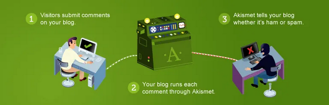

  

# Index

### Introducció
- [Context del Projecte](#context-del-projecte)
- [Descripció del projecte](#descripció-del-projecte)
- [Objectius del Projecte](#objectius-del-projecte)
- [Què és WordPress?](#què-és-wordpress)
- [Característiques Principals de WordPress](#característiques-principals-de-wordpress)
- [Avantatges i Desavantatges de WordPress](#avantatges-i-desavantatges-de-wordpress)

### Desenvolupament del Projecte.
- [Instal·lació](#installació)
- [Menú de navegació](#menú-de-navegació)
- [Gestió d'usuaris](#gestió-dusuaris)
- [Categories i Subcategories](#categories-i-subcategories)
- [Creació d'Articles i Pàgines](#creació-darticles-i-pàgines)
- [Selecció i Configuració de la Plantilla](#selecció-i-configuració-de-la-plantilla)
- [Instal·lació i Configuració de Plugins](#installació-i-configuració-de-plugins)
  - [Plugins per a Funcionalitats del Portal](#plugins-per-a-funcionalitats-del-portal)
  - [Plugins per a Gestió del CMS](#plugins-per-a-gestió-del-cms)
- [Multilingüisme al CMS](#multilingüisme-al-cms)

### Conclusions
- [Resultats Obtinguts](#resultats-obtinguts)
- [Problemes trobats i solucions](#problemes-trobats-i-solucions)
- [Potencials Millores Futures](#potencials-millores-futures)
- [Conclusió final](#conclusió-final)

  

# INTRODUCCIÓ

## Context del projecte

Aquest projecte es desenvolupa en el marc d'una col·laboració interna entre dos departaments clau de la nostra organització:

- El departament de Desenvolupament (MASDEV).
- El departament de maquinari i infraestructures (MASTECH). 

L'objectiu principal és crear una botiga online utilitzant WordPress, que permeti a MASTECH vendre els seus productes tecnològics de manera eficient i accessible.

## Descripció del projecte

En aquest projecte, el departament MASDEV s'ha encarregat del disseny, el desenvolupament i la implementació d'una plataforma de comerç electrònic per al departament MASTECH. Aquesta botiga en línia està dissenyada per oferir una experiència d'usuari òptima, facilitant la navegació i la compra de productes de maquinari.

## Objectius del Projecte

Desenvolupament de la Plataforma de Comerç Electrònic:

- Utilitzar WordPress com a CMS per crear una botiga en línia que compleixi amb els requisits tècnics i funcionals establerts.

Optimització de l'Experiència de l'Usuari:

- Dissenyar una interfície intuïtiva i atractiva que permeti als usuaris trobar i comprar productes de manera senzilla.

Gestió Eficient de Continguts:

- Implementar una estructura de continguts clara i organitzada, amb categories i subcategories que facilitin la cerca de productes.

Seguretat i Rendiment:

- Assegurar que la plataforma sigui segura i que el rendiment sigui òptim, mitjançant la implementació de plugins i configuracions específiques.

## Què és WordPress?

WordPress és un sistema de gestió de continguts (CMS) de codi obert que permet crear i gestionar llocs web de manera senzilla i eficient mitjançant l'ús de temes i plugins.

Hi ha dues versions principals:

- WordPress.org --> la versió autoallotjada.
- WordPress.com --> la versió allotjada per Automattic.

## Característiques principals de Wordpress

## Avantatges i desavantatges de Wordpress

  

# Desenvolupament del Projecte.

## Instal·lació

El nostre WordPress està instal·lat en un Ubuntu Server (versió 22.04 LTS) utilitzant la pila LAMP (Linux, Apache, MySQL, PHP).  Al següent enllaç es detalla el procés d'instal·lació:
 

[Procés d'instal·lació](./instal·lacio.md)

## Menú de navegació

Inclou enllaços a:

1. Inici
2. Botiga
3. Cistella
4. Finalitzar Compra
5. Preguntes

 

  

## Gestió d'usuaris

Rols d'usuaris:

- Superadministrador (usuari predefinit per la instal.lació): Control total sobre el lloc web.
  - Nom d'usuari --> ***mas***
- Autor: Permís per escriure i gestionar els seus propis articles.
  - Nom d'usuari: Autor
- Publicador: Capacitat per publicar i gestionar contingut.
  - Nom d'usuari: Publicador

Configuarció de rols i permisos: 

- Utilització del plugin "User Role Editor" per personalitzar permisos:

## Categories i Subcategories

Vam definir quatre categories principals, cadascuna amb dues subcategories:

- MONITORS
  - Corbs
  - Normals

- PC
  - Portàtils
  - Torre

- EMMAGATZEMATGE:
  - HDD
  - SSD

- COMPONENTS:
  - De PC 
  - D'Escriptori

## Creació d'Articles i Pàgines

Articles --> Es van crear 15 articles, cadascun amb detalls específics.

- Descripció detallada del producte.
- Imatges d´alta qualitat.
- Categoria corresponent.
- Informació sobre la disponibilitat de estoc.
- Preu i possibles descomptes.

Pàgines --> Es van crear les pàgines clau següents:

1. Inici: Presentació general de la botiga.
2. Botiga: Llistat complet de productes disponibles.
3. Cistella: Resum de productes seleccionats per lusuari.
4. Finalitzar Compra: Procés de compra i pagament.
5. Preguntes: Informació útil per als usuaris.

## Selecció i Configuració de la Plantilla

Plantilla Seleccionada:

- Shuttle iShop --> Disseny modern, compatible amb [WooCommerce](https://woofacil.com/que-es-woocommerce/), personalitzable.

 

Personalització de la Plantilla:

- Ajustaments de la disposició de la pàgina (layout).
- Integració amb els plugins essencials.

[Procés de selecció plantilla](./template.md)

## Instal·lació i Configuració de Plugins

Plugins per a Funcionalitats del Portal:

- Simply Schedule --> Dedicat a poder crear cites amb els usuaris a la nostra botiga per resoldre problemes o ajudar-los en qualsevol dubte.

- 3CX Xat Live --> Per xat en viu, s'inicia després d'entrar a l'app, permet comunicar-se amb treballador al moment. L'app implementa missatges i trucades, però només tenim habilitat els missatges.

- BBPress --> Plugin el qual utilitzem per tindre un apartat de fòrums per informar a la última els usuaris dels nostres productes i el món de la informàtica.

Plugins per a Gestió del CMS:

- WP Statistics --> Ens proporciona estadístiques de tota la pàgina web per poder millorar-la.

- Wordfence Security --> Ens proporciona un plus de seguretat. Incorpora: tallafocs, antivirus i un escaneig antimalwares. Podem fer filtratge d’usuaris, d’IP, bloquejar enllaços maliciosos i fer un rastreig.

- LiteSpeed Cache --> Fa una neteja de cache a tota la web i dona consells per poder facilitar la resposta i càrrega.

- Akismet Anti-spam --> Detecta i elimina spam de la nostra web.

[Procés d'instal·lació plugins](./plugins.md)

## Multilingüisme al CMS

Plugin Weglot:

- Traducció automàtica al castellà.
- Ajustaments de traducció manual per millorar la precisió en català i castellà.
- Configuració d'idiomes al tauler d'administració de Weglot.

# Conclusions

## Resultats Obtinguts

El projecte ha permès desenvolupar una botiga en línia funcional per al departament MASTECH, utilitzant WordPress com a plataforma de gestió de continguts. Entre els principals èxits destaquen:

### Creació d'una Botiga en Línia

- Implementació d'una estructura de categories i subcategories que facilita la navegació i la cerca de productes per part dels usuaris.
- Publicació de 15 articles de productes amb descripcions detallades, imatges, informació d'estoc i preus.
- Configuració d'una plantilla atractiva i personalitzable, "Shuttle iShop", que millora l'experiència d'usuari.

### Optimització de l'Experiència de l'Usuari

- Configuració de menús intuïtius i widgets útils per a la navegació.
- Implementació d'un sistema de multilingüisme, permetent la visualització de la botiga en català i castellà mitjançant el plugin Weglot.
- Integració de funcionalitats addicionals com xat en viu, fòrums de discussió i programació de cites.

### Gestió Eficient del Contingut i la Seguretat

- Configuració de rols i permisos per a una gestió segura i organitzada del contingut.
- Instal·lació de plugins de seguretat com Wordfence per protegir la botiga en línia de amenaces.
- Utilització de plugins de memòria cau i estadístiques per millorar el rendiment i monitoritzar el trànsit web.

## Problemes Trobats i Solucions

Durant el desenvolupament del projecte, es van presentar diversos desafiaments que van ser abordats de la següent manera:

### Rendiment del Lloc Web

- Desafiament: Lentitud en la càrrega de pàgines a causa de la quantitat de plugins instal·lats.
- Solució: Instal·lació i configuració de LiteSpeed Cache per optimitzar la velocitat de càrrega i el rendiment del lloc.

### Compatibilitat de Plugins:

- Desafiament: Conflictes entre certs plugins que afectaven la funcionalitat del lloc.
- Solució: Desactivar els plugins conflictius, buscar alternatives compatibles i mantenir actualitzats tots els components del lloc.

### Traduccions Inexactes

- Desafiament: Inexactituds en les traduccions automàtiques proporcionades per Weglot.
- Solució: Realitzar ajustos manuals en les traduccions per assegurar la precisió i claredat del contingut en ambdós idiomes.

## Potencials Millores Futures

El projecte ha establert una base sòlida per a la botiga en línia de MASTECH, però existeixen diverses àrees en les que es poden implementar millores per augmentar la seva funcionalitat i eficiència:

### Optimització SEO:

- Implementar tècniques avançades de SEO per millorar la visibilitat del lloc en motors de cerca.
- Utilitzar plugins com Yoast SEO per optimitzar el contingut i les metaetiquetes.

### Integració amb Sistemes de Pagament Addicionals:

- Ampliar les opcions de pagament disponibles a la botiga per incloure mètodes com PayPal, Stripe i transferències bancàries.

### Màrqueting i Promocions:

- Implementar eines de màrqueting com Mailchimp per gestionar campanyes de correu electrònic i butlletins.
- Configurar promocions i descomptes automàtics mitjançant plugins de WooCommerce.

### Automatització de Processos:

- Integrar sistemes de gestió d'inventari i logística per automatitzar l'actualització d'estoc i la gestió d'enviaments.
- Implementar funcionalitats d'intel·ligència artificial per a recomanacions de productes basades en el comportament de l'usuari.

### Millora de l'Experiència de l'Usuari:

- Afegir funcions avançades com cerca predictiva i filtrat dinàmic de productes.
- Desenvolupar una aplicació mòbil complementària per oferir una experiència de compra.

## Conclusió final

Aquest projecte ha demostrat la viabilitat i efectivitat d'utilitzar WordPress com a plataforma per desenvolupar una botiga en línia robusta i funcional. La col·laboració entre els departaments MASDEV i MASTECH ha estat fonamental per a l'èxit del projecte, i les lliçons apreses durant el procés proporcionen una base valuosa per a futurs desenvolupaments i millores. La botiga en línia resultant no només satisfà les necessitats actuals del departament MASTECH, sinó que també està preparada per escalar i adaptar-se a noves oportunitats i desafiaments en el futur.
