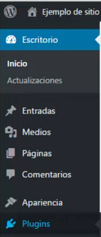

# Procés d'instal·lació d'un plugin

Al menu de Wordpress anirem a la barra de l’esquerra i seleccionarem “Afegir nou”

Seguidament anirem a la dreta a posar el nom del nou plugin

Li donem a instal.lar

I la activem

Finalment si anem a plugins podrem veure tots els plugins instal.lats

