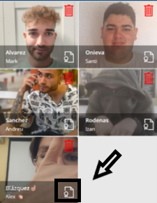

# Índice de Contenidos

### Introducció

- [Índice de Contenidos](#índice-de-contenidos)
    - [Introducció](#introducció)
    - [Desenvolupament del Projecte](#desenvolupament-del-projecte)
    - [Conclusió](#conclusió)
    - [Fitxa Tècnica](#fitxa-tècnica)
- [Introducció](#introducció-1)
  - [Context del Projecte](#context-del-projecte)
  - [Descripció del Projecte](#descripció-del-projecte)
  - [Objectius del Projecte](#objectius-del-projecte)
  - [Qué és PowerApps?](#qué-és-powerapps)
  - [Característiques Principals de PowerApps](#característiques-principals-de-powerapps)
  - [Avantatges i desavantatges de PowerApps](#avantatges-i-desavantatges-de-powerapps)
- [Desenvolupament del projecte](#desenvolupament-del-projecte-1)
  - [Instal·lació i Configuració de PowerApps](#installació-i-configuració-de-powerapps)
  - [Estructura de Continguts i Dades](#estructura-de-continguts-i-dades)
    - [LListes](#llistes)
    - [Pantalles, interacció i navegació](#pantalles-interacció-i-navegació)
- [Conclusió](#conclusió-1)
- [Fitxa Tècnica](#fitxa-tècnica-1)

### Desenvolupament del Projecte

- [Instal·lació i Configuració de PowerApps](#installació-i-configuració-de-powerapps)
- [Estructura de Continguts i Dades](#estructura-de-continguts-i-dades)
    - [Llistes](#llistes)
    - [Pantalles, Interacció i Navegació](#pantalles-interacció-i-navegació)

### Conclusió

- [Conclusió](#conclusió-1)

### Fitxa Tècnica

- [Fitxa Tècnica](#fitxa-tècnica-1)

   

# Introducció

## Context del Projecte

El present projecte sorgeix com a resposta a la sol·licitud d'un institut educatiu que buscava una solució tecnològica per simplificar i optimitzar la gestió de les matrícules dels seus professors. En aquest context, es va identificar la necessitat de desenvolupar una aplicació que permetés manejar de manera eficient i centralitzada la informació relativa a les altes i els títols acadèmics dels professors. Per això, es va decidir utilitzar Microsoft PowerApps, una eina de desenvolupament d'aplicacions de baix codi que permet la creació ràpida de solucions personalitzades i adaptades a les necessitats específiques de la institució. 

## Descripció del Projecte

El projecte consisteix en el desenvolupament d'una aplicació a PowerApps que facilita la gestió de les altes dels professors de l'institut. L'aplicació permet registrar nous professors i gestionar els seus títols acadèmics de forma senzilla i estructurada. A més, proporciona funcionalitats per modificar i eliminar registres existents, assegurant que la informació estigui sempre actualitzada i sigui accessible de manera segura.

## Objectius del Projecte

1. Desenvolupar una Aplicació Funcional:

    - Crear una aplicació en PowerApps que centralitzi la gestió de les altes dels professors.

2. Millorar l'Eficiència dels Processos:
        
    - Simplificar els procediments administratius relacionats amb la gestió d'altes, reduint els temps de processament i minimitzant els errors.
    
3. Facilitar l'Accés i la Gestió de la Informació:
        
    - Permetre un fàcil accés i maneig de la informació dels professors i els seus títols acadèmics.
    
4. Assegurar la Integritat i Seguretat de les Dades:
    - No hi ha seguretat explicita, però en haver-se creat a l'entorn de sapalomera.net, només es pot accedir a través d'un compte amb sapalomera.net.

## Qué és PowerApps?

PowerApps és una plataforma de desenvolupament d'aplicacions empresarials de Microsoft que permet als usuaris construir aplicacions mòbils i web personalitzades sense necessitat de tenir habilitats de programació avançades. Forma part de la suite Microsoft Power Platform, que també inclou Power BI i Power Automate. PowerApps permet als usuaris connectar les seves aplicacions a dades emmagatzemades a la plataforma Microsoft 365 o en diverses fonts de dades externes, utilitzant una interfície d'usuari senzilla de lliscar i deixar anar.

## Característiques Principals de PowerApps

## Avantatges i desavantatges de PowerApps

   

# Desenvolupament del projecte

## Instal·lació i Configuració de PowerApps

Accés a PowerApps:

- Accedir a PowerApps a través de l'Office 365 o Microsoft 365 amb credencials d'usuari autoritzat.
- Navegar fins a l'apartat de PowerApps des de l'inici de la suite d'Office 365.

Creació de l'Aplicació:

- Iniciar una nova aplicació des de zero seleccionant l'opció "Creació d'una aplicació en blanc" per a una major flexibilitat en el disseny.
- Configurar el nom de l'aplicació i les opcions bàsiques relacionades amb el rendiment i l'accessibilitat.

 

## Estructura de Continguts i Dades

### LListes

        
 

Professors --> Llista per emmagatzemar les dades personals dels professors.

 

Títols Acadèmics --> Llista on es guarden tots els diferents títols acadèmics.

 

Titols Professors --> Llista que fa el paper de taula intermitja. Registre professor + títol acadèmic.

 

### Pantalles, interacció i navegació

Pantalla Principal de l'Aplicació --> Aquesta és la pantalla d'inici de l'aplicació, on es mostra una galeria visual de tots els professors. A la part inferior de la pantalla, hi ha dos botons principals: un per afegir nous títols acadèmics als professors existents, i un altre per registrar nous professors a l'aplicació.
 

  

Cada perfil de professor en la galeria està equipat amb dues opcions addicionals: 

Botó eliminar professor --> Aquest botó permet eliminar de manera segura el perfil del professor seleccionat després de confirmar l'acció.

ThisItem és el professor des del qual s'ha clicat el botó d'eliminar

  

Botó veure títols --> Aquest botó dirigeix a l'usuari a una pantalla detallada on es poden consultar tots els títols acadèmics vinculats amb el professor.

En clicar el botó, s'accedeix directament a la pantalla 'TitolsProfessor' sense cap transició visual. Encara que no observeu cap canvi immediat, cal especificar aquest paràmetre per permetre la configuració següent: s'inicialitza la variable 'selecteditem' assignant-li el valor de ThisItem. Aquesta variable és crucial, ja que s'utilitza per transferir les dades del professor seleccionat d'una pantalla a una altra, assegurant la continuïtat i la precisió de la informació en l'aplicació.

**
[Prem aquí per viatjar a 'Titols Professor' i simular el comportament del botó](./titols_professors.md)
**

  

Click al perfil del professor --> Quan fem clic en el perfil d'un professor, s'obre la pantalla "Veure Professor".

Definim l'origen de dades en la llista de professors, establint per defecte el mode de només lectura. L'element que es mostra s'obté mitjançant la funció LookUp, la qual cerca dins de la llista professors, utilitzant com a criteri que la ID del registre coincideixi amb la ID de 'selecteditem'.

**
[Prem aquí per viatjar a 'Veure professors' i simular el comportament del botó](./veure_profesors.md)
**

  

Botó afegir professor --> Accedeix a la pantalla 'AfegirProfessor' i inicialitza un nou formulari anomenat 'FormNouProfe'.

**[Prem aquí per viatjar a 'Afegir professor' i simular el comportament del botó](./afegir_profe.md)**

  

Botó afegir títols a professors --> Accedeix a la pantalla 'AfegirTitolProfessor' i inicialitza un nou formulari denominat 'FormAfegirTitolProfe'.

**[Prem aquí per viatjar a 'Afegir títols' i simular el comportament del botó](./afegir_titol.md)**

   

# Conclusió

El projecte desenvolupat ha complert amb èxit els objectius establerts, proporcionant una aplicació funcional per a la gestió d'altes dels professors de l'institut. Utilitzant PowerApps, hem creat una eina eficient i fàcil d'usar que centralitza la informació dels professors i els seus títols acadèmics. La col·laboració entre els departaments de sistemes de l'institut i el nostre equip de desenvolupament ha estat essencial per comprendre les necessitats específiques i oferir una solució adaptada.

Durant el desenvolupament, hem superat diversos desafiaments tècnics, com la integració de dades.

Aquest projecte no només millora la gestió administrativa de l'institut, sinó que també proporciona una base sòlida per a futurs desenvolupaments i expansions de funcionalitats.

   

# Fitxa Tècnica 

| **Component**                       | **Detalls**|
| ----------------------------------- |------------|
| **Nom de l'Aplicació**              | Alta professorat |
| **Plataforma Utilitzada**           | Microsoft PowerApps |
| **Integracions**                    | Llistes de SharePoint per a l'emmagatzematge de dades |
| **Funcionalitats Principals**       | - Registre i gestió de professors - Gestió de títols acadèmics - Navegació intuïtiva amb pantalles dedicades per a cada funcionalitat |
| **Desenvolupament i Implementació** | - Creació de l'aplicació a través de PowerApps - Utilització de formularis i galeries per a la visualització i entrada de dades - Implementació de botons per a accions específiques (afegir, editar, eliminar, etc.) - Configuració de permisos i seguretat per a protegir la informació sensible |
| **Avantatges de l'Aplicació**       | - Facilita la gestió centralitzada de la informació dels professors - Millora l'eficiència dels processos administratius - Proporciona una interfície d'usuari intuïtiva i fàcil d'utilitzar - Assegura la integritat i seguretat de les dades gràcies a que l'aplicació és de Microsoft  |