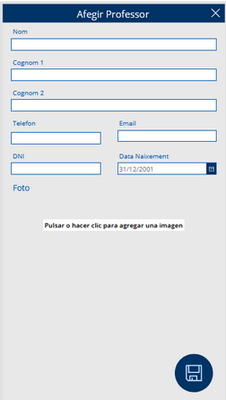
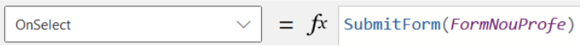
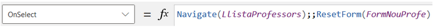
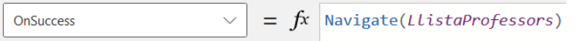

# Afeigr nou profe

Pantalla destinada a l'afegiment d'un nou professor a la llista, on es sol·liciten totes les dades necessàries. Inclou un botó per guardar el professor creat i un altre botó situat a la cantonada superior dreta, comú en totes les pantalles, que permet retrocedir.

    

Quan es prem, s'envia el formulari perquè les dades siguin introduïdes a la taula 'Professors'.

Navega a la pàgina anterior, en aquest cas a 'LlistaProfessors', i reinicia el formulari 'FormNouProfe'.

Si les dades són introduïdes correctament viatja a la pantalla anterior

