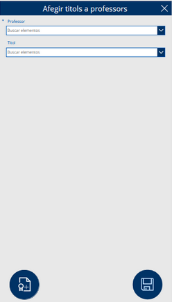
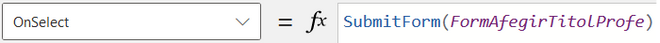
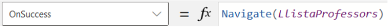
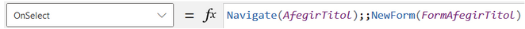

# Afegir titols a professors

Pantalla destinada a afegir títols als professors, que inclou un menú desplegable per seleccionar el professor i el títol corresponent. Com a totes les altres pàgines, disposa d'un botó per retrocedir que no tornarem a explicar. A més, compta amb un botó per afegir el títol seleccionat i un altre per guardar els canvis realitzats.

 

Botó de guardar dades --> Envia el formulari a la llista de títols acadèmics i guarda l'informació

.png)

Si les dades són introduïdes correctament, l'aplicació retorna a la pantalla anterior.

 

Botó d'afegir títol --> Canvia a la pantalla 'AfegirTitol' i inicialitza un nou formulari denominat 'FormAfegirTitol'.

