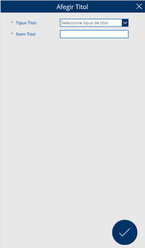

# Formulari per afegir un nou formulari a les llistes

Pantalla destinada a afegir nous títols, on es poden introduir el tipus i el nom del títol. Aquesta pantalla inclou un botó per tornar a la pantalla anterior i un altre botó per afegir el títol especificat.

Si les dades són introduïdes correctament, l'aplicació canviarà automàticament a la pantalla anterior.

