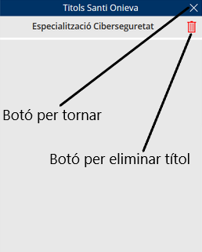
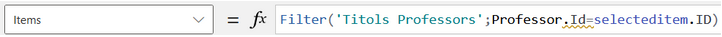
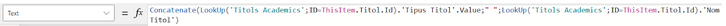
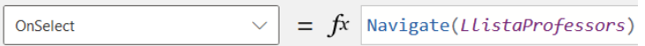
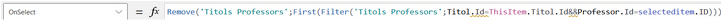

# Pantalla per Visualitzar els Títols d'el Professor seleccionat

## Qué fa aquesta pantalla?

Aquesta pantalla mostra en format de galeria tots els títols acadèmics que posseeix un professor determinat. Com a totes les altres pàgines de l'aplicació, inclou un botó per retornar a la pantalla anterior, facilitant la navegació dins de l'aplicació. A més, disposa d'un botó específic per eliminar qualsevol títol acadèmic del professor, proporcionant una gestió eficient i directa de les seves qualificacions.

## Com obté els títols?

Per obtenir els títols a mostrar, el sistema realitza una cerca a la llista ‘Titols Professors’. Filtra tots els registres on la identificació (ID) del professor coincideixi amb la ID del professor que s'ha proporcionat des de la pantalla ‘LlistaProfessors’.

## Com mostra els títols?

Els títols a la galeria són mostrats concatenant el seu tipus i el seu nom. Aquesta informació s'obté buscant a la base de dades utilitzant la identificació (ID) del títol acadèmic específic.

## Botons

### Botó per anar cap enrere

La funció d'aquest botó és retornar a la pantalla 'LlistaProfessors'. El botó es mostra en forma de creu.

### Botó per eliminar professor

Elimina de la llista ‘Titols Professors’ el primer registre trobat on la identificació (ID) del títol coincideixi amb la ID del títol que es desitja eliminar, i on la ID del professor correspongui amb la del professor proporcionat des de la pantalla anterior.

