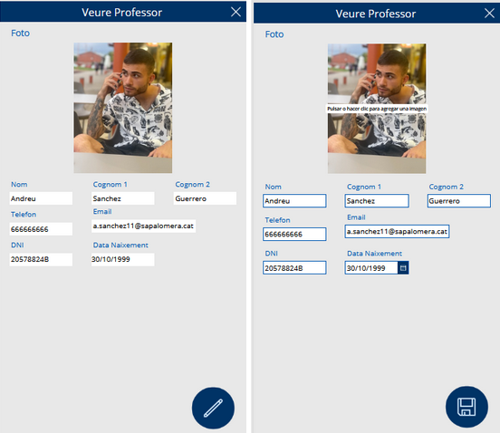
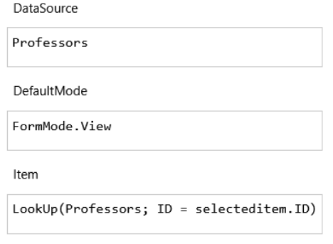
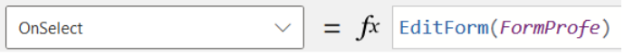
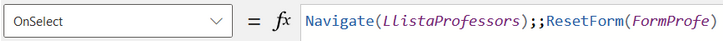

# Veure professor

Pàgina per visualitzar les dades del professor, equipada amb un botó per tornar a la pantalla anterior i un altre botó per editar al professor. En fer clic en el botó d'editar, la pàgina entra en mode d'edició, moment en què el botó d'editar es substitueix per un botó de guardar per confirmar els canvis realitzats.

Per activar el mode d'edició, premeu el botó del llapis. Això canviarà la interfície a mode d'edició, tal com es mostra a la imatge de la dreta. A continuació veurem el funcionament intern d'aquest procés: 

També tenim el botó de tirar enrrere:

