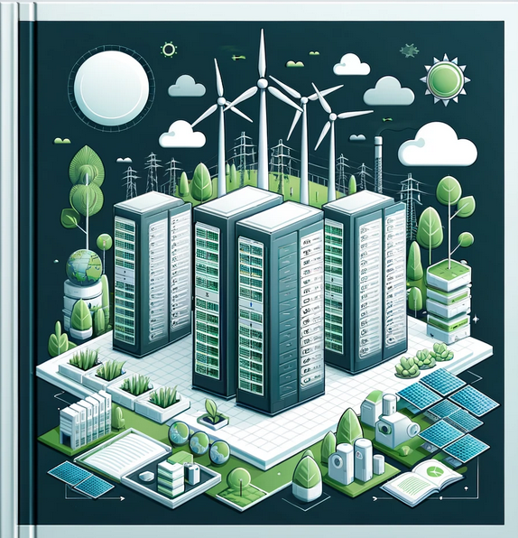
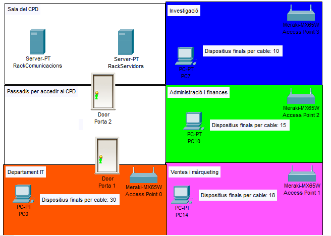
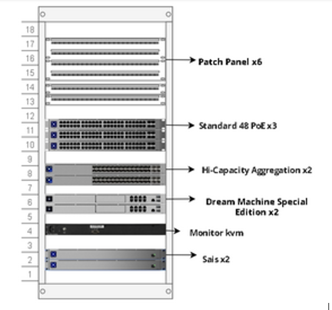
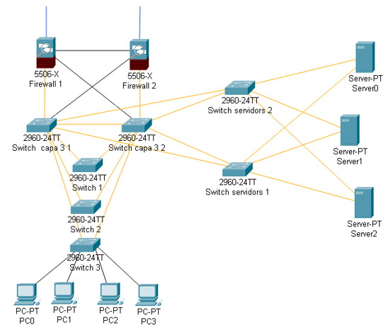
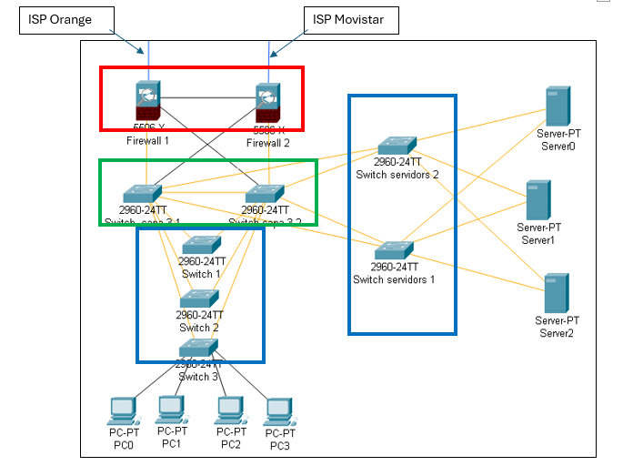
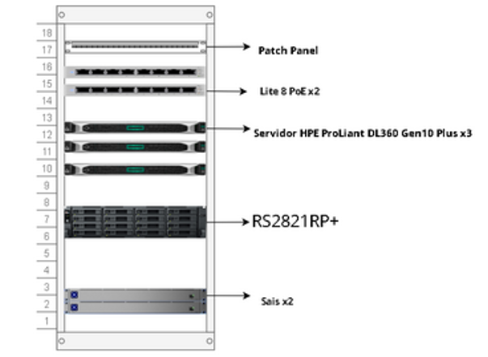
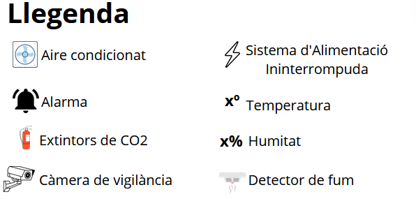
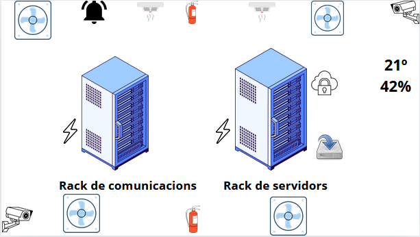
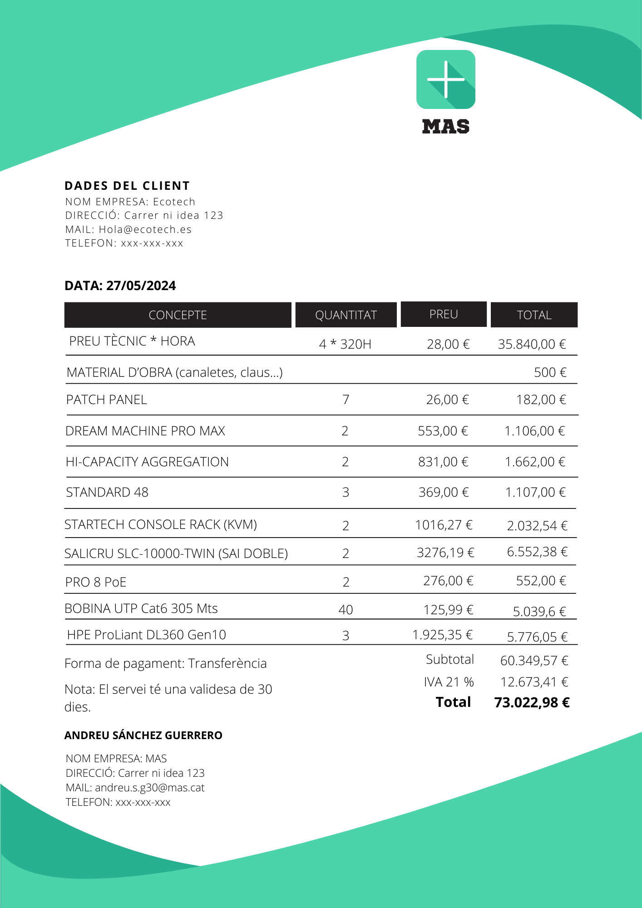

### Introducció
- [Context del projecte](#context-del-projecte)
- [Descripció del projecte](#descripció-del-projecte)
- [Components principals del projecte](#components-principals-del-projecte)
- [Beneficis esperats](#beneficis-esperats)

### Desenvolupament del Projecte

- [Anàlisi de l'empresa que ens ha contractat](#anàlisi-de-lempresa-que-ens-ha-contractat)
- [Distribució de l’empresa per sales](#distribució-de-lempresa-per-sales)
- [Comunicació entre racks](#comunicació-entre-racks)
  - [Què és Top of Rack (TOR)?](#què-és-top-of-rack-tor)
  - [Per què hem triat top of the rack?](#per-què-hem-triat-top-of-the-rack)
- [Distribució dels dispositius dintre del rack](#distribució-dels-dispositius-dintre-del-rack)
  - [Rack de comunicacions](#rack-de-comunicacions)
  - [Elecció de l'Equipament de Xarxa](#elecció-de-lequipament-de-xarxa)
  - [Raons per Escollir Ubiquiti](#raons-per-escollir-ubiquiti)
  - [Equipament Seleccionat](#equipament-seleccionat)
- [Esquema lògic de xarxa](#esquema-lògic-de-xarxa)
- [Model de 3 capes](#model-de-3-capes)
    - [Què és el Model de 3 Capes?](#què-és-el-model-de-3-capes)
    - [Per què hem escollit el Model de 3 Capes?](#per-què-hem-escollit-el-model-de-3-capes)
- [Evitar bucles amb RSTP](#evitar-bucles-amb-rstp)
    - [Què és RSTP?](#què-és-rstp)
    - [Ventatjas de RSTP](#ventatjas-de-rstp)
- [Separació de la xarxa per subxarxes i VLANs](#separació-de-la-xarxa-per-subxarxes-i-vlans)
    - [Què són les Subxarxes i les VLANs?](#què-són-les-subxarxes-i-les-vlans)
    - [Implementació de Subxarxes i VLANs a EcoTech](#implementació-de-subxarxes-i-vlans-a-ecotech)
    - [Esquema de Subxarxes i VLANs](#esquema-de-subxarxes-i-vlans)
    - [Descripció de la Separació de la Xarxa](#descripció-de-la-separació-de-la-xarxa)
- [Tria de Servidors i la seva Arquitectura](#tria-de-servidors-i-la-seva-arquitectura)
    - [Tipus de Servidors](#tipus-de-servidors)
    - [Tria de Servidors](#tria-de-servidors)
    - [Beneficis de la Combinació de Servidors Dedicats i Virtuals](#beneficis-de-la-combinació-de-servidors-dedicats-i-virtuals)
- [Mesures de Seguretat física](#mesures-de-seguretat-física)
- [Mesures de Seguretat Lògica](#mesures-de-seguretat-lògica)
- [Pressupost](#pressupost)

### Conclusió

- [Conclusió](#conclusió-1)

### Fitxa Tècnica

- [Fitxa Tècnica](#fitxa-tècnica-1)

   

# Introducció

## Context del Projecte

El departament MASTECH de la nostra empresa MAS, i EcoTech, ens hem reunit per discutir les millors opcions que beneficiïn les dues companyies. Durant la reunió, van deixar clar la seva disposició a invertir calitat/preu en un Centre de Processament de Dades (CPD).

Implementar un CPD proporcionaria a EcoTech una infraestructura tecnològica més sòlida, segura i escalable que respaldaria el seu creixement continu i el seu compromís amb la innovació i la sostenibilitat ambiental.

En resposta a les seves necessitats, hem presentat la proposta següent:

[Desenvolupament del projecte](#desenvolupament-del-projecte-1)

  

## Descripció del Projecte

El projecte de Centre de Processament de Dades (CPD) per a EcoTech consisteix en la planificació, instal·lació i configuració d'una infraestructura tecnològica robusta que pugui suportar el creixement continu de l'empresa. Aquest CPD està dissenyat per proporcionar una plataforma segura, fiable i escalable que permetrà a EcoTech gestionar les seves operacions de manera més eficient i innovadora.

  

## Components Principals del Projecte

1. Infraestructura Física:
    - **Sales de CPD:** Espai dedicat per allotjar el rack de servidors i el rack de comunicacions. També te allotjat dispositius de seguretat física.
    - **Racks i Dispositius:** Organització i distribució dels dispositius dins dels racks per optimitzar l'espai i la gestió del cablejat.

2. Xarxa i Comunicacions:
    - **Esquema de Xarxa:** Disseny d'un esquema de xarxa lògic i físic que asseguri la comunicació fluida i segura entre tots els dispositius.
    - **Switchos i Enrutadors/firewalls:** Utilització de switchos i enrutadors/firewalls que suportin protocols avançats com el RSTP (Rapid Spanning Tree Protocol) per evitar bucles de xarxa.

3. Seguretat i Fiabilitat:
    - **Seguretat Física:** Mesures per protegir físicament els equips, incloent controls d'accés i sistemes de vigilància.
    - **Seguretat de Xarxa:** Implementació de VLANs i altres mesures per segmentar la xarxa i protegir les dades sensibles.

4. Gestió de Dades:
    - **Servidors:** Utilització de servidors HP DL360 GEN10 amb tecnologia reacondicionada per garantir el rendiment i la fiabilitat.
    - **Virtualització:** Implementació de tecnologies de virtualització per optimitzar l'ús dels recursos del servidor.
    - **Emmagatzematge:** Utilització d'un NAS (Network Attached Storage) per a còpies de seguretat i gestió de dades.

5. Procediments de Backup:
    - **Automatització de Backups:** Configuració de scripts i cron jobs per realitzar còpies de seguretat diàries de les bases de dades i altres dades crítiques.
    - **Emmagatzematge de Backups:** Guardar còpies de seguretat en ubicacions segures per garantir la recuperació de dades en cas de fallada del sistema.

6. Escalabilitat i Creixement:
    - **Planificació per al Futur:** Disseny del CPD tenint en compte el creixement futur d'EcoTech, assegurant que la infraestructura pugui ser ampliada fàcilment.
    - **Tecnologies Innovadores:** Incorporació de tecnologies innovadores que suportin els objectius de sostenibilitat i eficiència d'EcoTech.

  

## Beneficis Esperats
    
- **Millora en la Gestió de Dades:** Una infraestructura més robusta i fiable permetrà a EcoTech gestionar les seves dades de manera més eficient.
- **Seguretat Avançada:** Les mesures de seguretat implementades protegiran les dades sensibles contra amenaces internes i externes.
- **Escalabilitat:** La infraestructura escalable assegura que el CPD pugui créixer juntament amb EcoTech, adaptant-se a les necessitats canviants de l'empresa.
- **Eficiència Operativa:** La virtualització i altres tecnologies innovadores milloraran l'eficiència operativa, permetent a EcoTech oferir millors serveis als seus clients.
- **Sostenibilitat:** Reducció de l'impacte ambiental gràcies a pràctiques sostenibles.
- **Alta disponibilitat:** Mínim temps d'inactivitat gràcies a una infraestructura fiable i sistemes de backup efectius.
- **Flexibilitat:** Capacitat d'adaptar-se ràpidament a les necessitats canviants del negoci.

   

# Desenvolupament del Projecte

## Anàlisi de l'empresa que ens ha contractat

"EcoTech" és una empresa ficticia que es dedica a la producció i comercialització de tecnologies ecològiques.

El seu enfocament principal radica en el desenvolupament i la venda de productes tecnològics dissenyats per promoure la sostenibilitat ambiental i l'eficiència energètica.

  

## Distribució de l’empresa per sales

Aquesta secció descriu com es distribueixen les diferents sales dins de l'empresa.

EcoTech ens ha deixat aquesta imatge com a referencia. És una imatge sencilla però clara d'entendre.
  

Segons aquesta distribució que ens ha facilitat l'empresa, podem extreure les següents conclusions:

1. Sala del CPD.
   - **Racks**:
     - 1 Rack de comunicacions.
     - 1 Rack de Servidors.
   - **Accés**:
     - Porta 2 connecta la Sala del CPD amb el Passadís per accedir al CPD.

2. Passadís per accedir al CPD.
   - Connecta la Sala del CPD amb la sala del departament d'IT mitjançant la Porta 2 i la Porta 1.

3. Departament d'investigació.
   - **Quantitat de dispositius finals per cable**: 
        - 10
        - 1 d'aquestes 10 ips, està reservada per 1 **access point**.

4. Administració i Finances
   - **Quantitat de dispositius finals per cable**:
        - 15
        - 1 d'aquestes 15 ips, està reservada per 1 **access point**.

5. Ventes i Màrqueting
   - **Quantitat de dispositius finals per cable**: 
        - 18
        - 1 d'aquestes 18 ips, està reservada per 1 **access point**.

6. Departament IT
   - **Quantitat de dispositius finals per cable**: 
        - 30
        - 1 d'aquestes 30 ips, està reservada per 1 **access point**. 

**Resum General**
- **Total de dispositius finals per cable**:
  - Investigació: 10
  - Administració i Finances: 15
  - Ventes i Màrqueting: 18
  - Departament IT: 30
  - -------------------------------
    Total: 73 dispositius finals + 20 càmeres = 93 IPs per cable

- **Punts d'accés inalàmbric**:
  - Access Point 0 (Departament IT)
  - Access Point 1 (Ventes i Màrqueting)
  - Access Point 2 (Administració i Finances)
  - Access Point 3 (Investigació)

Aquesta distribució ajuda a visualitzar clarament la disposició de les sales, la ubicació dels servidors, els dispositius finals i els punts d'accés a l'empresa, facilitant la planificació per al muntatge del CPD.

Considerem que una sola sala és suficient per allotjar els nostres equips en aquest moment. Com que estem operant amb un nombre limitat de racks, no veiem la necessitat immediata d'expandir-nos a múltiples sales. Aquesta simplificació a la infraestructura ens permet optimitzar l'ús de l'espai i els recursos disponibles.

A més, en consolidar els racks en una sola sala, podem centrar els nostres esforços a enfortir la seguretat física d'aquest espai específic. Ens hem assegurat d'implementar mesures de seguretat robustes per protegir els equips i les dades que hi ha. Aquesta concentració ens permet maximitzar l'eficàcia de les nostres mesures de seguretat, cosa que inclou el control d'accés, la vigilància i la detecció d'intrusions.

La infraestructura del nostre CPD compta amb la comunicació entre racks ToR i un ampli espai a la sala, cosa que la fa completament escalable.

- Vídeo de la sala del CPD detalladament amb un model 3D fet amb ***Sweet Home 3D***

    [Clica per accedir per veure el vídeo](Enlace)

  

## Comunicació entre racks

En el nostre projecte de CPD, la comunicació entre racks és un aspecte crític per assegurar una xarxa eficient, fiable i escalable. Hem optat per una solució basada en la tecnologia Top of Rack (TOR) per gestionar aquesta comunicació. A continuació, es detallen els components i avantatges d'aquesta solució.

### Què és Top of Rack (TOR)?

La tecnologia TOR consisteix en col·locar un switch a la part superior de cada rack. Aquest switch connecta tots els dispositius dins del rack i després s'interconnecta amb els switches d'altres racks mitjançant connexions d'alta velocitat. Això crea una xarxa eficient i fàcil de gestionar.

### Per què hem triat top of the rack?

Hem optat per l'opció de comunicació entre racks Top of Rack (ToR) a causa dels seus avantatges significatius:

1. Eficàcia en la Gestió del Cablejat:
    - La solució ToR redueix la complexitat del cablejat dins del CPD. Amb els switchos situats a la part superior de cada rack, es redueix la longitud dels cables necessaris per connectar els dispositius dins del mateix rack. Això no només facilita la gestió del cablejat, sinó que també millora l'estètica i l'accessibilitat per a tasques de manteniment.

2. Escalabilitat:
    - La configuració ToR permet afegir nous racks i switchos fàcilment sense necessitat de realitzar una reconfiguració significativa de la xarxa existent. Aquesta flexibilitat és crucial per a un CPD que necessita créixer i adaptar-se a les necessitats canviants de l'empresa amb el temps.

3. Redundància i Fiabilitat:
    - Amb la solució ToR, cada rack pot tenir múltiples connexions a switchos centrals, oferint així redundància a nivell de xarxa. En cas de fallada d'un switch, el tràfic es pot redirigir a través d'altres camins disponibles, assegurant així la continuïtat del servei i minimitzant el temps d'inactivitat.

4. Rendiment Elevat:
    - Les connexions d'alta velocitat entre switchos ToR asseguren un ample de banda suficient per a les aplicacions més exigents. Això és especialment important per a aplicacions de dades intensives i serveis de virtualització, on la latència baixa i l'alt ample de banda són crítics.

5. Simplicitat en la Configuració i Gestió:
    - La configuració de switchos ToR és més senzilla comparada amb altres arquitectures de xarxa, ja que la major part del tràfic es maneja localment dins del rack. Això facilita la gestió de la xarxa, redueix el temps de configuració i minimitza els errors humans.

  

## Distribució dels dispositius dintre del rack

Apartat que detalla com es col·loquen els dispositius dins de cada rack per optimitzar l'espai, la refrigeració i l'accessibilitat per al manteniment.

### Rack de comunicacions

#### Elecció de l'Equipament de Xarxa

Ens hem decantat per la marca Ubiquiti per la seva excel·lent relació qualitat-preu i la seva reputació en oferir productes fiables i de rendiment superior. Hem treballat amb Ubiquiti en nombrosos projectes anteriors i sempre hem obtingut resultats excel·lents.

#### Raons per Escollir Ubiquiti
1. Qualitat i Fiabilitat:
    - Ubiquiti és reconeguda per produir equipament de xarxa d'alta qualitat que ofereix una fiabilitat excepcional. La seva gamma de productes està dissenyada per suportar les exigències de les infraestructures de xarxa modernes, garantint un rendiment consistent i durador.

2. Relació Qualitat-Preu:
   - Els productes d'Ubiquiti ofereixen una relació qualitat-preu molt competitiva. Aquesta marca proporciona solucions avançades a preus assequibles, permetent-nos maximitzar l'eficiència del pressupost sense comprometre la qualitat ni les funcionalitats.

3. Experiència Prèvia:
   - Hem treballat amb Ubiquiti en diversos projectes, i la nostra experiència ha estat consistentment positiva. Els seus productes han demostrat ser fàcils de configurar, gestionar i mantenir, oferint un alt nivell de satisfacció als nostres clients.

#### Equipament Seleccionat
1. CloudGateway (Dream Machine Pro Max):
    - Hem seleccionat dos unitats de Ubiquiti Dream Machine Pro Max per realitzar les funcions de router i firewall. Aquest dispositiu integrat ofereix una combinació potent de funcionalitats de routing, seguretat i gestió de xarxa, adaptant-se perfectament a les necessitats del nostre CPD.

2. Switchos Standard 48:
    - Hem seleccionat tres Ubiquiti Standard 48 per connectar els dispositius finals dins del CPD. Aquests switchos ofereixen una alta capacitat de ports i un rendiment consistent, fent-los ideals per gestionar una gran quantitat de connexions.
        - Alta Capacitat de Ports.
        - Velocitat Gigabit.
        - Compatibilitat amb PoE.

3. Hi-Capacity Aggregation Switches:
    - Hem seleccionat dos Ubiquiti Hi-Capacity Aggregation Switches per connectar els switchos Standard 48 i els servidors mitjançant connexions de fibra òptica. Aquests switchos són essencials per agregar tràfic de múltiples switchos i proporcionar una ruta de dades d'alta velocitat.

4. Monitor KVM amb Elevador
    - Per a la gestió centralitzada i el control dels servidors, hem seleccionat un monitor KVM (Keyboard, Video, Mouse) amb elevador. Aquest dispositiu permet l'accés i el control de múltiples servidors des d'un únic punt, facilitant les tasques d'administració i manteniment.
5. Sistemes d'Alimentació Ininterrompuda (SAI).

    - Per garantir la continuïtat del servei i protegir els equips de possibles interrupcions elèctriques, hem inclòs dos Sistemes d'Alimentació Ininterrompuda (SAI) a la part inferior del rack. Aquests dispositius proporcionen una font d'alimentació segura i fiable en cas de fallades de subministrament elèctric.

  

## Esquema lògic de xarxa

Es presenta un esquema lògic de la xarxa que mostra com es connecten els dispositius dins del CPD.

Tenim dues lineas ISP cadascuna d’un proveïdor diferent, cada línea va conectada a un "cloud gateway" que fan les funcions de routing i firewall.

Cada "cloud gateway" te dos ports SFP+ (in/out), per aquest motiu no podem fer tota la redundancia per fibra. Estaran connectats per fibra a un switch de capa 3 (cadascun a un diferent) i estaran connectats a l’altre switch de capa 3 per ethernet.

Els "cloud gateways" estaran connectats per ethernet entre ells amb el port deshabilitat, fem això per si algún dia l'empresa decideix fer balanceig de càrrega. Encara que nosaltres no ho recomenem.

Tota la resta de swithcos estan connectats entre ells amb fibra i tot amb redundancia.

  

## Model de 3 capes

Imatge clara on identifiquem les capen en el nostre esquema lògic de xarxa.

En el disseny de la xarxa del CPD d'EcoTech, hem optat pel model de xarxa de 3 capes. Aquest model proporciona una estructura jeràrquica que facilita la gestió, escalabilitat i eficiència de la xarxa.

### Què és el Model de 3 Capes?

El model de 3 capes és una arquitectura de xarxa que divideix la infraestructura en tres nivells o capes:

1. Capa d'Accés:
    - És la capa més baixa i connecta els dispositius finals (ordinadors, servidors, impressores, etc.) a la xarxa. Els switchos d'accés gestionen la connexió dels dispositius d'usuari final.

2. Capa de Distribució:
    - Aquesta capa actua com un pont entre la capa d'accés i la capa de nucli. Els switchos de distribució agreguen el tràfic de múltiples switchos d'accés i l'envien a la capa de nucli. També poden aplicar polítiques de seguretat i filtratge de tràfic.

3. Capa de Nucli:
    - És la capa superior i s'encarrega de l'encaminament ràpid del tràfic de xarxa dins del centre de dades. Els switchos de nucli proporcionen connexions d'alta velocitat i baix retard entre les diverses parts de la xarxa.

### Per què hem escollit el Model de 3 Capes?

1. Escalabilitat:
    - El model de 3 capes permet una fàcil expansió de la xarxa a mesura que les necessitats de l'empresa creixen. Afegir nous dispositius a la capa d'accés no afecta significativament el rendiment de les capes superiors.

2. Rendiment:
    - Aquesta arquitectura permet un tràfic de dades ràpid i eficient, ja que cada capa està optimitzada per a la seva funció específica.

3. Gestió Senzilla:
    - La divisió en tres capes facilita la gestió de la xarxa, ja que cada capa es pot administrar i monitoritzar de manera independent. Això permet una localització ràpida de problemes i una gestió més eficient dels recursos.

  

## Evitar bucles amb RSTP

En la configuració de la xarxa del CPD d'EcoTech, és crucial assegurar-nos de que no es produeixen bucles de xarxa, ja que aquests poden causar una degradació significativa del rendiment de la xarxa i, en alguns casos, poden provocar la caiguda total de la xarxa. Per evitar aquests problemes, utilitzem el protocol **Rapid Spanning Tree Protocol (RSTP)**.

### Què és RSTP?

Rapid Spanning Tree Protocol (RSTP) és una evolució del protocol original Spanning Tree Protocol (STP), dissenyat per millorar la velocitat de la xarxa en situacions de canvi de topologia, com ara la fallada d'un enllaç o l'addició d'un nou switch.

### Ventatjas de RSTP

1. Detecció de Bucles:
    - RSTP detecta de manera automàtica els bucles de xarxa i crea una topologia d'arbre que evita la formació de bucles. Això es fa bloquejant certs enllaços redundants fins que siguin necessaris.

2. Convergència Ràpida:
    - Una de les principals avantatges de RSTP és la seva capacitat de convergir ràpidament després d'un canvi de topologia. Això significa que pot adaptar-se ràpidament a les fallades de la xarxa, recuperant-se molt més ràpidament que el STP original.

3. Ports Ràpids:
    - RSTP introdueix el concepte de ports ràpids (Edge Ports), que poden passar a l'estat de reenviament immediatament sense esperar els temporitzadors STP tradicionals. Això és especialment útil per als ports connectats directament a estacions de treball o servidors.

 

Enllaç dels switchos on es poden veure les seves especificacions i que efectivament soporten aquesta tecnòlogia.

[Hi-Capacity Aggregation](https://eu.store.ui.com/eu/en/pro/products/usw-pro-aggregation)

[Switch Standrad 48](https://eu.store.ui.com/eu/en/pro/category/all-switching/products/usw-48)

 

## Separació de la xarxa per subxarxes i VLANs

La separació de la xarxa en subxarxes i VLANs (Virtual Local Area Networks) és essencial per garantir una gestió eficient, millorar la seguretat i optimitzar el rendiment. A continuació es detallen les raons per les quals hem implementat aquesta estratègia i els beneficis associats.

### Què són les Subxarxes i les VLANs?

1. **Subxarxes:**
    - Una subxarxa és una subdivisió lògica d'una xarxa IP més gran. Permet dividir una xarxa gran en segments més petits, millorant la gestió i la seguretat del trànsit de dades.

2. **VLANs:**
    - Una VLAN és una xarxa local virtual que permet agrupar dispositius dins d'una mateixa xarxa física com si estiguessin en una mateixa xarxa lògica. Això es fa mitjançant la configuració dels switchos, i permet segmentar la xarxa en funció de les necessitats operatives i de seguretat.

### Implementació de Subxarxes i VLANs a EcoTech

1. **Divisió en subxarxes:**
    - Hem dividit la xarxa principal d'EcoTech en diverses subxarxes per segmentar el trànsit i millorar la gestió de la xarxa. Cada departament té la seva pròpia subxarxa, lo qual permet una gestió més específica i controlada del trànsit de dades. Hem utilitzat l'adreçament IP 172.16.0.0/16, dividint-lo en subxarxes /24.

2. **Configuració de VLANs:**
    - Utilitzant la tecnologia VLAN, hem creat diferents VLANs per a cada departament i funció específica dins de l'empresa. Això ens permet separar l'accés i el trànsit de dades de manera lògica, fins i tot si els dispositius estan físicament propers.

### Esquema de Subxarxes i VLANs

| Departament                        | VLAN | Subxarxa            | Rang d'IPs                | Gateway          |
|------------------------------------|------|---------------------|--------------------------|-----------------------|
| **Departament d’Informàtica**      | 10   | 172.16.10.0/24      | 172.16.10.1 - 172.16.10.254 | 172.16.10.1         |
| **Departament de Vendes i Màrqueting** | 20 | 172.16.20.0/24      | 172.16.20.1 - 172.16.20.254 | 172.16.20.1         |
| **Departament d’Administració i Finances** | 30 | 172.16.30.0/24      | 172.16.30.1 - 172.16.30.254 | 172.16.30.1         |
| **Departament d’Investigació**     | 40   | 172.16.40.0/24      | 172.16.40.1 - 172.16.40.254 | 172.16.40.1         |
| **Dispositius de Seguretat**       | 100   | 172.16.50.0/24      | 172.16.50.1 - 172.16.50.254 | 172.16.50.1         |
| **Gestió i Administració de Xarxa** | 110   | 172.16.60.0/24      | 172.16.60.1 - 172.16.60.254 | 172.16.60.1         |

### Descripció de la Separació de la Xarxa

1. **VLAN 10: Departament d’Informàtica**:
   - **Subxarxa**: 172.16.10.0/24
   - **Rang d'IPs**: 172.16.10.1 - 172.16.10.254
   - **Gateway**: 172.16.10.1
   - **Funció**: Dedicada a tots els dispositius gestionats pel departament d’Informàtica.

2. **VLAN 20: Departament de Vendes i Màrqueting**:
   - **Subxarxa**: 172.16.20.0/24
   - **Rang d'IPs**: 172.16.20.1 - 172.16.20.254
   - **Gateway**: 172.16.20.1
   - **Funció**: Assignada als dispositius del departament de Vendes i Màrqueting.

3. **VLAN 30: Departament d’Administració i Finances**:
   - **Subxarxa**: 172.16.30.0/24
   - **Rang d'IPs**: 172.16.30.1 - 172.16.30.254
   - **Gateway**: 172.16.30.1
   - **Funció**: Destinada als dispositius del departament d’Administració i Finances.

4. **VLAN 40: Departament d’Investigació**:
   - **Subxarxa**: 172.16.40.0/24
   - **Rang d'IPs**: 172.16.40.1 - 172.16.40.254
   - **Gateway**: 172.16.40.1
   - **Funció**: Assignada als dispositius del departament d’Investigació.

5. **VLAN 100: Dispositius de Seguretat**:
   - **Subxarxa**: 172.16.100.0/24
   - **Rang d'IPs**: 172.16.100.1 - 172.16.100.254
   - **Gateway**: 172.16.100.1
   - **Funció**: Dedicada als dispositius de seguretat, com ara sistemes de monitoratge i vigilància.

6. **VLAN 110: Gestió i Administració de Xarxa**:
   - **Subxarxa**: 172.16.110.0/24
   - **Rang d'IPs**: 172.16.110.1 - 172.16.110.254
   - **Gateway**: 172.16.110.1
   - **Funció**: Destinada a la gestió i administració dels elements de xarxa i servidors.

  

## Tria de Servidors i la seva Arquitectura

En aquesta secció, detallarem la tria de servidors, considerant l'ús de servidors dedicats i virtuals, així com els beneficis associats a cada opció.

### Tipus de Servidors

Hem optat per una combinació de servidors dedicats i virtuals per aprofitar els avantatges de cada tipus i satisfer les necessitats específiques d'EcoTech.

1. **Servidors Dedicats**:
   - Són màquines físiques dedicades a una sola aplicació o servei. Ofereixen el màxim rendiment i control sobre els recursos de maquinari.

2. **Servidors Virtuals (VMs)**:
   - Són instàncies virtuals que s'executen en un entorn de virtualització sobre servidors físics. Permeten una millor utilització dels recursos i una major flexibilitat.

### Tria de Servidors

Per a EcoTech, hem seleccionat els següents servidors per a la seva arquitectura híbrida:

1. **Servidors Dedicats**:
    - Model: HPE ProLiant DL360 Gen10
    - Característiques:
        - CPU: XEON 6226R 16-core
        - RAM: 12 x 32GB DIMM
        - Emmagatzematge: 2 x 960GB SATA SSD
        - Ús: Bases de dades crítiques, aplicacions de rendiment alt, serveis que requereixen temps de resposta mínims.

2. **Servidors Virtuals (VMs)**:
    - Utilitzem VMware vSphere com a plataforma de virtualització per gestionar les màquines virtuals (VMs). Això permet una millor utilització dels recursos i facilita la gestió dels servidors.
    - Ús:
        - Aplicacions Menys Crítiques: Les aplicacions que no requereixen un rendiment extremadament alt s'executen en VMs, proporcionant flexibilitat i eficiència en la utilització dels recursos.

        - Entorns de Desenvolupament i Proves: Els entorns de desenvolupament i proves també s'allotgen en VMs, permetent als desenvolupadors crear i provar aplicacions en un entorn controlat.

### Beneficis de la Combinació de Servidors Dedicats i Virtuals

- **Rendiment**:
  - Els servidors dedicats ofereixen el màxim rendiment per a aplicacions crítiques i processament de grans volums de dades, mentre que els servidors virtuals proporcionen flexibilitat i eficiència en la utilització dels recursos.

- **Escalabilitat**:
  - La combinació de servidors dedicats i virtuals permet una escalabilitat fàcil, ja que es poden afegir noves VMs o ampliar els recursos dels servidors dedicats segons les necessitats.

- **Seguretat**:
  - La separació de les aplicacions i dades en servidors dedicats i virtuals permet aplicar polítiques de seguretat específiques per a cada entorn, millorant la protecció global de la infraestructura.

 

## Mesures de Seguretat física

Aquesta secció descriu les mesures i protocols de seguretat física implementats per assegurar la integritat, la disponibilitat i la confidencialitat dels recursos físics del CPD.

1. **Control d'Accés**
   - **Accés Restrictiu**: L'accés al CPD està restringit a personal autoritzat mitjançant l'ús de targetes d'identificació amb tecnologia RFID.
   - **Biometria**: S'han instal·lat escàners biomètrics (empremtes digitals) per a una seguretat addicional en àrees crítiques.
   - **Registre d'Entrades i Sortides**: Totes les entrades i sortides són registrades electrònicament, mantenint un registre per a qualsevol revisió de seguretat necessària.

2. **Videovigilància**
   - **Càmeres de Seguretat**: Càmeres de seguretat d'alta resolució amb cobertura 24/7 són instal·lades en tots els accessos, passadissos i àrees crítiques del CPD.
   - **Monitoratge Remot**: Les imatges de les càmeres són monitoritzades en temps real per un equip de seguretat dedicat i també es poden revisar remotament.
   - **Emmagatzematge de Vídeos**: Els enregistraments de seguretat es guarden durant un període determinat per a possibles revisions futures.

3. **Protecció contra Incendis**
   - **Sistemes de Detecció d'Incendis**: Sensors de fum i calor són instal·lats en tot el CPD per detectar qualsevol indici d'incendi de manera precoç.
   - **Extintors i Sistemes d'Extinció**: Extintors accessibles i sistemes d'extinció automàtica (per exemple, sistemes d'aspersió i de gas inert) són distribuïts estratègicament.
   - **Plans d'Evacuació**: Plans d'evacuació ben senyalitzats i simulacres d'incendi regulars per assegurar que tot el personal sàpiga com actuar en cas d'emergència.

4. **Control Ambiental**
   - **Sistemes de ventilació**: Sistemes de calefacció, ventilació i aire condicionat per mantenir una temperatura i humitat òptimes dins del CPD.
   - **Monitors Ambientals**: Sensors per monitoritzar la temperatura, la humitat i altres factors ambientals crítics en temps real.
   - **Alarmes**: Alarmes per alertar en cas de condicions ambientals fora dels paràmetres establerts.

5. **Protecció contra Intrusos**
   - **Tanques de Seguretat**: Tanques perimetrals amb sensors de moviment per detectar i dissuadir intrusos.
   - **Portes de Seguretat**: Portes reforçades amb mecanismes de bloqueig automàtic en àrees sensibles.
   - **Sistemes d'Alarma**: Sistemes d'alarma per alertar el personal de seguretat en cas de qualsevol intent d'intrusió.

6. **Sistemes d'Alimentació Ininterrompuda (SAI)**
   - **SAI**: Sistemes d'alimentació ininterrompuda per assegurar que els servidors i altres equips crítics continuïn funcionant en cas de tall d'energia.
   - **Generadors de Reserva**: Generadors de reserva que es posen en marxa automàticament en cas de fallada de l'energia principal.

7. **Sistema de Refredament per Líquid**
    - Utilitzarem sistemes de refredament per líquid en els racks de servidors d'alta densitat per dissipar la calor de manera més eficient.

8. **Polítiques i Procediments**
   - **Polítiques de Seguretat**: Polítiques clares de seguretat física que defineixen els protocols d'accés, les responsabilitats del personal i els procediments d'emergència.
   - **Formació del Personal**: Formació regular del personal en matèria de seguretat física, incloent protocols d'emergència i bones pràctiques de seguretat.
   - **Auditories de Seguretat**: Auditories periòdiques per avaluar l'eficàcia de les mesures de seguretat i identificar àrees de millora.

  

## Mesures de Seguretat Lògica

1. **Control d'Accés i Autenticació**
   - **Autenticació Multifactor (MFA)**: Implementació de l'autenticació multifactor per assegurar que només el personal autoritzat pugui accedir als sistemes i dades sensibles.
   - **Gestió de Privilegis**: Assignació de permisos d'accés basats en rols per limitar l'accés als recursos segons les necessitats del treballador.
   - **Polítiques de Contrasenya**: Polítiques estrictes de contrasenyes que inclouen requisits de complexitat, canvi regular de contrasenyes i prohibició de reutilització de contrasenyes antigues.

2. **Xarxes Segures**
   - **Segmentació de Xarxa**: Separació de la xarxa en subxarxes i VLANs per limitar la propagació d'amenaces i facilitar la gestió del trànsit de xarxa.
   - **Firewalls**: Utilització de firewalls de nova generació per monitoritzar i controlar el trànsit entrant i sortint basant-se en polítiques de seguretat definides.

3. **Protecció de Dades**
   - **Xifrat de Dades**: Xifrat de dades en trànsit i en repòs per protegir la informació sensible contra accessos no autoritzats.
   - **Còpies de Seguretat Regulars**: Realització de còpies de seguretat freqüents i automatitzades de totes les dades crítiques. Farem servir TreuNAS.

4. **Monitorització i Auditories**
   - **Monitorització Contínua**: Utilització d'eines de monitorització com Zabix per a la supervisió contínua de l'activitat de la xarxa, els sistemes i les aplicacions.

  

## Pressupost

   

# Conclusió

El CPD implementat per la nostre empresa, MASTECH, per a EcoTech no només compleix amb els objectius inicials del projecte, sinó que també proporciona una base sòlida per al creixement futur. Les tecnologies avançades i les mesures de seguretat robustes asseguren que EcoTech pugui manejar els seus processos amb confiança i eficiència, proporcionant alhora una experiència segura i fiable per als seus clients i empleats. Amb aquesta infraestructura, EcoTech està ben posicionada per afrontar els reptes futurs i continuar sent un líder en el seu sector.

   

# Fitxa Tècnica

| **Component** | **Detalls** |
|---------------|-------------|
| **Projecte** | Implementació d'un Centre de Processament de Dades (CPD) |
| **Empresa** | EcoTech |
| **Desenvolupador** | MASTECH |
| **Tecnologies Usades** | Servidors dedicats (HPE ProLiant DL360 Gen10), Servidors virtuals (VMware vSphere), Mesures de seguretat física i lògica |
| **Adreçament IP** | Xarxa: 172.16.0.0/16, Subxarxes /24 per departaments |
| **VLANs** | VLAN 10: IT (172.16.10.0/24), VLAN 20: Vendes i Màrqueting (172.16.20.0/24), VLAN 30: Administració i Finances (172.16.30.0/24), VLAN 40: Investigació (172.16.40.0/24), VLAN 100: Seguretat (172.16.100.0/24), VLAN 110: Gestió i Administració (172.16.110.0/24) |
| **Seguretat Física** | Control d'accés, videovigilància, protecció contra incendis, control ambiental, protecció contra intrusos, SAI |
| **Seguretat Lògica** | Autenticació multifactor, segmentació de xarxa, firewalls, xifrat de dades, còpies de seguretat, monitorització contínua, formació i conscienciació del personal |
