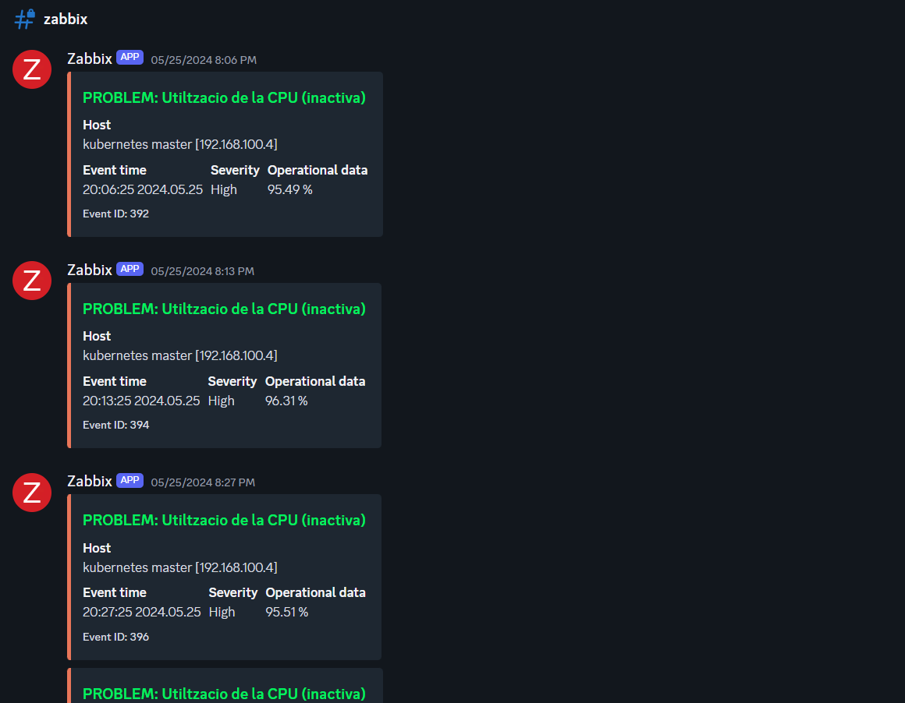

  

# Index

### Introducció
- [Context del projecte](#context-del-projecte)
- [Descripció del projecte](#descripció-del-projecte)
- [Objectius del projecte](#objectius-del-projecte)
- [Què és Zabbix?](#què-és-zabbix)
- [Avantatges i Desavantatges de Zabbix](#avantatges-i-desavantatges-de-zabbix)

### Desenvolupament del projecte
- [Instal·lació](#installació)
- [Afegir hosts](#afegir-hosts)
- [Monitoritzar parametres](#monitoritzar-parametres)
  - [Que es monitoritzará i perque](#que-es-monitoritzará-i-perque)
    - [Comuns per ambdues maquines](#comuns-per-ambdues-maquines)
    - [Exclusius del node master](#exclusius-del-node-master)
  - [Creació de parametres (items)](#creació-parametres-items)
- [Avisos sobre parametres controlats](#avisos-sobre-parametres-controlats)
  - [De que s'avisará i perque](#de-que-savisará-i-perqué)
    - [Comunes per ambdues maquines](#comunes-per-ambdues-maquines)
    - [Exclusives del node master](#exclusives-del-node-master)
  - [Creació alertes (triggers)](#creacio-alertes-triggers)
- [Accions que s'executaran quan salti un avís](#accions-que-sexecutaran-quan-salti-un-avís)
- [Taulers que ajuden a centralitzar l'informació](#taulers-que-ajuden-a-centralitzar-linformació)
- [Informes perdiodics per estar al dia](#informes-periodics-per-estar-al-dia)

### Conclusions
- [Resultats obtinguts](#resultats-obtinguts)
- [Potencials Millores Futures](#potencials-millores-futures)
- [Conclusió final](#conclusió-final)

### Fitxa tècnica
- [Fitxa tècnica](#fitxa-tècnica)

# Introducció

## Context del projecte

La monitorització dels sistemes informàtics s’ha convertit en una necessitat imprescindible per garantir la disponibilitat i el rendiment òptim de les infraestructures tecnològiques. Les empreses i organitzacions depenen cada vegada més dels seus sistemes informàtics, i qualsevol interrupció o baixada de rendiment pot tenir conseqüències greus, tant econòmiques com operatives. En aquest context, el projecte s'emmarca dins la necessitat de disposar d'eines eficients que permetin monitoritzar, gestionar i assegurar la continuïtat dels serveis tecnològics. Ho hem realitzat sobre un altre projecte, [projecte de docker](../8--Docker/README.md). En concret, la secció de Kubernetes.

## Descripció del projecte

Aquest projecte consisteix en la implementació i configuració de la plataforma de monitorització Zabbix per controlar el funcionament de diverses màquines i serveis d'una infraestructura informàtica. El projecte inclou la instal·lació de Zabbix, l’addició de màquines clients amb agents de Zabbix, la creació d’items per monitoritzar diferents aspectes de les màquines, la configuració de triggers per generar alertes, l’establiment d’accions en resposta a aquestes alertes, la creació de dashboards per centralitzar la informació i la generació d’informes periòdics. En concret, Zabbix s'ha utilitzat per monitoritzar les dues màquines membres del clúster de Kubernetes, amb l'objectiu de garantir que el clúster funcioni de manera òptima i sense interrupcions.

## Objectius del projecte

- Implementar una solució completa de monitorització utilitzant Zabbix.
- Monitoritzar diversos aspectes crítics de les màquines i serveis de l’entorn informàtic.
- Configurar alertes i accions automàtiques per garantir una resposta ràpida davant incidències.
- Crear dashboards personalitzats per visualitzar dades en temps real.
- Generar informes periòdics per avaluar el rendiment i la disponibilitat de les màquines monitoritzades.

## Què és Zabbix?

Zabbix és una eina de monitorització de codi obert dissenyada per supervisar i rastrejar el rendiment i la disponibilitat de servidors, dispositius de xarxa, aplicacions i altres components de TI. Zabbix ofereix una solució completa per a la recollida, el processament i la visualització de dades de monitorització, així com per generar alertes i informes. En aquest projecte, Zabbix s'ha utilitzat específicament per monitoritzar dues màquines que són membres d'un clúster de Kubernetes, garantint així que el clúster funcioni de manera òptima i sense interrupcions.
Per què hem escollit Zabbix?

Hem escollit Zabbix per diverses raons. Primer, és una eina de codi obert, la qual cosa permet una gran flexibilitat i personalització sense els costos associats a solucions comercials. Segon, Zabbix és conegut per la seva capacitat d'escalabilitat i robustesa, factors essencials per a la monitorització de clústers de Kubernetes. A més, Zabbix ofereix una àmplia gamma de funcions, com ara la creació d'alertes, accions automatitzades i informes detallats, que són fonamentals per mantenir la salut i el rendiment dels sistemes monitoritzats.

## Avantatges i desavantatges de Zabbix

# Desenvolupament del projecte

## Instal·lació
El nostre Zabbix està instal·lat en un Ubuntu Server (versió 24.04 LTS) utilitzant nginx, MySQL i PHP. Al següent enllaç es detalla el procés d'instal·lacio:

[Procés d'instal·lació](instalacio.md)

## Afegir hosts
Hem escollit afegir 2 maquines per poder monitoritzar-los amb aquesta eina
- 2 Ubuntu Server (22.04 LTS) membres d'un mateix clúster de Kubernetes
  - 1 Node master
  - 1 Node worker

Al següent enllaç es detallen les passes seguides:

[Com afegir hosts](afegir_hosts.md)

## Monitoritzar parametres
Hem creat diferents items per tenir vigilats certs aspectes de les maquines que estem controlant

### Que es monitoritzará i perque
#### Comuns per ambdues maquines

- Utilització de CPU
  - La utilització de la CPU és un indicador clau de la càrrega de treball i la capacitat de processament disponible en el node. Monitoritzar aquest paràmetre ajuda a identificar quan el node està sota una càrrega excessiva, la qual cosa pot afectar el rendiment de les aplicacions en execució.

- Utilització de Memòria
  - La memòria disponible és crucial per al funcionament fluid dels pods i les aplicacions. Un ús elevat de memòria pot portar a situacions de swapping, on el rendiment es degrada significativament. Monitoritzar aquest paràmetre permet prendre accions preventives abans que s’esgoti la memòria.
  
- Ús del Disc
  - L'espai en disc és vital per a l'emmagatzematge de dades d'aplicacions, logs i altres fitxers temporals. La manca d'espai en disc pot causar fallades en les aplicacions i en el sistema operatiu. Monitoritzar aquest paràmetre assegura que sempre hi hagi prou espai disponible.

- Ús de Xarxa (Entrada i Sortida)
  - La utilització de la xarxa és crucial per a la comunicació entre els nodes i amb l'exterior. Monitoritzar el tràfic de xarxa ajuda a detectar colls d'ampolla, possibles atacs DDoS, i assegura que el tràfic de dades sigui fluid i sense interrupcions.

#### Exclusius del node master

- Estat de l'API Server
  - La monitorització de l'estat de l'API de Kubernetes és essencial per garantir la disponibilitat i la funcionalitat del Control Plane. Detecta possibles fallades en el component central de gestió, permetent una ràpida resposta davant problemes crítics i assegurant l'operació contínua del clúster.

- Estat dels Pods
  - La monitorització de l'estat dels pods assegura la disponibilitat i el rendiment de les aplicacions desplegades en Kubernetes. Detecta fallades en la creació, execució o terminació dels pods, permetent una gestió proactiva de problemes que podrien afectar l'experiència de l'usuari i l'operació del negoci.

### Creació parametres (items)

En el següent enllaç es detalla com hem creat els items.

[Creacio d'items](items.md)

Una llista dels parametres creats en ambdues maquines

  

## Avisos sobre parametres controlats
Hem creat alertes per els diferents items i aixi avisar-nos per si passes alguna cosa

### De que s'avisará i perqué
#### Comunes per ambdues maquines

- Alta utilització de la CPU
  - La CPU és un dels recursos més crítics en qualsevol sistema. Una alta utilització de la CPU pot indicar que els processos estan consumint molts recursos, cosa que pot afectar el rendiment del sistema. Si la CPU està sobrecarregada, els temps de resposta poden augmentar i les aplicacions poden tornar-se lentes o no respondre. És essencial monitoritzar i rebre alertes sobre l'alta utilització de la CPU per prendre mesures correctives abans que afecti els usuaris o serveis.
  
- Alta utilització de la memoria
  - La memòria (RAM) és vital per al rendiment de les aplicacions. Una alta utilització de la memòria pot portar a situacions de swapping, on el sistema comença a utilitzar el disc dur com a memòria addicional, cosa que és molt més lenta. Això pot degradar significativament el rendiment del sistema i causar que les aplicacions es ralentitzin o es bloquegin. Monitoritzar la memòria i rebre alertes sobre la seva alta utilització permet als administradors identificar i resoldre problemes abans que impactin en l'operació normal del sistema.
  

- Poc espai de disc disponible
  - L'emmagatzematge en disc és fonamental per a l'operació de qualsevol sistema. Tenir poc espai de disc disponible pot portar a fallades en el sistema, ja que les aplicacions i el sistema operatiu necessiten espai lliure per funcionar correctament. Problemes com la incapacitat de guardar dades, registres d'errors i fallades en els serveis poden ocórrer si l'espai en disc s'esgota. Rebre alertes sobre el baix espai en disc permet als administradors prendre mesures preventives, com netejar arxius innecessaris o afegir més capacitat d'emmagatzematge.
  
- Trafic d'entrada elevat
  - El trànsit d'entrada elevat pot indicar una alta demanda de serveis en el sistema, cosa que pot portar a la saturació de la xarxa o dels recursos del servidor. Pot ser un símptoma d'un augment en l'activitat legítima (per exemple, més usuaris accedint a un servei) o pot indicar possibles atacs de xarxa (com atacs DDoS). Monitoritzar i rebre alertes sobre el trànsit d'entrada elevat permet als administradors identificar ràpidament la causa i prendre les accions necessàries per mitigar l'impacte.

- Trafic de sortida elevat
  - El trànsit de sortida elevat pot ser un indici de diverses situacions, com la transferència de grans volums de dades, possibles exfiltracions de dades, o activitats malicioses dins de la xarxa (per exemple, malware enviant dades fora de la xarxa). Monitoritzar el trànsit de sortida i rebre alertes permet als administradors investigar i abordar qualsevol comportament anòmal, garantint la seguretat i l'eficiència de la xarxa.
  
#### Exclusives del node master

- Estat de la API de Kubernetes no "ok"
  - La API de Kubernetes és el punt central de comunicació i gestió del clúster. Si la API no està operativa o té problemes, els components del clúster no poden interactuar correctament, cosa que afecta la creació, gestió i monitorització dels recursos. Això pot portar a la fallada de desplegaments, escalabilitat i altres operacions crítiques. Monitoritzar l'estat de la API de Kubernetes i rebre alertes sobre qualsevol problema permet als administradors reaccionar ràpidament per garantir la disponibilitat i el correcte funcionament del clúster.

- Pocs pods en estat "Running"
  - En un entorn de serveis, és essencial que els processos crítics estiguin en funcionament. Tenir pocs processos en estat "Running" pot indicar problemes amb la disponibilitat dels serveis. Això pot ser causat per fallades en les aplicacions, problemes de recursos en el servidor o configuracions incorrectes. Monitoritzar l'estat dels processos i rebre alertes quan hi ha pocs en estat "Running" permet als administradors prendre mesures ràpides per restaurar l'operativitat dels serveis i assegurar la continuïtat del servei.
  

### Creacio alertes (triggers)
En el següent enllaç es detalla com es crean les alertes

[Creacio d'alertes](triggers.md)

Una llista de les alertes creades en les dues maquines

   

## Accions que s'executaran quan salti un avís

A part de indicar com crear una alerta pas a pas, hem utilitzat el `Media type` de Discord que ja inclou el mateix Zabbix perque aixi envii un missatge a un canal determinat cada vegada que salta un trigger. 

En el següent enllaç es detalla tot lo mencionat anteriorment.

[Creació d'accions](trigger_actions.md)

## Taulers que ajuden a centralitzar l'informació

Per facilitarnos la feina a l'hora de revisar les ultimes dades rebudes dels items, hem creat un dashboard 

En el següent enllaç es detalla la creació de taulers (dashboards)

[Creacio de dashboards](dahboards.md)

## Informes periodics per estar al dia

Utilitzant el dashboard anterior, hem programat l'enviament d'un informe sobre el tauler cada dilluns a les 10:30 del matí, que anirá destinat als 3 membres del grup

Creació detallada del informe en el següent enllaç:

[Creació d'informes](reports.md)

# Conclusions

## Resultats Obtinguts

La implementació de Zabbix ha permès una monitorització exhaustiva de les dues màquines membres del clúster de Kubernetes. Els resultats obtinguts inclouen:

- **Detecció precoç d'incidències**: Gràcies a les alertes configurades, ha estat possible identificar i solucionar problemes abans que afectessin el rendiment general del sistema.
- **Centralització de la informació**: Els dashboards creats han facilitat una visió global i en temps real de l'estat del clúster.
- **Informes periòdics**: Els informes generats han proporcionat una base sòlida per a l'anàlisi del rendiment i la disponibilitat de les màquines monitoritzades.

## Potencials Millores Futures

Encara que els resultats obtinguts han estat satisfactoris, existeixen diverses àrees en les quals es podrien introduir millores futures:

- **Escalabilitat**: Ampliar la monitorització a més màquines i serveis dins del clúster de Kubernetes.
- **Integració amb altres eines**: Explorar la integració de Zabbix amb altres eines de gestió i automatització per millorar els fluxos de treball.
- **Optimització de recursos**: Investigar maneres de reduir l'ús de recursos de sistema per part de Zabbix, especialment en entorns amb molts dispositius.

## Conclusió final

En conclusió, la implementació de Zabbix ha demostrat ser una solució eficient i robusta per a la monitorització del clúster de Kubernetes. La capacitat de detectar problemes de manera proactiva i centralitzar la informació ha millorat significativament la gestió i el manteniment de les màquines. Tot i això, hi ha oportunitats per a futures millores que podrien augmentar encara més l'eficiència i l'eficàcia del sistema de monitorització.

# Fitxa Tècnica

| **Component**| **Detalls**|
| --------------------------------------- | ---------------------------------------------|
| **Projecte**| Monitorització de Clúster de Kubernetes amb Zabbix |
| **Empresa**| MAS |
| **Departament**| MASOps |
| **Tecnologies utilitzades**| - **Zabbix:** Eina de monitorització de codi obert. - **Kubernetes:** Plataforma d'orquestració de contenidors. - **Agents Zabbix:** Instal·lats en les màquines a monitoritzar.|
| **Components del sistema monitoritzat** | - Dos nodes membres d'un clúster de Kubernetes. - Serveis desplegats dins del clúster. |                                                                            |
