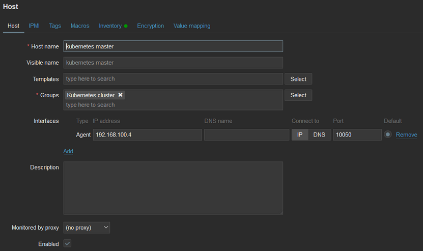
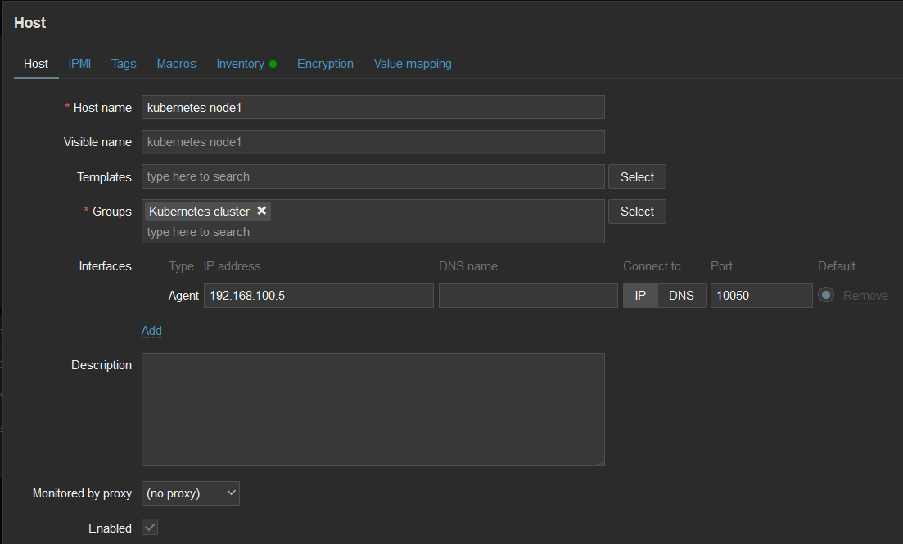

# Afegir hosts per ser monitoritzats

## Hosts a afegir
- 2 Ubuntu Server (22.04 LTS) membres d'un mateix clúster de Kubernetes
  - 1 Node master
  - 1 Node worker

Ja que son les mateixes maquines que el aparat de Kubernetes, les seves caracteristiques es detallen [aqui]()

 
## Instalar i configurar agent
Com que haviem de repetir aquest proces mes d'una vegada, hem creat un script per facilitar-nos la feina

[install-agent.sh](install-agent.sh)

Aprofitant que les maquines on volem instalar el client estan en una xarxa NAT i aquesta te regles de reenviament de ports per accedir a través de SSH als hosts, copiem el script mitjançant scp.

```powershell
scp -P <port> "install-agent.sh" <usuari>@localhost:/home/<usuari>
```

Una vegada copiat, executem el script en cada node

```bash
sh install-agent.sh
```

Abans de finalitzar, hem de canviar el fixter de configuració del agent de cada host i posar el hostname que posarem al Zabbix

Node master:
```bash
sudo sed -i 's/^Hostname=/Hostname=kubernetes master/' /etc/zabbix/zabbix_agentd.conf
```

Node worker:
```bash
sudo sed -i 's/^Hostname=/Hostname=kubernetes node1/' /etc/zabbix/zabbix_agentd.conf
```

Per últim, reiniciem el servei
```bash
sudo systemctl restart zabbix-agent
```

## Afegir hosts a Zabbix
Per motius d'organització, primer creem un grup de hosts.
Anem a ``Configuration -> Host groups -> Create host group`` i li posem el nom que volguem


Una vegada creat, podem afegir els hosts
Anem a ``Configuration -> Hosts -> Create host`` i omplenem els camps necessaris

**IMPORTANT**: En el camp `Host name` hem d'introduir el **mateix** valor que hem introduit a la variable `Hostname` del arxiu de configuració de l'agent 

Creació node master



Creació node worker



