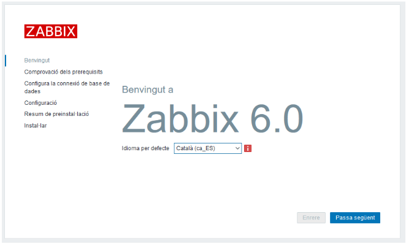
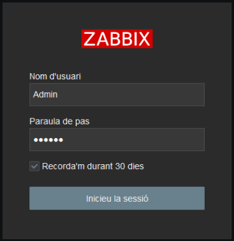
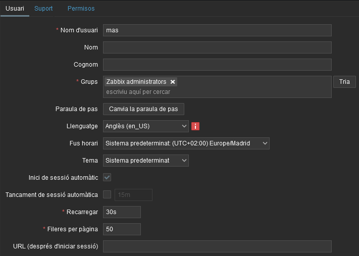

# Instal·lació i configuració Zabbix

## Caracteristiques servidor
- Ubuntu Server (versió 24.04 LTS)
- 2048 MB RAM 
- 2 processadors
- 35 GB HDD
- 2 interficies de xarxa
  - 1 Mode host-only
  - 1 Mode Xarxa NAT 


## Instal·lació
En aquest apartat es mostraran tots el passos per instalar l'eina de monitoritzacio Zabbix seguint la [documentacio oficial](https://www.zabbix.com/download?zabbix=6.0&os_distribution=ubuntu&os_version=24.04&components=server_frontend_agent&db=mysql&ws=apache)


### Afegir repositori

```bash
wget https://repo.zabbix.com/zabbix/6.0/ubuntu/pool/main/z/zabbix-release/zabbix-release_6.0-6+ubuntu24.04_all.deb
sudo dpkg -i zabbix-release_6.0-6+ubuntu24.04_all.deb
sudo apt update
```


### Instalar server,fronted i agent

```bash
sudo apt install zabbix-server-mysql zabbix-frontend-php zabbix-nginx-conf zabbix-sql-scripts zabbix-agent
```


### Importar dades inicials

#### Instal·lació i configuració MySQL

```bash
sudo apt install mysql-server
sudo mysql_secure_installation
```


#### Creació base de dades

```
sudo mysql
```
```SQL
mysql> CREATE DATABASE zabbix CHARACTER SET utf8mb4 COLLATE utf8mb4_bin;
mysql> CREATE USER zabbix@localhost IDENTIFIED BY 'password';
mysql> GRANT ALL PRIVILEGES ON zabbix.* TO zabbix@localhost;
mysql> SET GLOBAL log_bin_trust_function_creators = 1;
mysql> quit;
```

#### Importar dades i esquema inicial

```bash
zcat /usr/share/zabbix-sql-scripts/mysql/server.sql.gz | mysql --default-character-set=utf8mb4 -uzabbix -p password
```

#### Desactivar 'log_bin_trust_function_creators'

```
sudo mysql
```
```SQL
mysql> SET GLOBAL log_bin_trust_function_creators = 0;
mysql> quit;
```


### Configurar acces a la base de dades

```bash
sudo nano /etc/zabbix/zabbix_server.conf
# Linia 129
# DBPassword=
DBPassword=password
```


### Configurar PHP per al frontend

```bash
sudo nano /etc/zabbix/nginx.conf
# Linies 2 i 3
# listen      	8080;
# server_name 	example.com;
listen      	8888;
server_name 	mas-zabbix.cat;
```


### Instalar paquet d'idioma

```bash
sudo apt-get install language-pack-ca
```


### Iniciar servei del server i agent

```bash
sudo systemctl restart zabbix-server zabbix-agent nginx php8.3-fpm
sudo systemctl enable zabbix-server zabbix-agent nginx php8.3-fpm
```


### Configuració interfície web
Per accedir: ``<ip_server>:<port>``




## Configuració
Primer fem login. Credencials per defecte:
- Usuari: Admin
- Password: zabbix



### Autenticació
En l'apartat ``Administració -> Autenticació -> Autenticació`` hem definit les següent politiques de contrasenyes


### Usaris
En l'apartat ``Administració -> Usuaris -> Create user`` hem creat un usari amb rol de 'Super admin' que utilitzarem en comptes de Admin




