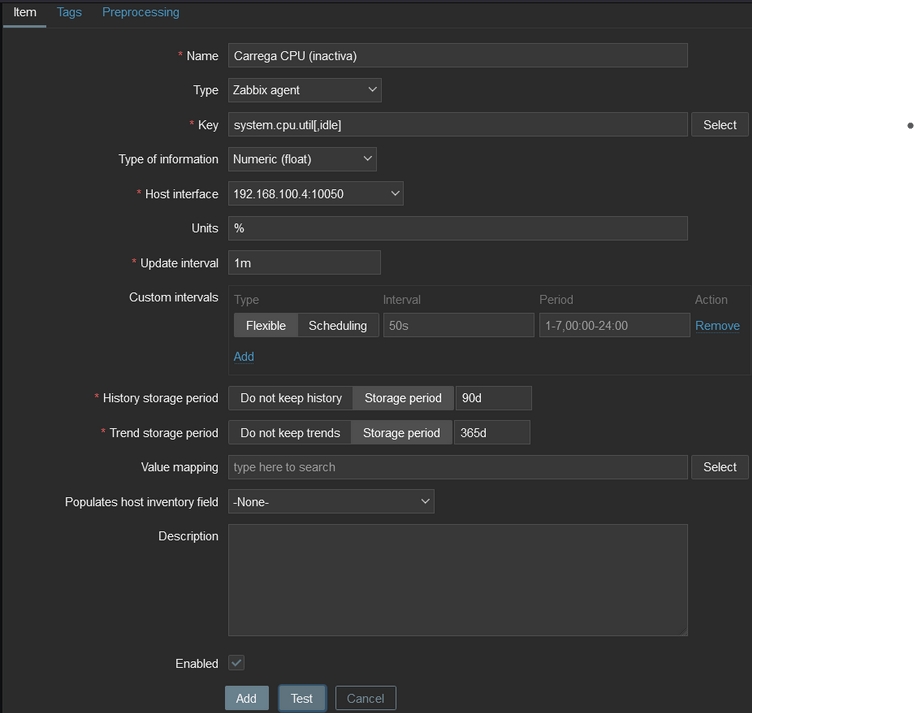
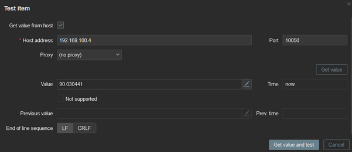
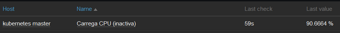
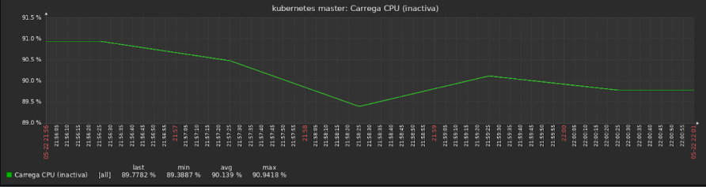

# Creació de parametres a monitoritzar

## Com crear un parametre (item)
En aquest cas crearem el de `utilització de CPU`. Anem a `Configuration -> Hosts -> <host> -> Items -> Create item` i omplenem els camps seguint les caracteristiques rellevants

- Nom: Carrega CPU (inactiva)
- Tipus: Agent Zabbix
- Clau: `system.cpu.util[,idle]`
- Tipus d'informació: Numerica (amb decimals)
- Unitats: `%`

Els altres valors es poden deixar per defecte

 

Una vegada acabat d'omplenar, abans d'afegir-ho ho provem per verificar que funcioni correctament



Com que tot funciona segons el previst, ja el podem afegir.

Passats uns minuts, podem anar a l'apartat de `Monitoring -> Latest data` i veurem el nostre item rebent dades



Si preferim veure un grafic, fem clic al nom del item i en el menú que es deplega, seleccionem `Graph`, i ens mostrara un grafic semblant a aquest




## Creació dels altres parametres

### Comuns en ambues maquines

#### Utilització de Memòria
- Nom: Memoria disponible
- Tipus: Agent Zabbix
- Clau: `vm.memory.size[available]`
- Tipus d'informació: Numerica (amb decimals)
- Unitats: MB
- Preprocessament:
  - Multiplicador personalitzat: 0.00000095367431640625 (Per passar de bytes a megabytes)
  
#### Ús del Disc
- Nom: Disc disponible
- Tipus: Agent Zabbix
- Clau: `vfs.fs.size[/,free]`
- Tipus d'informació: Numeric (amb decimals)
- Unitats: MB
- Preprocessament:
  - Multiplicador personalitzat: 0.00000095367431640625 (Per passar de bytes a megabytes)

#### Ús de Xarxa (Entrada i Sortida)
- Trafic xarxa enp0s3 (entrada|sortida)
- Tipus: Agent Zabbix
- Clau: `net.if.(in|out)[enp0s3]`
- Tipus d'informació: Numerica (sense decimals)
- Unitats: Bps

### Exclusius del node master

#### Estat de l'API Server
Abans de crear aquest item, hem de generar un token per accedir a la API de Kubernetes desde el Zabbix.

Totes les comandes van al node master.

1. Creem una Service Account
   
    ```bash
    kubectl create serviceaccount zabbix-monitoring
    ```

2. Asignem permisos al compte
   
   ```bash
   kubectl create clusterrolebinding zabbix-monitoring --clusterrole=cluster-admin --serviceaccount=default:zabbix-monitoring
   ```

3. Creem i apliquem el fitxer de configuració del token
   
   ```bash
   nano zabbix-monitoring-token.yaml
   ```
   ```yaml
   apiVersion: v1
   kind: Secret
   metadata:
    name: zabbix-monitoring-token
    annotations:
        kubernetes.io/service-account.name: zabbix-monitoring
   type: kubernetes.io/service-account-token
   ```
   ```bash
   kubectl apply -f zabbix-monitoring-token.yaml
   ```

4. Obtenim el token
   
   ```bash
   kubectl get secret zabbix-monitoring-token -o jsonpath='{.data.token}' | base64 --decode
   ```

5. Afegim el token al host
   
   En l'interficie web anem a `Configuration -> Hosts -> kubernetes master -> Macros -> Host macros`, creem una macro anomenada `{$KUBE.API.TOKEN}` i posem com a valor el resultat de la comanda anterior.

Una vegada afegida la macro, ja podem crear l'item.

- Nom: Estat API server
- Tipus: Agent HTTP
- Clau: `kube.api.status` (personalitzada)
- Tipus d'informació: Text
- URL: https://<ip_node_master>:6443/livez
- Tipus sol·licitud: GET
- Headers:
  - Authorization: Bearer `{$KUBE.API.TOKEN}`

#### Estat dels Pods
Abans de poder crear aquest item, hem de crear un script i definir una clau personalitzada.

Totes les comandes s'han d'executar en el node master.

1. Creem el script 
   
   ```bash
   sudo apt install jq #Opcional si ja està el paquet instal·lat
   ```
   ```bash
   sudo nano /usr/local/bin/pods_state.sh
   ```
   ```bash
   #!/bin/bash
   NODE_IP="<ip-node-master>"
   TOKEN="<token>"
   
   PODS_URL="https://$NODE_IP:6443/api/v1/namespaces/default/pods"
   
   # Obtenim les dades relacionades amb els pods
   PODS_JSON=$(curl -k -s -H "Authorization: Bearer $TOKEN" $PODS_URL)
   
   # Amb l'ajuda de jq (jQuery) només obtenim el nom i estat de cada pod 
   echo $PODS_JSON | jq -r '.items[] | .metadata.name + ": " + .status.phase'
   ```

2. Definim la clau personalitzada
   
   ```bash
   sudo nano /etc/zabbix/zabbix_agentd.d/user_parameters.conf
   ```

   ```conf
   UserParameter=pods.state,/usr/local/bin/pods_state.sh
   ```

   ```bash 
   sudo systemctl restart zabbix-agent.service
   ```

Una vegada definida la clau, ja podem començar a crear l'item.

- Nom: Estat pods
- Tipus: Agent Zabbix
- Clau: `pods.state`
- Tipus d'informació: Text

#### Pods en estat "Running"
Aquest item complementa al anterior, mostrant la quantitat de pods que hi han en estat "Running"

- Nom: Pods en estat "Running"
- Tipus: Dependecia
- Key: `count.running.pods`
- Tipus d'informació: Numerica (sense decimals)
- Item del que depén: `kubernetes master: Estat pods`
- Preprocessament:
  - JavaScript: 
      ```js
      var data = value;
      var matches = data.match(/Running/g);
      return matches ? matches.length : 0;
      ```