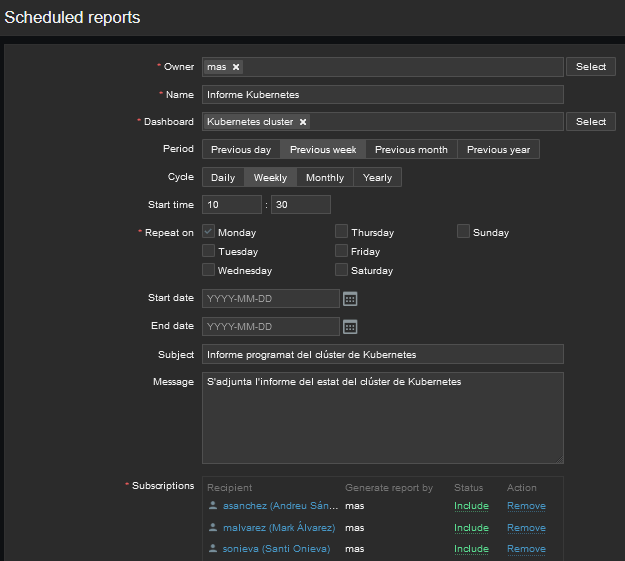

# Creació de informes per estar al dia sobre l'estat de les maquines

## Passos previs abans de crear un informe

Per començar, haurem de crear tants usuaris com persones volem que rebin l'informe, en el nostre cas crearem 3 usuaris. Per aixo, anem a `Administration -> Users -> Create user` i omplenem els camps rellevants


Abans de crear-lo hem d'afegir-li el `Media` de correu electronic


I assignar-li un rol


Una vegada creat l'usuari, hem de fer uns canvis al servidor de Zabbix.

Per començar, editem l'arxiu de configuració del servidor.

```bash
sudo nano /etc/zabbix/zabbix_server.conf
# Linia 932
# StartReportWriters=0
StartReportWriters=1

#Linia 940
# WebServiceURL=
WebServiceURL=http://localhost:10053/report
```

I reiniciem el servei

```bash
sudo systemctl restart zabbix-server.service
```

A continuació, instal·lem el paquet `zabbix-web-service`, el iniciem i l'habilitem

```bash
sudo apt install zabbix-web-service
sudo systemctl start zabbix-web-service
sudo systemctl enable zabbix-web-service
```

Després, per fer servir el sistema de reports tambe ens fara falta Google Chrome. Aixi que ho instal·lem també

```bash
wget https://dl.google.com/linux/direct/google-chrome-stable_current_amd64.deb
sudo dpkg -i google-chrome-stable_current_amd64.deb
sudo apt --fix-broken install
```

Una vegada instal·lat Chrome, reiniciem el servei web de Zabbix

```bash
sudo systemctl restart zabbix-web-service
``` 

Per finalitzar, hem d'anar a l'interifice web, l'apartat de `Administration -> General -> Other`, i en el camp `Frontend URL` posem la URL que utilitzem per accedir a l'interficie web en si


## Creació del informe periodic (scheduled reports)

Anem a `Reports -> Scheduled reports -> Create report` i el configurem al nostre gust. En el nostre cas hem decidit configurar-lo amb les següents caracteristiques

- Propietari: mas
- Nom: Informe Kubernetes
- Dashboard: `Kubernetes cluster`
- Periode: Setmana anterior
- Cicle: Setmanal
- Hora d'inici: 10:30
- Repeteix: Dilluns
- Assumpte: Informe programat del clúster de Kubernetes
- Missatge: S'adjunta l'informe del estat del clúster de Kubernetes
- Subscripcions (a qui s'enviará):
  - asanchez (a.sanchez11@sapalomera.cat)
  - malvarez (m.alvarez@sapalomera.cat)
  - sonieva (s.onieva@sapalomera.cat)



Abans de crear-lo es pot fer una prova per comprovar que tot estigui ben configurat. (S'ha enviat a asix2-m14-mas@sapalomera.cat perque al realitzar el test, s'envia al correu que tingui configurat l'usuari que relitza la prova)


