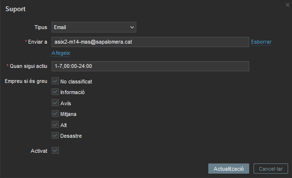

# Creacio de accions a realitzar quan salti una alerta

## Com crear una acció (trigger actions)
Abans de començar amb la creació, hem de configurar el `Media type` de Email per indicar amb quins parametres ha d'enviar correus. 

Primer hem d'obrir a la safata d'entrada del compte desde la que es enviaran els correus i anar a `Gestiona el teu compte de Google -> Seguretat -> Accés d'aplicacions menys segures` i activem l'unica opcio que surt


 
Una vegada fet aixo, en l'intrficie web naveguem a `Admninistration -> Media types -> Email` i canviem els següents valors:

- Servidor SMTP: smtp.gmail.com
- Port del servidor SMTP: 587
- SMTP helo: <nom_servidor>
- Correu-e SMTP: <compte_origen>
- Seguretat de la connexió: STARTTLS
- Authenticació: Nom d'usuari i paraula de pas
  - Nom d'usuari: <usuari\>
  - Paraula de pas: <contrasenya\>

Actualitzem el `Media type` i procedim a configurar l'usari que rebra aquest correus
Per aixo, viatjem a `Administration -> Users -> <usuari> -> Media` i afegim una nova amb les següents caracteristiques.

- Tipus: Email
- Enviar a: <correu\>



Ara, ja podrem crear l'accio en si. En aquest cas, crearem una de prova. Anem a `Configuration -> Actions -> Trigger actions -> Create action` i omplenem els camps

- Nom: prova
- Condició:
  -  Tipus: trigger
  -  Operador: és igual
  -  Triggers: `kubernetes master: Pods en estat "Running"`
- Operació:
  - Enviar als grups d'usuaris: Zabbix administrators
  - Enviar només a: Email

Una vegada creat, per provar el seu funcionament, forçarem que salti el trigger configurat a l'accio.

Per forçar-ho, utilitzarem la comanda `kubectl` al node master per "dir-li" al clúster que no intenti replicar cap instancia de phpmyadmin, simulant la caiguda del mateix

```bash
kubectl scale --replicas=0 deployment/phpmyadmin
```

Passat 1 minut (ja que l'item esta configurat per comprobar la quantitat de pods en estat "Running" cada minut), automaticament enviara un correu electronic a tots el usuaris que pertanyin al grup `Zabbix adminisrators`.

Si anem a la bustia de qualsevol membre d'aquest grup, podrem veure un correu com aquest


Per finalitzar, com tot funciona correctament, tornem a "dir-li" al clúster que repliqui la quantitat d'instancies de phpmyadmin que hi ha normalment

```bash
kubectl scale --replicas=1 deployment/phpmyadmin
```


## Com crear una alerta per Discord
Per poder veure i entendre les alertes, i per no estar tota la estona vigilant l'interficie web, hem utilitzat el `Media type` de Discord que ja inclou Zabbix per enviar tota alerta que salti a un canal d'un servidor ja existent de Discord

Primer hem de crear el canal en si on s'enviaran els missatges


Una vegada creat, posem el ratolí a sobre i obrim la configuració del canal, on anirem a l'apartat de `Integrations` i donarem a l'opcio de `Create Webhook`. Ens sortira una cosa com aquesta


Obrim el desplegable del webhook que acabem de crear i li cambiem tant el nom com la foto per que sigui menys confós. **IMPORTANT** també copiar la URL (Ens servira per després)


Quedaria aixi


A continuació, anem a la interficie web, naveguem a `Administration -> General -> Macros -> Add` i omplim els camps:
- Macro: `{$ZABBIX_URL}`
- Valor: <URL_per_accedir_a_zabbix>


Ara, hem de configurar el `Media type` de Discord a l'usuari que rebra les alertes. Anem a `Administration -> Users -> <usuari> -> Media -> Add` i la configurem amb els següents parametres:

- Tipus: Discord
- Enviar a: <URL_del_webhook>


Per ultim, ja podem crear el trigger action en si. Com hem mencionat en l'apartat anterior, anem a `Configuration -> Actions -> Trigger actions -> Create action` i posem els següents valors

- Nom: Enviament discord
- Condició
  - Tipus: Gravetat del trigger
  - Operador: Es més gran o igual a
  - Gravetat: Informació
- Operació:
  - Enviar als usuaris: <usuari_pas_anterior>
  - Enviar només a: Discord

Passat 1 minut desde la creació, si anem al canal de Discord on hem configurat el webhook ja hauriem de veure missatges relacionats amb els triggers creats anteriorment

