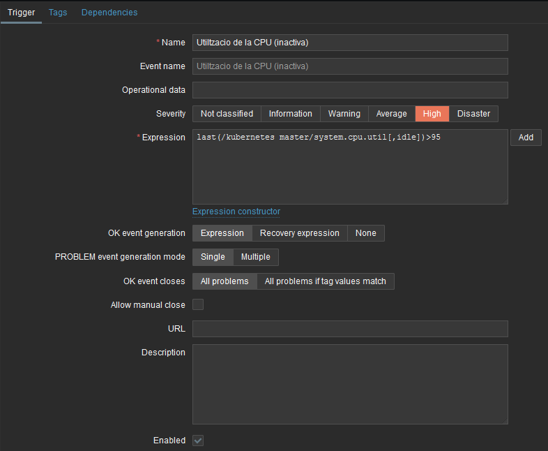
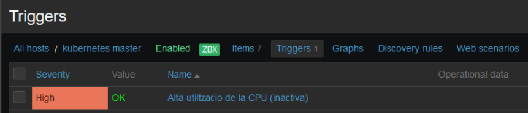

# Creació d'alertes dels parametres

## Com crear una alerta (trigger)
En aquest cas crearem la de `Alta utilització de la CPU`. Anem a `Configuration -> Hosts -> <host> -> Triggers -> Create trigger` i omplenem els camps obligatoris.

- Nom: Utiltzacio de la CPU (inactiva)
- Gravetat: Alta
- Expressió: `last(/kubernetes master/system.cpu.util[,idle])>95`

Una vegada creat, tornarem a la llista de triggers i podem veure si esta tot 'OK' o hi ha algun problema

## Creació de les altres alertes

### Comunes en ambdues maquines

#### Alta utilització de la memoria
- Nom: Utilitzacio de memoria
- Gravetat: Mitja
- Expressio: `last(/kubernetes master/vm.memory.size[available])>530`

#### Poc espai de disc disponible
- Nom: Espai de disc disponible
- Gravetat: Desastre
- Expressio: `last(/kubernetes master/vfs.fs.size[/,free])<2048`
  
#### Trafic d'entrada elevat
- Nom: Trafic entrant en un interval de 5 minuts
- Gravetat: Mitja
- Expressio: `avg(/kubernetes master/net.if.in[enp0s3],300)>100000000`

#### Trafic de sortida elevat
- Nom: Trafic sortitnt en un interval de 5 minuts
- Gravetat: Alerta
- Expressio: `avg(/kubernetes master/net.if.out[enp0s3],300)>50000000`

### Exclusives del node master

#### Estat de la API de Kubernetes no "ok"
- Nom: Estat de la API
- Gravetat: Desastre
- Expressio: `last(/kubernetes master/kube.api.status)<>"ok"`

#### Pocs pods en estat "Running"
- Nom: Pods en estat "Running"
- Gravetat: Alta
- Expressio: `last(/kubernetes master/count.running.pods)<6`

