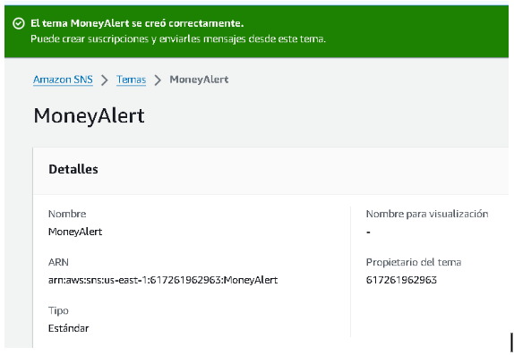
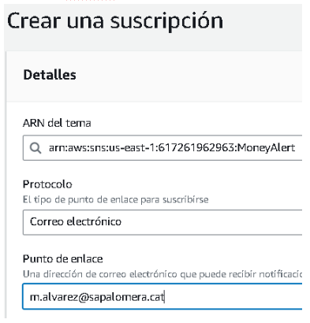
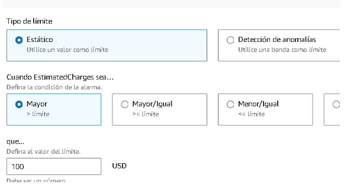
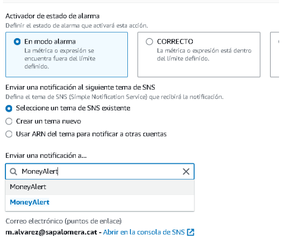

### Laboratori Amazon CloudWatch

1. Seleccionarem el servei de CloudWatch (Simple Notification Service) i li posarem primer de tot un nom.

Les primeres configuracions son:
  - Al panel de l'esquerra seleccionem "Temes" i creem un.(Un tema funciona com a canal de comunicació)
  - El tema sera Standard.
  - Li posarem un nom   
  

2. Ara ens haurem de subscriure al tema per podré rebre les notificacions.
  - Li donem a crear subscripció.
    - En ARN posarem el tema creat.
    - En protocol posarem només per correu electrònic.
    - Finalment, en punt d'enllaç posarem el correu que rebrà les notificacions   
  

3. Crearem una alarma amb CloudWatch
- Dins de CloudWatch en el pannel de l'esquerra anirem a Alarmes i creem una.
    - Seleccionarem l'unica opció de mètrica i després càrrec total estimat.
    - Despres posarem un limit estandard i la condició, en aquest cas que sigui mes gran de 100 dolars.   
  

4. Només faltara configurar les notificacions
- Ho deixarem en mode alarma
  - Deixarem l'opció de SNS existent i posem la nostra alarma   
  

5. Finalment, esperem al missatge d'alarma creada correctament i ja estarà configurada per rebre missatges.   
  
