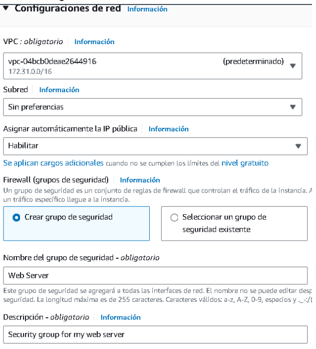

### Laboratori Amazon EC2

1. Seleccionarem el servei de EC2 i li posarem primer de tot un nom.   
  

2. Seleccionarem la ISO d'amazon Linux → Amazon Linux 2023 AMI x86_64 (HVM).   
  

3. Escollim el tipus d'instància, utilitzarem la més petita i amb menys costos.   
  

4. Hem de posar la clau, en aquest cas i amb la nostra llicència només podem utilitzar la predefinida.   
  

5. Configuració de xarxa   
  

6. Configuració d'emmagatzematge   
  

7. A l'apartat de detalls avançats es pot posar un script, posarem el següent per poder executar una instància on hi estarà un html.

Aquest script fa el següent:
- Actualitza el servidor.
- Instal·la un servidor web Apache. (HTTPS)
- Configura el servidor web perquè comenci automàticament durant l'arrencada.
- Activa el servidor web.
- Crea una pàgina web senzilla.   
  

8. Finalment, podrem donar a llançar instància i esperem el missatge de "tot correcte" i anem a veure totes les nostres instàncies.   
  

9. Ara tindrem la nostra instància en execució, la seleccionarem i anirem a detalls (Important agafar la IP Pública!!)   
  

10. Encara no podrem entrar al .html perquè per seguretat no podem, així que haurem d'anar a "Grups de seguretat."   
  

11. Dins la pràctica ens fa crear una regla de seguretat d'entrada perquè ho accepti tot per HTTP.   
  

12. Finalment, amb la regla de seguretat configurada podrem entrar dins de la pàgina amb la nostra instància EC2 creada.   
  
