#### Passos a seguir:

1. En el panell de navegació d’AWS entrarem al servei d'Amazon RDS.   
  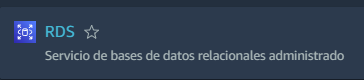
2. És molt important escollir la zona més pròxima a on estem i volem afegir els nostres serveis, nosaltres hem escollit Europa (París).   
  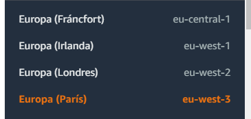
3. Dins del servei escollirem el botó de “Crear base de dades”.   
  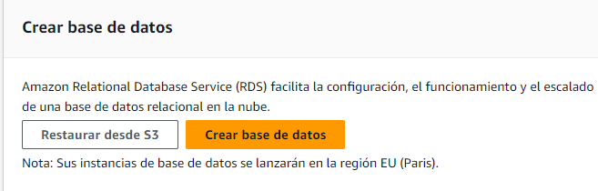
4. Ara estarem en la configuració de la BD, és important escollir “Creació estàndard” per poder configurar tot el que volem, després escollirem quin motor volem per la nostra BD.   
  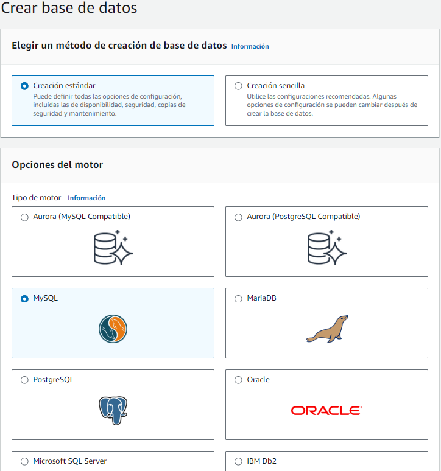
5. Seleccionem la versió del motor.   
  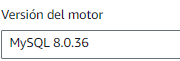
6. Com tenim un compte administrat per l'institut amb un límit de crèdits, escollirem la capa gratuïta que té els recursos mínims i gratis o menys costosos per la nostra BD.   
  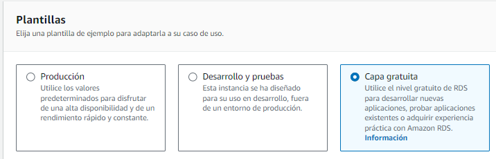
7. Posarem el nom de la BD, el nom de l'usuari administrador i la seva contrasenya, escollirem "autoadministrat" perquè sinó Amazon crea les seves credencials.   
  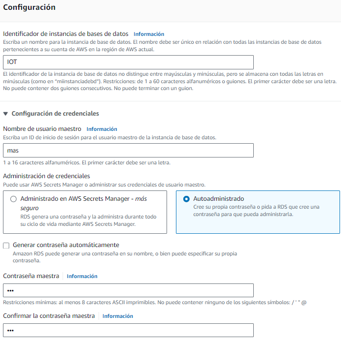
8. Com tenim la capa gratuïta només tenim per escollir el pla t3.micro on té: 2 CPU, 1 GiB de RAM amb 2085 Mbps de xarxa.   
  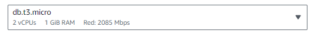
9. En emmagatzematge deixarem tot predeterminat, el volum és el millor i no necessitarem més de 20 GiB que és el mínim.

   En escalat podem posar fins on volem que escali si sobrepassa el nivell posat abans fins a un màxim de 6144 GB.   
  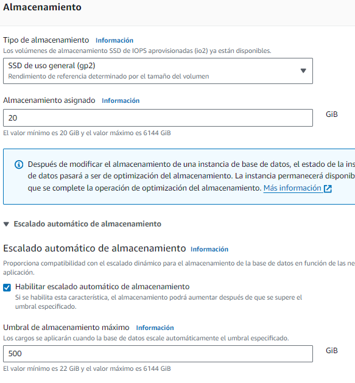
10. En connectivitat, no voldrem connectar al servei EC2 perquè només tenim la BD com a servei i en tipus de xarxa obtenir la IPV4, la VPC tindrem al default perquè no necessitem cap específica.

     Finalment, direm que volem accés públic per poder veure-la fora d'AWS.   
  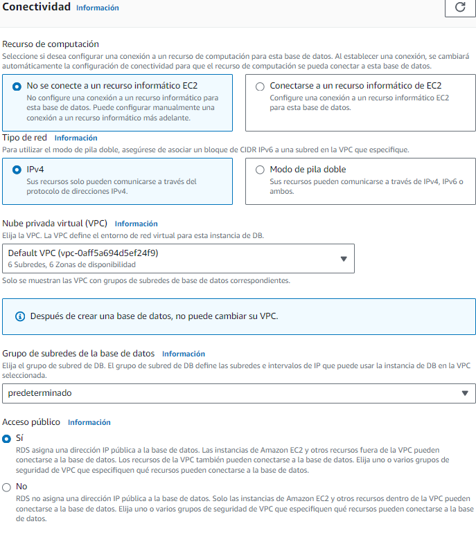
11. Habilitarem que es facin les còpies de seguretat automàticament.   
  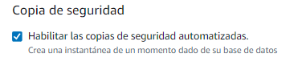
12. Finalment, donarem a crear BD i en el menú de base de dades podrem veure la nostra creada.

    Haurem d’esperar a que l'estat estigui en “Iniciat”.   
  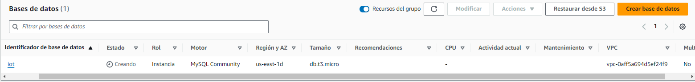
13. Entrem dins de la nostra BD i en connectivitat tindrem el punt d’enllaç i el seu port.   
  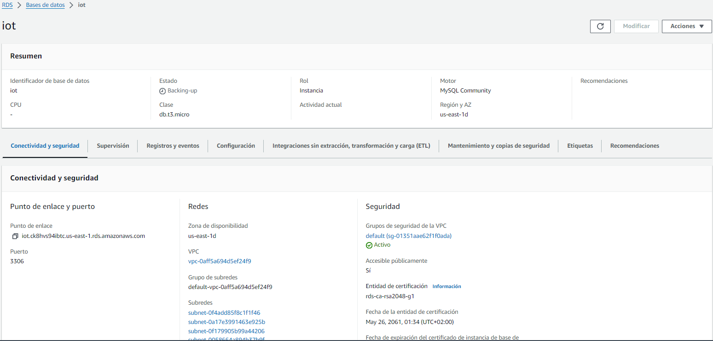
14. Utilitzarem l'eina Workbench per poder entrar a la nostra BD, haurem de copiar els valors esmentats abans i els posarem en Hostname i port, després omplirem el nom i contrasenya que hem posat en la configuració de la base de dades.   
  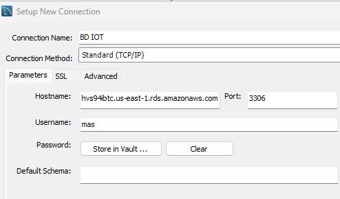
15. Ara dins farem un import del dump que hem fet de la base de dades del nostre servidor.   
  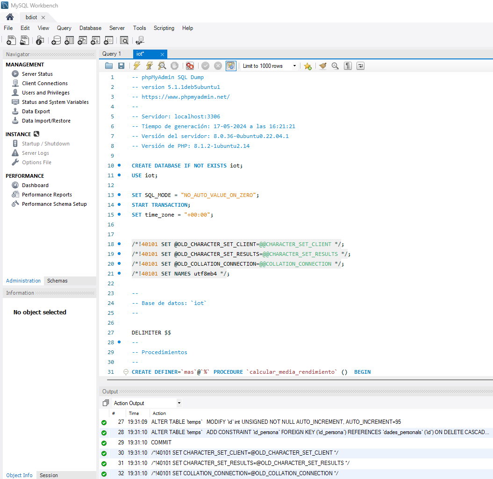
16. Hem de canviar l'arxiu PHP que fa la connexió des del PHP principal cap a la nostra base de dades on haurem de posar els valors que ens ha donat AWS, el hostname, l'usuari i la contrasenya.   
  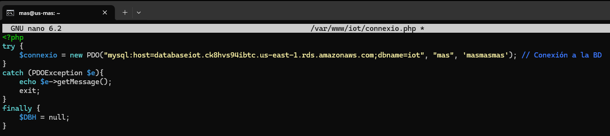
17. Resultat que funciona la inserció a la BD d'AWS.   
  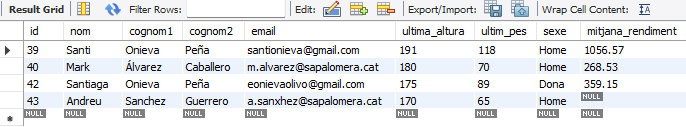
