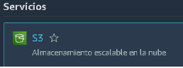
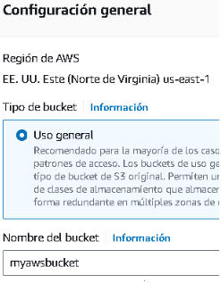
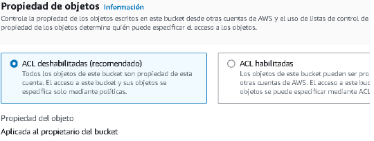
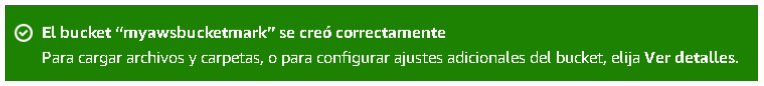
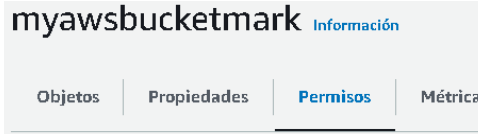
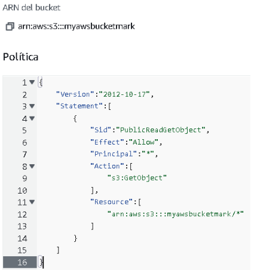
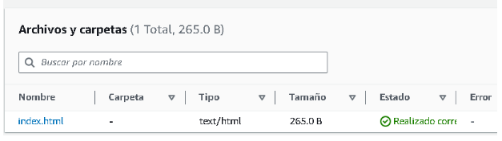
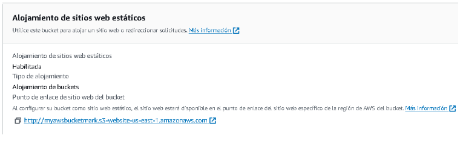
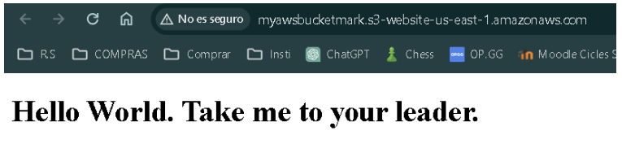

### Laboratori Amazon S3

1. Seleccionarem el servei de S3.   
  

2. Li donarem a crear bucket i li posarem un nom.   
  

3. En propietats d'objecte deixarem les ACL deshabilitades.   
  

4. Esperarem al missatge de confirmació de la creació del bucket.   
  

5. Ara anirem al panell de l'esquerra i seleccionarem buckets, dins anirem a dins del bucket creat anirem a permisos, a l'opció de política de bucket posarem el següent.   
     
  

7. En el menú del bucket seleccionarem a dalt l'opció de carregar arxius i li posarem un html senzill.   
  

8. Dins de propietats del bucket anirem a "allotjament de llocs web estàtics", donarem a editar i habilitarem l'opció que està dins i seleccionem l'arxiu .html. Després de tot això ens sortirà un enllaç, el copiem i el posem a Google.   
  

9. Finalment, estem a dins del bucket amb el html que hem pujat.   
  
