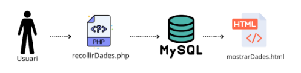

  

# Index

### Introducció
- [Context del Projecte](#context-del-projecte)
- [Descripció del projecte](#descripció-del-projecte)
- [Objectius del Projecte](#objectius-del-projecte)
- [Què és Amazon Web Services?](#què-és-amazon-web-services)
- [Com funciona Amazon Web Services?](#com-funciona-amazon-web-services)
- [Característiques principals d'Amazon Web Services](#característiques-principals-damazon-web-services)
- [Avantatges i Desavantatges d'Amazon Web Services](#avantatges-i-desavantatges-damazon-web-services)
- [Serveis d'Amazon Web Services](#serveis-damazon-web-services)
- [Quins serveis ens semblen més importants?](#quins-serveis-ens-semblen-més-importants)

### Desenvolupament del Projecte.
- [Laboratori Amazon EC2](#laboratori-amazon-ec2)
- [Laboratori Amazon CloudWatch](#laboratori-amazon-cloudwatch)
- [Laboratori Amazon S3](#laboratori-amazon-s3)
- [Procés d'implementació d'Amazon Web Services amb IOT](#procés-dimplementació-damazon-web-services-amb-iot)

### Notes del curs d'Amazon Web Services.
- [Notes](#notes)

### Conclusions
- [Resultats Obtinguts](#resultats-obtinguts)
- [Potencials Millores Futures](#potencials-millores-futures)
- [Conclusió final](#conclusió-final)

  

# INTRODUCCIÓ

## Context del projecte

Aquest projecte es desenvolupa en el marc d'una col·laboració amb una empresa de IoT que ens ha contractat per pujar les seves dades al núvol. Per assolir aquest objectiu, hem decidit formar-nos en tecnologies de computació en el núvol a través de tres cursos específics d'Amazon Web Services (AWS):

1. **Amazon Web Services Foundations**: Aquest curs introdueix els conceptes bàsics d'AWS, proporcionant una comprensió general dels serveis i la infraestructura d'AWS.
2. **Amazon Web Services Semester 1**: En aquest curs, s'aprofundeix en l'ús pràctic dels serveis d'AWS, incloent-hi configuració i administració de recursos en el núvol.
3. **Amazon Web Services Semester 2**: Aquest curs avança en temes més avançats i específics, com ara la seguretat, l'optimització de costos i les millors pràctiques en l'arquitectura de solucions en AWS.

L'objectiu era completar aquests cursos, prendre notes detallades i, finalment, implementar els coneixements adquirits en un projecte final. Aquest projecte final va servir com a prova de concepte per a una aplicació pràctica dins de la nostra organització, demostrant les habilitats adquirides i els beneficis de l'adopció de tecnologies de computació en el núvol.

## Descripció del projecte

En aquest projecte, el nostre equip ha estat encarregat del disseny, desenvolupament i implementació d'una base de dades IoT a Amazon Web Services (AWS) per a una empresa de IoT que ens ha contractat. Utilitzant els coneixements adquirits en els cursos d'Amazon Web Services Foundations, Amazon Web Services Semester 1 i Amazon Web Services Semester 2, hem creat una solució que millora significativament l'escalabilitat, la seguretat i l'eficiència de la gestió de dades.

Aquesta base de dades en el núvol està dissenyada per oferir una infraestructura robusta que permeti manejar grans volums de dades IoT en temps real, facilitant l'accés, l'anàlisi i la visualització de les dades de manera efectiva.

## Objectius del Projecte

### Desenvolupament de la Base de Dades IoT a AWS:

- Utilitzar Amazon Web Services per crear una base de dades en el núvol que compleixi amb els requisits tècnics i funcionals establerts per l'empresa de IoT.

### Optimització de l'Escalabilitat i Eficiència:

- Dissenyar una arquitectura que permeti escalar automàticament segons la demanda, assegurant un rendiment òptim en tot moment.

### Gestió Eficient de Dades:

- Implementar una estructura de dades clara i organitzada, facilitant l'accés i l'anàlisi de les dades IoT en temps real.

### Seguretat i Rendiment:

- Assegurar que la base de dades sigui segura i que el rendiment sigui òptim, mitjançant la implementació de mesures de seguretat avançades i configuracions específiques d'AWS.

## Què és Amazon Web Services?

Amazon Web Services (AWS) és una plataforma de serveis al núvol ofert per Amazon. En termes senzills, AWS proporciona una àmplia gamma de serveis tecnològics que permeten a les empreses i desenvolupadors construir i gestionar aplicacions i llocs web de manera més fàcil, ràpida i econòmica.

## Com funciona Amazon Web Services?

AWS funciona per regions, zones d'alta disponibilitat i ubicacions de vora, a continuació explicarem com es distribueix pel seu funcionament.

### Regió

Una regió és una àrea geogràfica àmplia que conté diverses zones de disponibilitat. Cada regió d'AWS és independent i està aïllada de les altres, cosa que ajuda a complir les normatives locals i proporciona redundància geogràfica.

**Funció:** Les regions permeten als usuaris emmagatzemar i processar dades a prop de la seva ubicació geogràfica, cosa que redueix la latència i assegura el compliment de regulacions de dades.

### Zones de Disponibilitat (Availability Zones - AZs)

Una zona de disponibilitat és una ubicació aïllada que allotja un o més centres de dades. Cada zona està connectada a les altres mitjançant enllaços de baixa latència.

**Funció:** Les zones de disponibilitat permeten als usuaris dissenyar aplicacions d'alta disponibilitat i tolerància a errors distribuint els seus recursos a través de múltiples zones. Això assegura que si una zona falla, les altres puguin mantenir l'operació dels serveis.

### Ubicacions de Vora (Edge Locations)

Són llocs ubicats a prop dels usuaris finals, dissenyats per emmagatzemar i lliurar contingut amb baixa latència. Les ubicacions de vora solen estar situades a prop de zones de gran població i trànsit.

**Funció:** Les ubicacions de vora permeten distribuir contingut als usuaris de manera ràpida i eficient des del punt més proper, millorant la velocitat i reduint la latència.

  

## Característiques principals d'Amazon Web Services
- Emmagatzematge de Dades: AWS ofereix serveis per emmagatzemar dades, com Amazon S3, que és com una gran prestatgeria virtual on es pots guardar qualsevol mena de fitxer i accedir-hi des de qualsevol lloc.
- Computació: Amb serveis com Amazon EC2, es pot llogar potents servidors virtuals per executar aplicacions, sense necessitat de comprar i mantenir servidors físics.
- Bases de dades: AWS proporciona serveis de bases de dades com Amazon RDS, que permeten emmagatzemar i gestionar dades de manera eficient i segura.
- Xarxes: Serveis com Amazon VPC permeten crear xarxes privades virtuals per protegir i controlar l'accés als recursos.
- Seguretat i Compliment: AWS té característiques de seguretat avançades per protegir les dades i complir normatives i regulacions.

## Avantatges i Desavantatges d'Amazon Web Services

  

## Serveis d'Amazon Web Services

   

## Quins serveis ens semblen més importants?

- Amazon EC2: Un servei web que ofereix capacitat de còmput escalable al núvol. S'ha de considerar com llogar un equip al núvol.

- Amazon EBS: Emmagatzematge per a instàncies EC2 específiques. S'ha de considerar com la unitat d'emmagatzematge d'una instància EC2.

- Amazon RDS: Això permet als desenvolupadors crear i administrar bases de dades relacionals al núvol. 

- Amazon VPC: Un servei que proporciona una xarxa virtual dedicada al compte d'AWS. Aquesta infraestructura està aïllada lògicament d'altres xarxes virtuals del núvol d'AWS. Tots els serveis d'AWS es poden llançar des d'una VPC. Serveix per protegir les dades i administrar qui pot accedir a la xarxa.

- AWS Identity and Access Management (IAM): Implica el control dels usuaris que necessitin accedir a recursos informàtics.

- AWS CloudTrial: Monitoritza totes les accions que es fan al compte d'AWS per motius de seguretat.

- Amazon CloudWatch: CloudWatch és un servei de supervisió per monitoritzar els recursos d'AWS i les aplicacions que executa a AWS.

- AWS Shield: Servei de protecció contra DDoS administrat que protegeix les aplicacions que s'executen en Amazon Web Services (AWS).

- AWS WAF: Servei que li dona control sobre el tràfic que permet o bloqueja en les seves aplicacions web mitjançant la definició de regles de seguretat web personalitzables.

  

# Desenvolupament del Projecte

Gràcies als cursos d'Amazon Web Services, hem pogut conèixer l'entorn i practicar amb diferents serveis i eines com: Amazon EC2, Amazon S3, Amazon CloudFront, Amazon CloudWatch, Amazon RDS, Elastic Load Balancing, calcular els costos d'AWS, Amazon Lambda, AutoScaling i les eines d'IA per als diferents serveis.

Amb tot això, explicarem un total de tres serveis fàcils d'entendre, explicats pas a pas amb el seu resultat final.

## Laboratori Amazon EC2

Què és Amazon EC2?

L'ús d'Amazon EC2 redueix els costos de maquinari perquè pugui desenvolupar i implementar aplicacions amb més rapidesa. Es pot utilitzar Amazon EC2 per llançar tants servidors virtuals com es necessitin, configurar la seguretat i les xarxes, i administrar l'emmagatzematge.

**[Prem aquí per viatjar al laboratori del servei d'Amazon EC2](./Laboratoris/Amazon_EC2.md)**

## Laboratori Amazon CloudWatch

Què és Amazon CloudWatch?

Amazon CloudWatch és una eina per poder monitoritzar els recursos i les aplicacions que s'executen a AWS.

**[Prem aquí per viatjar al laboratori del servei d'Amazon CloudWatch](./Laboratoris/Amazon_CW.md)**

## Laboratori Amazon S3

Què és Amazon S3?

Amazon S3 (Simple Storage Service) és un servei d'emmagatzematge al núvol ofert per Amazon Web Services (AWS). Està dissenyat per emmagatzemar i recuperar qualsevol quantitat de dades des de qualsevol lloc a la web, proporcionant una infraestructura altament escalable, duradora i segura.

**[Prem aquí per viatjar al laboratori del servei d'Amazon S3](./Laboratoris/Amazon_S3.md)**

## Procés d'implementació d'Amazon Web Services amb IOT

Hem aprofitat el projecte d'AWS per unir-ho amb el projecte de IOT, el nostre projecte de IOT utilitzem l'aplicació web app inventor amb els sensors del nostre telèfon mòbil per poder millorar el rendiment de la persona que l'utilitza.

### Què hem fet perquè funcioni a AWS?
En el nostre projecte hem fet un dump de la nostra base de dades creada al servidor de proves i hem creat la base de dades a AWS amb el servei d'Amazon RDS, hem connectat l'aplicació App Inventor, AWS i el nostre servidor perquè sigui funcional.

**[Prem aquí per viatjar al projecte d'IOT amb AWS](./Laboratoris/Amazon_IOT.md)**

# Notes

**[Prem aquí per viatjar a veure les notes dels cursos](./Laboratoris/Notes.md)**

# Conclusions

## Resultats obtinguts
Al llarg del projecte, hem aconseguit implementar de manera efectiva una base de dades IoT utilitzant Amazon Web Services (AWS). Hem adquirit i aplicat coneixements dels tres cursos d'AWS, cobrint des dels fonaments fins a temes avançats com la seguretat i l'optimització de costos. Els resultats més destacats són els següents:

- Escalabilitat: Hem dissenyat una arquitectura que pot escalar automàticament segons la demanda, assegurant que la nostra solució pot manejar grans volums de dades IoT sense comprometre el rendiment.
- Seguretat: Hem implementat mesures de seguretat avançades, garantint la protecció de les dades i el compliment de les normatives.
- Eficiència: La gestió eficient de les dades ha permès una anàlisi i visualització més ràpida, facilitant la presa de decisions.
- Integració: Hem aconseguit integrar l'aplicació IoT amb AWS, permetent una transmissió fluida de dades des dels sensors fins a la base de dades al núvol.

## Potencials Millores Futures
Tot i els èxits aconseguits, hi ha diverses àrees on podríem millorar:

- Optimització de Costos: Continuar explorant i aplicant estratègies per reduir els costos operacionals, com ara l'ús de plans de pagament més ajustats a les nostres necessitats.
- Automatització de Processos: Desenvolupar scripts i eines per automatitzar tasques repetitives, com ara la configuració de seguretat i la gestió d'infraestructures.
- Anàlisi de Dades Avançada: Integrar serveis d'IA i machine learning d'AWS per obtenir insights més profunds i prediccions a partir de les dades recollides.
- Ampliació de Funcionalitats: Afegir nous serveis i funcionalitats que puguin aportar més valor al projecte, com ara serveis de monitorització avançada i notificacions en temps real.

## Conclusió final

El projecte ha estat una experiència molt valuosa i enriquidora. No només hem aconseguit implementar una solució robusta per a la gestió de dades IoT, sinó que també hem après molt sobre les capacitats i serveis que ofereix AWS. Hem pogut veure com l'ús de la computació al núvol pot transformar i millorar la manera en què gestionem i analitzem les dades.

Els objectius inicials s'han complert amb èxit i el projecte ha establert una bona base per a futures solucions i millores. La flexibilitat, escalabilitat i seguretat d'AWS han estat claus per aconseguir els resultats que esperàvem, demostrant que aquesta plataforma és molt útil per a qualsevol empresa que vulgui adoptar tecnologies al núvol.
