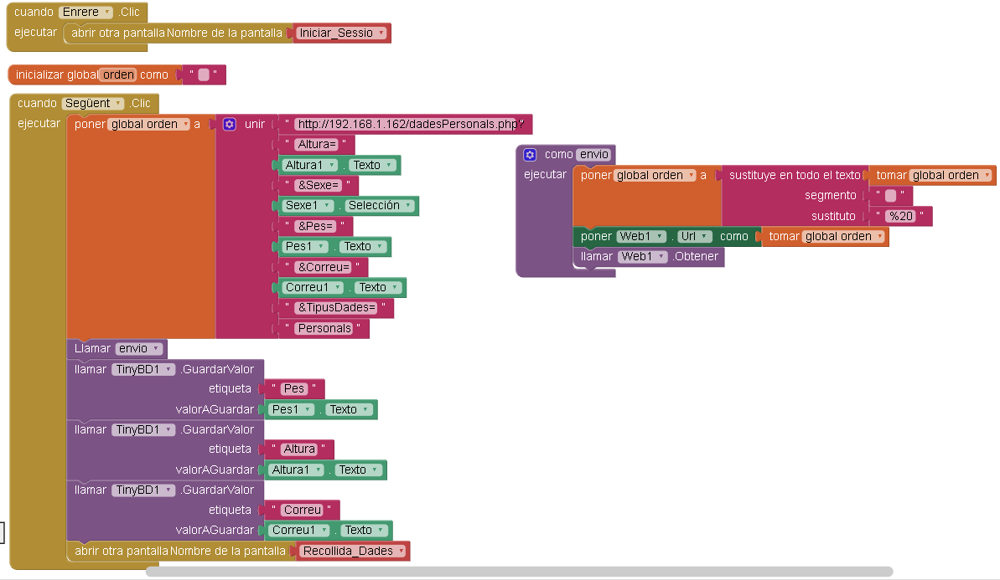

## Dades_Personals2

   

### Que pasa quant fas click a Enrere?
Si dona clic a "Enrere" tornarà a Iniciar_Sessio

### Inicialització
Inicialitza una variable global anomenada "orden" buida.

### Que pasa quant fas click a Següent?
Es construeix un URL amb les dades d'entrada que tenen: Altura, Sexe, Pes i Correu amb tipus de dades "Personals".
La variable creada abans anomenada "orden" posarem l'URL creada.

Posteriorment, crida a la funció "Envio" on substitueix els espais en blanc en l'URL pel codi "%20", després agafa la propietat de l'URL d'un component WEB1 amb el valor de la variable global "orden" i fa una sol·licitud HTTP GET a l'URL establerta.

### Emmagatzematge
Després de cridar al procediment "envio", guarda els valors ingressats de: Altura, Sexe, Pes i Correu en la BD TinyDB amb les etiquetes "Pes", "Altura" y "Correu" respectivament.
