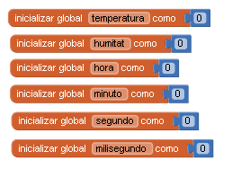
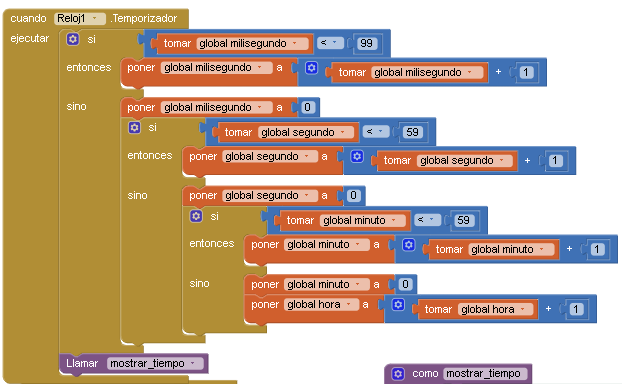
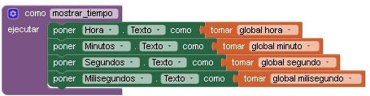
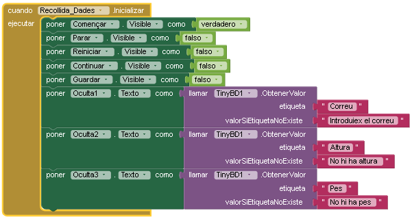
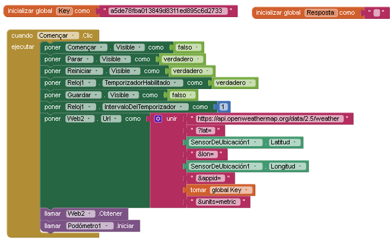
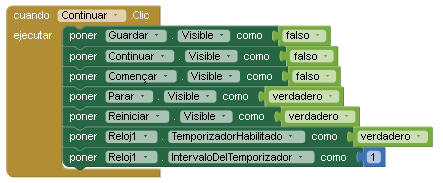
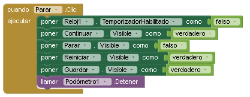
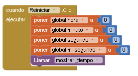
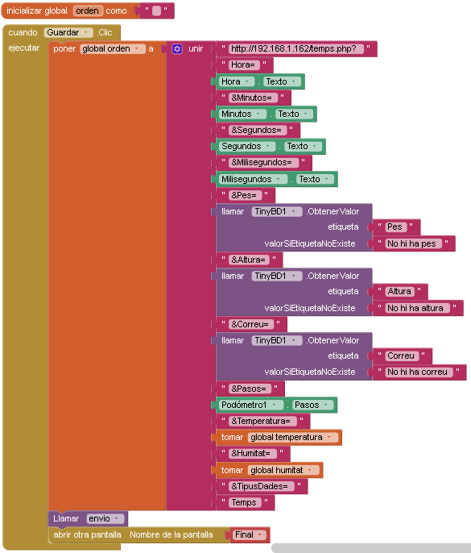
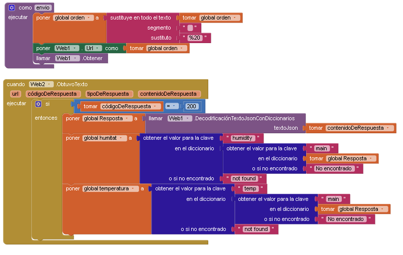

## Recollida_Dades

### Inicialització
Inicialitzem una variable global anomenada "temperatura" amb valor 0.

Inicialitzem una variable global anomenada "humitat" amb valor 0.

Inicialitzem una variable global anomenada "hora" amb valor 0.

Inicialitzem una variable global anomenada "minuto" amb valor 0.

Inicialitzem una variable global anomenada "segundo" amb valor 0.

Inicialitzem una variable global anomenada "milisegundo" amb valor 0.

   

### Inicialitzador "Reloj1"

Incrementa mil·lisegons, quan passa de 100 sumarà 1 als segons.

Incrementa els segons, quan passa de 60 sumarà 1 als minuts.

Incrementa els minuts, quan passa de 60 sumarà 1 a les hores.

   

#### Mostrar temps:

Actualitza els camps de les variables: global hora, global minuto, global segundo i global milisegundo.

   

### Inicialitzador Recollida_Dades

A l'inicialitzar, es configuren els botons de la interfície: Començar (visible), Parar (invisible), Reiniciar (invisible), Continuar (invisible), Guardar (invisible).

   

### Botons:
#### Començar:
S'amaga el botó de "Començar".

Es mostra el botó "Parar".

Es mostra el botó "Reiniciar".

Es configura l'URL per obtenir dades del clima, agafant la latitud i altitud del sensor d'ubicació (SensorDeUbicación1), tot junt amb la clau API emmagatzemada en la variable global Key.

Es crida a la funció Web2. Obtener per obtenir les dades de l'URL configurada. Es crida a la funció Podómetro1. Iniciar per començar el podòmetre

   

#### Continuar:
S'amaga el botó de "Guardar".

S'amaga el botó de "Continuar".

Es mostra el botó "Parar".

Es mostra el botó "Reiniciar".

   

#### Parar:

S'amaga el botó de "Parar".

Es mostra el botó "Reiniciar".

Es mostra el botó "Continuar".

Es mostra el botó "Guardar".

   

#### Reiniciar:

En fer clic es reinicien les variables globals: global hora, global minuto, global segundo i global milisegundo a 0.

   

#### Guardar
En prémer guardar, agafa les variables: milisegundos, segundos, minutos, horas, pes, altura, correu, pasos, temperatura, humitat i construeix l'URL per enviar al .PHP guardat en la variable "orden" i crida a Web1 i ho envia.

   

   
