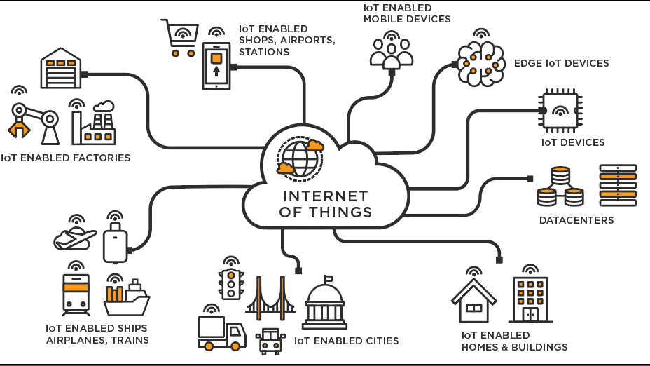

  

# Index

### Introducció
- [Context del Projecte](#context-del-projecte)
- [Descripció del projecte](#descripció-del-projecte)
- [Objectius del Projecte](#objectius-del-projecte)
- [Què és Internet of things?](#què-és-internet-of-things)
- [Característiques i com funciona IoT?](#característiques-i-com-funciona-iot)
- [Avantatges i Desavantatges d'IOT](#avantatges-i-desavantatges-diot)

### Desenvolupament del Projecte.
- [Especificacions del projecte](#especificacions-del-projecte)
- [Procés de recollida de dades](#procés-de-recollida-de-dades)

### Conclusions
- [Resultats Obtinguts](#resultats-obtinguts)
- [Potencials Millores Futures](#potencials-millores-futures)
- [Conclusió final](#conclusió-final)

  

# INTRODUCCIÓ

## Context del projecte

En el context del nostre projecte de final de curs d'informàtica, hem decidit desenvolupar un projecte d'Internet de les Coses (IoT) amb l'objectiu de millorar el rendiment físic dels usuaris mitjançant la recopilació i l'anàlisi de dades provinents de diversos sensors instal·lats al telèfon. El projecte està dissenyat per una empresa que vol captar dades de podòmetres, termòmetres, higròmetres i GPS per crear plans d'entrenament personalitzats. Aquestes dades seran recollides i processades per oferir una avaluació detallada del rendiment físic dels usuaris, contribuint així a la seva millora contínua.

## Descripció del projecte

El projecte d'IoT consisteix en la integració de diversos sensors per recollir dades físiques i ambientals dels usuaris. A través de l'ús d'una aplicació mòbil creada amb AppInventor, els usuaris poden introduir les seves dades personals, com ara el nom, cognoms, correu electrònic, pes, altura i sexe. Aquestes dades es complementen amb la informació recollida dels sensors, com el temps trigat en fer un quilòmetre. Totes aquestes dades es guarden en una base de dades MySQL, la qual permetrà un seguiment continu de l'evolució física dels usuaris. La informació recollida s'analitza mitjançant una fórmula específica que determina l'estat físic de l'usuari i genera un pla d'entrenament personalitzat.

## Objectius del Projecte

L'objectiu principal del projecte és registrar una sèrie de dades físiques dels usuaris per manipular-les i extreure conclusions que permetin crear plans d'entrenament personalitzats. A través d'aquest procés, es busca:

1. **Recollir Dades Precises:** Captar dades acurades de diferents sensors per tenir una imatge completa de l'estat físic de l'usuari.
2. **Analitzar i Avaluar:** Utilitzar una fórmula específica per avaluar el rendiment físic de l'usuari basant-se en les dades recollides.
3. **Crear Plans d'Entrenament:** Desenvolupar plans d'entrenament adaptats a les necessitats i capacitats individuals de cada usuari, amb l'objectiu de millorar el seu estat físic i rendiment atlètic.
4. **Fer un Seguiment Continu:** Guardar les dades en una base de dades per permetre un seguiment continu i una anàlisi de l'evolució física dels usuaris al llarg del temps.
5. **Proporcionar Retroalimentació:** Oferir informació detallada sobre els resultats i comparatives amb actuacions anteriors per ajudar els usuaris a entendre el seu progrés i ajustar les seves rutines d'exercici en conseqüència.

## Què és Internet of things?

L'Internet de les Coses, conegut com a IoT (Internet of Things), és un concepte que fa referència a la interconnexió digital d'objectes quotidians amb Internet. Aquests objectes, que poden ser des de dispositius electrònics fins a sensors i electrodomèstics, estan equipats amb tecnologia que els permet recopilar, enviar i rebre dades a través de la xarxa.

## Característiques i com funciona IoT

Els dispositius IoT incorporen sensors que recullen dades del seu entorn. Aquestes dades es transmeten a través d'una xarxa, com Internet, a un sistema centralitzat que les processa i analitza. A partir d'aquest anàlisi, es poden prendre decisions automatitzades o generar informació útil per als usuaris. 

### Components clau d'un sistema IoT:
1. **Sensors i Dispositius:** Recullen dades específiques del seu entorn (temperatura, humitat, moviment, etc.).
2. **Connectivitat:** Mitjans per transmetre les dades recollides, com ara Wi-Fi, Bluetooth, xarxes mòbils o protocols especialitzats com MQTT.
3. **Processament de Dades:** Unitat central que rep les dades dels sensors, les processa i les analitza.
4. **Interfície d'Usuari:** Plataforma o aplicació que permet als usuaris interactuar amb el sistema IoT i obtenir informació útil.

## Avantatges i Desavantatges d'IOT

  
# Desenvolupament del Projecte

## Especificacions del projecte
### Quines dades hem agafat de l'usuari?

En el nostre projecte hem agafat les dades personals: nom, cognoms, correu, pes, altura, sexe i temps trigat per fer 1 km

### Quins sensors hem utilitzar i perquè?

Hem utilitzat els sensors de: podòmetre, termòmetre, higròmetre i gps. Tots aquests sensors han estat agafats del mateix movil o de diferents APIs que es connecten per agafar les dades d'un altre lloc, tot això amb el resultat de tindre totes les dades per aconseguir els resultats i les condicions de la persona per examinar el seu rendiment.

## Procés de recollida de dades

Començament amb l'arxiu Iniciar_sessio:

**[Prem aquí per viatjar a l'arxiu d'Iniciar_sessio](./Passos/Iniciar_Sessio.md)**

   
1. Recol·lecció de Dades Inicials: 
L’usuari al començar en la nostra aplicació hi estara a l'arxiu Iniciar_Sessio i tindrà una pregunta: “Ets un usuari nou?” segons la seva selecció redirigira a diferents pàgines.

2. Recol·lecció de Dades específiques: 
L’usuari estará ja registrar a la nostra BBDD i ara li demanarem les dades personals que necessitarem per fer els nostres càlculs(pes, altura, sexe)

3. Procés de cronometratge:
L’usuari amb totes les seves dades ja registrades estara preparat per poder fer el quilòmetre, a la pantalla sortirà un cronòmetre el qual s'utilitza per registrar el temps que triga en fer la distancia, finalment ens envia la seva marca trigada en fer el quilòmetre.

4. Pregunta final:
L'usuari al acabar la carrera i enviar els resultats tindra l'opció de fer mes carreres, si diu que si es redirigira a l'usuari a Dades_Personals2 si dius que no es tencara la carrera

5. Resultats finals:
Finalment, l'usuari rebrà informació detallada sobre els seus resultats, incloent-hi comparatives amb les seves actuacions anteriors. Aquesta retroalimentació permetrà a l'usuari entendre el seu progrés i ajustar les seves rutines d'exercici en conseqüència.

   
   
   

# Conclusions

## Resultats obtinguts

Després d'implementar i testar el nostre projecte IoT, hem aconseguit els següents resultats:

1. Recollida Eficient de Dades: Els sensors han recollit dades de manera precisa i contínua, permetent una visió detallada de les condicions físiques i ambientals dels usuaris.
2. Avaluació Precisa: La fórmula desenvolupada per avaluar el rendiment físic ha proporcionat resultats coherents i fiables, permetent crear plans d'entrenament personalitzats efectius.
3. Interacció amb l'Usuari: L'aplicació mòbil ha estat ben rebuda pels usuaris, mostrant-se intuïtiva i fàcil d'utilitzar.
4. Base de Dades Fiable: La base de dades MySQL ha funcionat correctament, emmagatzemant grans volums de dades de manera segura i accessible.

## Potencials Millores Futures

Com a millores principals, implementarem el mètode de PHPMailer dins del nostre codi PHP per poder enviar automàticament les dades obtingudes als usuaris, comparant-les amb les dades antigues. Actualment, disposem d'una sèrie de gràfics que els nostres especialistes analitzen, i posteriorment s'envien els resultats als usuaris. L'objectiu seria automatitzar aquest procés perquè PHPMailer obtingui les dades de la base de dades i les compari amb les últimes dades registrades per veure les possibles millores. Aquest canvi permetria una retroalimentació més ràpida i eficient, millorant l'experiència de l'usuari i oferint una visió contínua del seu progrés.

## Conclusió final

En resum, el nostre projecte d'Internet de les Coses ha demostrat ser una eina efectiva per a la millora del rendiment físic dels usuaris mitjançant la recopilació i anàlisi de dades. Hem integrat diversos sensors que proporcionen informació precisa i contínua sobre les condicions físiques i ambientals, i hem desenvolupat una aplicació mòbil intuïtiva que facilita la interacció dels usuaris amb el sistema.

Els resultats obtinguts han estat positius, destacant la precisió en la recollida de dades, l'avaluació fiable del rendiment físic, i l'acceptació favorable de l'aplicació per part dels usuaris. La nostra base de dades MySQL ha demostrat ser una solució fiable per l'emmagatzematge segur i accessible de grans volums de dades.

En conclusió, el projecte no només ha complert els objectius inicials, sinó que també ha obert noves vies per a futures innovacions en la monitorització i millora del rendiment físic mitjançant tecnologies IoT. Aquesta experiència ha estat valuosa per comprendre les capacitats i els reptes associats amb les tecnologies IoT en l'àmbit de la salut i el benestar, i ens anima a continuar explorant noves oportunitats en aquest camp.
