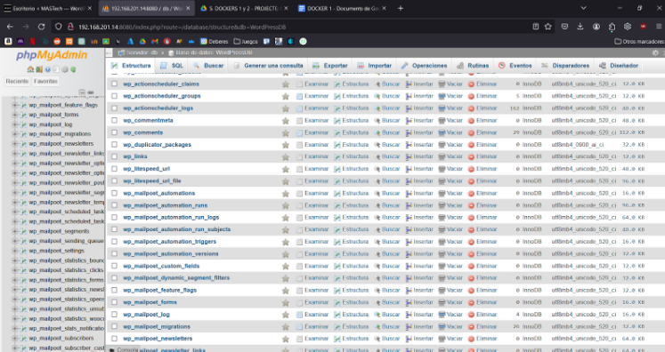

## Inicialització

1. Executem el nostre .yaml per crear i iniciar el nostre contenidor
   
   
Aquesta configuració permetrà als usuaris desenvolupar, desplegar i gestionar fàcilment un lloc web WordPress complet, incloent-hi tant el servidor web com la base de dades, i també proporcionarà una eina d'administració amigable per a la base de dades mitjançant phpMyAdmin.

2. Utilitzem  la comanda "docker ps -a" per poder veure els contenidors en execució

   

3. Agafem la nostra IP

   

4. Entrem dins del nostre WordPress amb la IP i el port configurat dins del .yaml

   

## Importació del Wordpress
Amb tot això tindrem un WordPress desplegat amb Docker, ara agafarem la informació del nostre Docker creat i la migrarem a aquest.

5. Primer de tot haurem de fer la còpia de seguretat, per això utilitzarem el Plugin "All in One Migration" per poder exportar tot el contingut del nostre lloc, incloent-hi la base de dades, fitxers, connectors, temes i configuracions.

   

Amb tot això anirem al WordPress creat dins del contenidor i haurem de fer una petita configuració perquè accepti arxius de més mida de 2 MB que és la capacitat màxima que per defecte té per raons de seguretat i rendiment.

6. Per tot això cal modificar la configuració de l'arxiu .htaccess i posar el següent:

   

7. Després haurem de descarregar el mateix plugin pel WordPress del contenidor i arrossegar la copa de seguretat.

   

8. Imatge del WordPress  i la BD importada.

   
   
