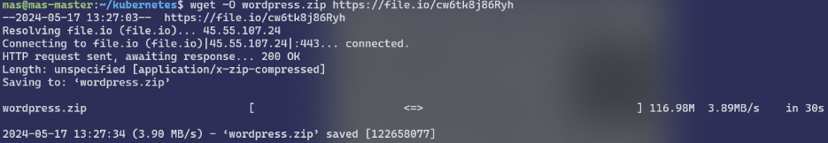

1. Agafem el dump de la BD guardat en l'instal·lació de Kubernetes i el passem al node Màster.
```bash
scp -P 2222 "G:\Unidades compartidas\PROJECTE\5. DOCKER\NO BORRAR\db.sql" mas@localhost:/home/mas/kubernetes
```

2. Descarreguem el .zip on tenim tots els arxius del projecte de Webs2-WordPress i el descomprimim
```bash
wget -O wordpress.zip https://file.io/cw6tk8j86Ryh
```
```bash
unzip wordpress.zip
```
 <br><br>

3. Ara creem dos arxius per servei, un pel mateix servei i un altre pel desplegament. En el cas de MySQL seran tres perquè necessitem un volum persistent.
- MYSQL-VOLUM
```yaml
apiVersion: v1
kind: PersistentVolume
metadata:
  name: mysql-pv-volume
  labels:
    type: local
spec:
  storageClassName: manual
  capacity:
    storage: 20Gi
  accessModes:
    - ReadWriteOnce
  hostPath:
    path: "/mnt/data"

---

apiVersion: v1
kind: PersistentVolumeClaim
metadata:
  name: mysql-pv-claim
spec:
  storageClassName: manual
  accessModes:
    - ReadWriteOnce
  resources:
    requests:
  	storage: 20Gi
```

- MYSQL-SERVEI
```yaml
apiVersion: v1
kind: Service
metadata:
  name: mysql
spec:
  ports:
    -port: 3336
    targetPort: 3306
  selector:
    app: mysql
```

- MYSQL-DESPLEGAMENT
```yaml
  apiVersion: apps/v1
  kind: Deployment
  metadata:
    name: mysql
  spec:
  replicas: 1
  selector:
    matchLabels:
    app: mysql
  template:
    metadata:
    labels:
    app: mysql
    spec:
    initContainers:
      - name: fetch
        image: andriykalashnykov/wget:1.0
        imagePullPolicy: IfNotPresent
        command: ["wget","https://drive.google.com/uc?export=download\\&id=1bqUdtuUn7wJrFjmTHmvFXBWL_a09Xu0a","-O","/docker-entrypoint-initdb.d/dump.sql"]
        volumeMounts:
          - mountPath: /docker-entrypoint-initdb.d
            name: dump
    containers:
      - name: mysql
        image: mysql:8
        env:
          - name: MYSQL_ROOT_PASSWORD
            value: mas
          - name: MYSQL_DATABASE
            value: WordPressDB
          - name: MYSQL_USER
            value: admin
          - name: MYSQL_PASSWORD
            value: mas
        ports:
          - containerPort: 3306
            name: mysql
        volumeMounts:
          - name: mysql-data
            mountPath: /var/lib/mysql
          - name: dump
            mountPath: /docker-entrypoint-initdb.d
    volumes:
      - name: dump
        emptyDir: {}
      - name: mysql-data
        persistentVolumeClaim:
          claimName: mysql-pv-claim
```

- PHPMYADMIN-SERVEI
```yaml
apiVersion: v1
kind: Service
metadata:
  name: phpmyadmin
spec:
  type: NodePort
  ports:
  - targetPort: 80
  	port: 8080
  	nodePort: 32032
  	protocol: TCP
  selector:
    app: phpmyadmin
```

- PHPMYADMIN-DESPLEGAMENT
```yaml
apiVersion: apps/v1
kind: Deployment
metadata:
  name: phpmyadmin
spec:
  replicas: 1
  selector:
    matchLabels:
  	app: phpmyadmin
  template:
    metadata:
  	labels:
    	app: phpmyadmin
  spec:
  	containers:
    	- name: phpmyadmin
      	image: phpmyadmin/phpmyadmin:latest
      	env:
        	- name: PMA_HOST
          	value: mysql:3336
        	- name: PMA_USER
          	value: admin
        	- name: PMA_PASSWORD
          	value: mas
      	ports:
        	- containerPort: 80

```

- WORDPRESS-SERVEI
```yaml
apiVersion: v1
kind: Service
metadata:
  name: wordpress
spec:
  type: NodePort
  ports:
  - targetPort: 80
  	port: 8888
  	nodePort: 32031
  	protocol: TCP
  selector:
  app: wordpress
```

- WORDPRESS-DESPLEGAMENT
```yaml
apiVersion: apps/v1
kind: Deployment
metadata:
  name: wordpress
spec:
  replicas: 4
  selector:
  matchLabels:
  	app: wordpress
  template:
  metadata:
  	labels:
    	app: wordpress
  spec:
  	containers:
    	- name: wordpress
      	image: wordpress:latest
      	env:
        	- name: WORDPRESS_DB_HOST
          	value: mysql:3336
        	- name: WORDPRESS_DB_USER
          	value: admin
        	- name: WORDPRESS_DB_PASSWORD
          	value: mas
        	- name: WORDPRESS_DB_NAME
          	value: WordPressDB
      	ports:
        	- containerPort: 80
      	volumeMounts:
        	- name: wordpress-data
          	mountPath: /var/www/html
  	volumes:
    	- name: wordpress-data
      	hostPath:
        	path: /home/mas/kubernetes/wordpress
        	type: Directory
```

4. Estructura de fitxers
```bash
kubernetes/
├── db.sql
├── mysql-deployment.yaml
├── mysql-service.yaml
├── mysql-volume.yaml
├── phpmyadmin-deployment.yaml
├── phpmyadmin-service.yaml
├── wordpress/
├── wordpress-deployment.yaml
├── wordpress-service.yaml
└── wordpress.zip
```

5. Apliquem els fitxers al clúster per desplegar els serveis
- Mysql
```bash
kubectl apply -f mysql-service.yaml,mysql-volume.yaml,mysql-deployment.yaml
```

- PhpMyAdmin
```bash
kubectl apply -f phpmyadmin-deployment.yaml,phpmyadmin-service.yaml
```

- WordPress
```bash
kubectl apply -f wordpress-deployment.yaml,wordpress-service.yaml
```

6. Amb una màquina dins de la mateixa xarxa posarem la IP del node Màster i el port especificat en la secció nodePort de l'arxiu WordPress-service.

 <br><br>
