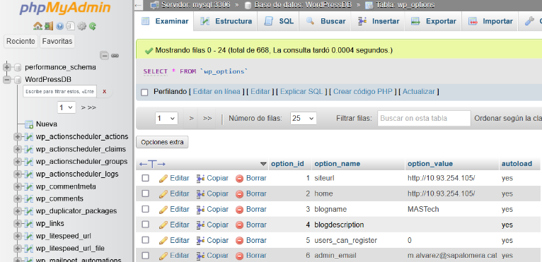
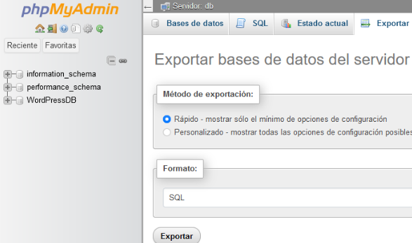

1. Configuració del HAProxy per la nostra pàgina web → haproxy.cfg
```bash
defaults
  mode http
  balance roundrobin

frontend webs
  bind :80
  default_backend nodes

backend nodes
  server mas1 192.168.1.1:8080 check
  server mas2 192.168.1.101:8080 check
```

2. Canviarem dins de la taula wp_options les variables "siteurl" i "home" de la BD, haurem de posar la IP la qual accedirem al WordPress

 <br><br>

3. Exportem la BD

 <br><br>

4. Enviem l'arxiu .sql amb l'exportació al node Mànager amb la comanda scp
```bash
scp C:\Users\eonie\Downloads\db.sql mas@192.168.1.134:/home/mas/docker
```

5. Com a mesura de seguretat guardarem tots els arxius del contenidor de WordPress al nostre PC per tindre una còpia de seguretat amb la comanda scp
```bash
scp -r <usuari>@<ip>:  <ruta_del_contenidor> <ruta_del_nostre_pc>
```
```bash
scp -r root@192.168.201.14:/var/lib/docker/volumes/docker_wordpressVol/_data/* "C:\Users\eonie\Downloads\wordpress"
```

6. Guardem l'arxiu en .zip per ser més manejable

7. Ara enviarem el .zip de la informació del contenidor de WordPress al nostre node Mànager
```bash
scp -r <ruta_de_l'arxiu_en_el_pc> <usuari>@<ip>:<ruta_on_deixar_el_contenidor> 
```
```bash
scp -r "C:\Users\eonie\Downloads\wordpress.zip" mas@192.168.1.134:/home/mas/docker/
```

8. Afegim etiqueta als nostres nodes
```bash
docker node update mas-swarmanager --label-add serveis=wordpress mas-swarmanager
```
```bash
docker node update mas-swarmworker1 --label-add serveis=wordpress mas-swarmworker1
```

9. Arxiu del docker-compose.yaml
- Serveis
```yaml
mysql:
  image: mysql:8
  environment:
    MYSQL_ROOT_PASSWORD: mas
    MYSQL_DATABASE: WordPressDB
    MYSQL_USER: admin
    MYSQL_PASSWORD: mas
  networks:
    - backend
  deploy:
    replicas: 1
    placement:
      constraints:
        - node.role == manager
  volumes:
    - /home/mas/docker/db.sql:/docker-entrypoint-initdb.d/db.sql
    - mysql_data:/var/lib/mysql
wordpress:
  depends_on:
    - mysql
    - haproxy
  image: wordpress:latest
  environment:
    WORDPRESS_DB_HOST: mysql:3306
    WORDPRESS_DB_USER: admin
    WORDPRESS_DB_PASSWORD: mas
    WORDPRESS_DB_NAME: WordPressDB
  networks:
    - backend
  ports:
    - "8000:80"
  volumes:
    - /home/mas/docker/wordpress:/var/ww/html
  deploy:
    replicas: 4
    placement:
      constraints:
        - node.labels.serveis == wordpress
phpmyadmin:
  image: phpmyadmin/phpmyadmin:latest
  environment:
    PMA_HOST: mysql:3306
    PMA_USER: admin
    PMA_PASSWORD: mas
  networks:
    - backend
  ports:
    - "8080:80"
  deploy:
    replicas: 1
    placement:
      constraints:
        - node.role == manager
```

- Xarxa, configuracions i volums
```yaml
networks:
  frontend:
  backend:

configs:
  haproxy.cfg:
    file: ./haproxy.cfg

volumes:
  mysql_data:
```

10. Utilitzem la comanda docker stack, Docker Stack és una comanda que s'utilitza per desplegar el servei amb Docker Swarm utilitzant un arxiu de Docker Compose
```bash
docker stack deploy -d -c docker-compose.yaml MASTECH
```

11. Comprovació de que funciona

 <br><br>
