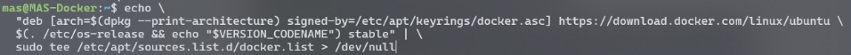
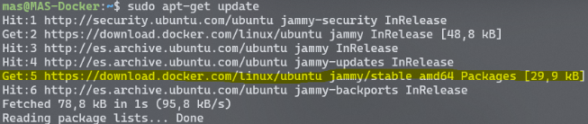
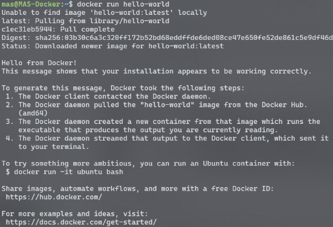

Primerament de tot, abans d'instal·lar Docker Compose haurem d'afegir el repositori de Docker:

## Preparació

1. Actualitzem els repositoris
```bash
sudo apt-get update
```

2. Instal·larem els repositoris ca-certificates  i curl
```bash
sudo apt-get install ca-certificates curl
```

ca_certidicates: Conté els certificats d'Autoritat de Certificació (CA) utilitzats comunament per validar l'autenticitat dels llocs web i altres serveis de xarxa.

curl: És una eina de línia d'ordres utilitzada per transferir dades des de o cap a un servidor utilitzant diversos protocols, és àmpliament utilitzada per realitzar sol·licituds web, descarregar arxius i interactuar amb API des de la terminal.

3. Creem el directori /etc/apt/keyrings amb els permisos 0755
```bash
sudo install -m 0755 -d /etc/apt/keyrings
```

4. Descarreguem  la clau GPG de Docker i la guardem en l'arxiu docker.asc en el directori anteriorment
```bash
sudo curl -fsSL /https://download.docker.com/linux/ubuntu/gpg -o /etc/apt/keyrings/docker.asc
```

5. Posem permisos al fitxer creat anteriorment
```bash
sudo chmod a+r /etc/apt/keyrings/docker.asc
```

6. Afegim el repositori

 <br><br>

7. Per últim, actualitzem un altra vegada els repositoris i podem comprovar que està el repositori de Docker

 <br><br>

## Instal·lació

8. Instal·lem els paquets de Docker
```bash
sudo apt-get install docker-ce docker-ce-cli containerd.io docker-buildx-plugin docker-compose-plugin
```

9. Per verificar podem fer docker run amb l’imatge hello-world

 <br><br>

## Configuració

10. Creació del fitxer .yml
```bash
sudo nano docker-compose.yaml
```

11. Dins executarem la informació necessària per configurar el nostre contenidor
```yaml
services:
  db:
    image: mysql:8
    volumes:
      - mysqlVol:/var/lib/mysql
    restart: always
    environment:
      MYSQL_ROOT_PASSWORD: mas
      MYSQL_DATABASE: WordPressDB
      MYSQL_USER: admin
      MYSQL_PASSWORD: mas
    ports:
      - "3336:3306"
  wordpress:
    depends_on:
      - db
    build:
      context: .
      dockerfile: Dockerfile-php
    image: wordpress:latest
    volumes:
      - wordpressVol:/var/www/html
    restart: always
    ports:
      - "8000:80"
    environment:
      WORDPRESS_DB_HOST: db:3306
      WORDPRESS_DB_USER: admin
      WORDPRESS_DB_PASSWORD: mas
      WORDPRESS_DB_NAME: WordPressDB
      UPLOAD_LIMIT: 64M
  phpmyadmin:
    image: phpmyadmin/phpmyadmin:latest
    restart: always
    environment:
      PMA_HOST: db
      PMA_USER: admin
      PMA_PASSWORD: mas
    ports:
      - "8080:80"

volumes:
  wordpressVol: {}
  mysqlVol: {}

```

11. Utilitzarem les comandes docker compose build i docker compose up per crear el grup de contenidors i aixecar-los.
```bash
sudo nano docker-compose build
```

```bash
sudo nano docker-compose up
```
