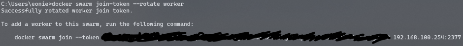

Utilitzem l'eina autolock de Docker Swarm, autolock és una eina de seguretat que permet bloquejar autoamticament la clau de desencriptació de l'estat del node Mànager, això vol dir que si es reinicia el node Mànager necessitaràs donar una contrasenya per desencriptar l'estat i permetre que el node torni a unir-se al clúster com a Mànager.

1. Activem la comanda autolock
```bash
docker swarm update --autolock=true
```

Aquesta comanda ens donara una KEY semblant a aquesta --> SWMKEY-1-IRTf5ts/ufvADGNsQUbfNwl9nRybsGB/MDT569lFmCc

2. Per a afegir més seguretat crearem un contexte al daemon de Docker i configurar l'accés de forma més segura
```bash
docker context create --docker host=ssh://mas@10.93.254.105 --description="Node Manager MAS" mas-manager mas-manager
```

3. Canviem el context
```bash
docker context use mas-manager
```

4.Canviem la KEY perquè un Worker s'uneixi al Mànager, com a mesura de seguretat això es farà cada vegada que s'uneixi un nou Worker

 <br><br>

5. Canviem el temps per a renovar els certificats cada dos mesos
```bash
docker swarm update --cert-expiry 1461h
```
Hauria de sortit un missatge com el següent:
```bash
CA Configuration:
  Expiry Duration: 2 months
```
