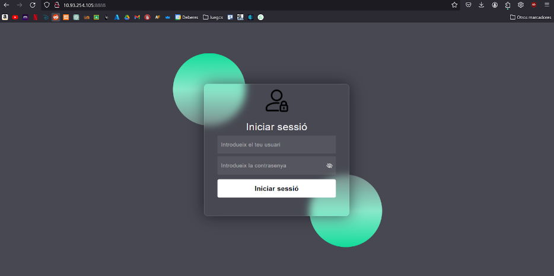

## Que tenim?
Tenim dues màquines amb les següents característiques:

- MÀNAGER: Un servidor Ubuntu amb dues interfícies de xarxa, una en mode pont i l'altra en mode NAT.

- WORKER1: Un servidor Ubuntu amb una interfície de xarxa en mode NAT.

## Inicialització
Per què no cal la instal·lació de Docker Swarm?

Com diu la guia de Docker, al seguir els passos de la instal·lació de Docker, directament ja inclou Docker Swarm.

1. Inicialització del Manager

 <br><br>

2. Generem el token d'unió i la passem  al .txt
```bash
docker swarm join-token worker > joinSwarm.txt
```

Aquesta comanda permet generar un token que permet a altres nodes unir-se al clúster com a treballadors

3. Enviem l'arxiu "joinSwarm.txt" al Worker per scp
```bash
scp joinSwarm.txt <nom_uusari>@<ip>:<ruta>
```

4. Executem l'arxiu en el Worker
```bash
bash joinSwarm.txt
```

Hauria de sortir un missatge com el següent: This node joined a swarm as a worker.

5. Llista dels nodes que tenim amb la comanda docker node ls

 <br><br>

## Desplegament i escalat senzill d’un servei simple amb Swarm.

1. Crearem un directori on aniran tots els arxius de la pàgina
```bash
mkdir html
```

2. Arxius necessaris per a la nostra web, agafarem els arxius creats al projecte e Webs 1

 <br><br>

3. Canviem el nom al login.php a index.php
```bash
mv html/login.php html/index.php
```

4. Dockerfile per utilitzar els arxius

 <br><br>


A partir de la imatge de PHP amb Apache, creem un altra imatge que utilitzi els fitxers mencionats anteriorment.

5. Compilem el DockerFile
```bash
docker build -t imatge_web .
```

imatge_web: Nom de la imatge.

El punt és perquè estem en el mateix directori i buscarà un arxiu anomenat Dockerfile.

6. Procés de pujada de la imatge en Docker Hub perquè el Worker pugui accedir a la imatge

Fem login:
```bash
docker login
```

Etiquetem la imatge:
```bash
docker tag <nom_de_la_imatge>:latest <usuari>/<nom_de_la_imatge>:latest
```

La pujem a Docker Hub:
```bash
docker push <nom_usuari>/<nom_de_la_imatge>:latest
```

7. Creem el servei
```bash
docker service create --name WEB -p 8888:80 <non_usuari>/<nom_de_la_imatge>:latest
```

8. Si utilitzem la comanda "docker ps" podem veure que es crea un contendior en el worker

 <br><br>

9. Escalem el servei per demostrar que els contenidors es comparteixen entre els diferents nodes
```bash
docker service scale WEB=2
```

Ara també esta en el Mànager

 <br><br>

10. Finalment tenim el contenidor en funcionament

 <br><br>
