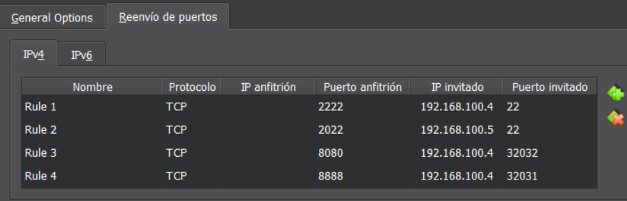
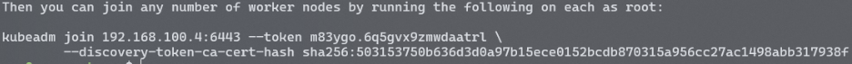
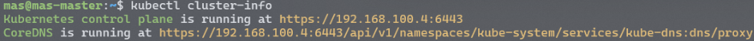
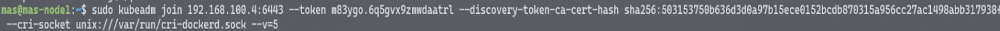
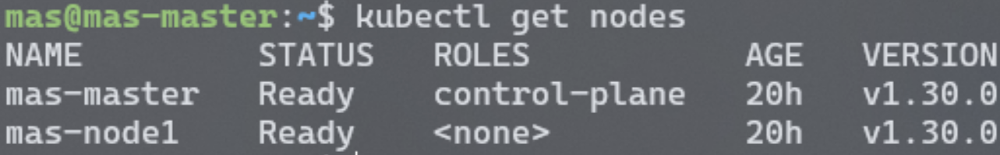

El projecte consisteix en la configuració de dos servidors Ubuntu Server 22.04 LTS a una xarxa NAT. Aquests servidors, anomenats "mas-master" i "mas-node1", 
s'han desplegat amb l'objectiu d'executar serveis com WordPress i phpMyAdmin en un entorn controlat.

Per facilitar l'accés a aquestes màquines des de l'exterior de la xarxa NAT, s'han establert normes de reenviament de ports. Aquestes regles permeten la connexió remota 
via SSH a cada servidor, així com l'accés als serveis específics, com ara el lloc web de WordPress i la interfície d'administració de phpMyAdmin.

1. Regles per la redirecció de les IPs de les dues màquines

 <br><br>

2. Instal·lació de Kubernetes
```bash
curl -fsSL https://pkgs.k8s.io/core:/stable:/v1.30/Relese.key | sudo gpg --dearmor -o /etc/apt/keyrings/kubernetes-apt-keyring.gpg
```

Afegim els permisos
```bash
sudo chmod 644 /etc/apt/keyrings/kubernetes-apt-keyring.gpg
```

Instal·lem repositoris necessaris
```bash
echo 'deb [signed-by=/etc/apt/keyrings/kubernetes-apt-keyring.gpg] https://pkgs.k8s.io/core:/stable:/v1.30/deb/ /' | sudo tee /etc/apt/sources.list.d/kubernetes.list
```

Afegim els permisos
```bash
sudo chmod 644 /etc/apt/sources.list.d/kubernetes.list
```

Afegim els permisos
```bash
sudo apt-get install -y kubectl
```

3. Instal·lació de Docker Engine
```bash
wget https://github.com/Mirantis/cri-dockerd/releases/download/v0.3.13/cri-dockerd_0.3.13.3-0.ubuntu-jammy_amd64.deb && sudo dpkg -i cri-dockerd_0.3.13.3-0.ubuntu-jammy_amd64.deb
```
Docker engine es el responsable de la creació, execució i gestió dels contenidors que componen les aplicacions en un cluster de Kubernetes.

4. Instal·lació de kubeadm y kubelet
```bash
sudo apt-get install -y kubelet kubeadm
```
S'utilitzan kubeadm y kubelet per a la gestió d'operacions dins del kluster de Kubernetes

Kubeadm

- Inicialitzar un clúster mestre de Kubernetes.

- Unir nosaltres al clúster mestre.

- Gestionar la configuració de xarxa i emmagatzematge persistent.

- Actualitzar la versió de Kubernetes en un clúster existent.

- Realitzar tasques de manteniment i solució de problemes al clúster.

Kubelet

- Iniciar, aturar i mantenir els contenidors dins dels pods.

- Monitoritzar l'estat dels contenidors i reportar aquest estat a l'API Server de Kubernetes.

- Gestionar recursos com CPU, memòria i emmagatzematge per als contenidors.

### Creem el Cluster i unim els nodes

5. Descarreguem les imatges necessàries
```bash
sudo kubeadm config images pull --cri-socket unix:///var/run/cri-dockerd.sock
```

6. Iniciem el clúster
```bash
sudo kubeadm init --cri-socket unix:///var/run/cri-dockerd.sock
```

A l'iniciar el clúster tindrem un missatge informatiu com el següent:
 <br><br>

7. Comanda per veure la informació del clúster
```bash
kubectl cluster-info
```

 <br><br>

8. Unim el node al clúster utilitzant la comanda que ens ha donat en inicialitzar el clúster

 <br><br>

9. Per al seu correcte funcionament, afegim un complement de xarxa de pods
```bash
kubectl apply -f https://github.com/weaveworks/weave/releases/download/v2.8.1/weave-daemonset-k8s.yaml
```

10. Llistem els nodes

 <br><br>
