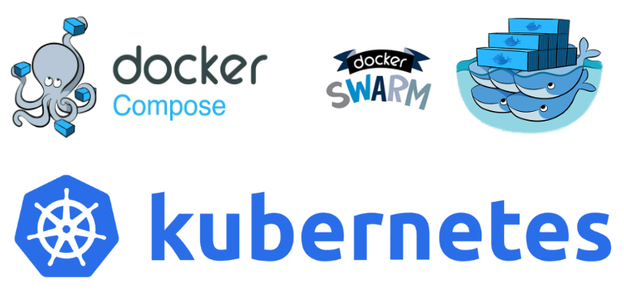
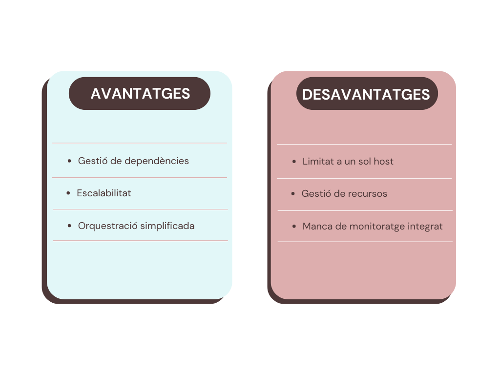
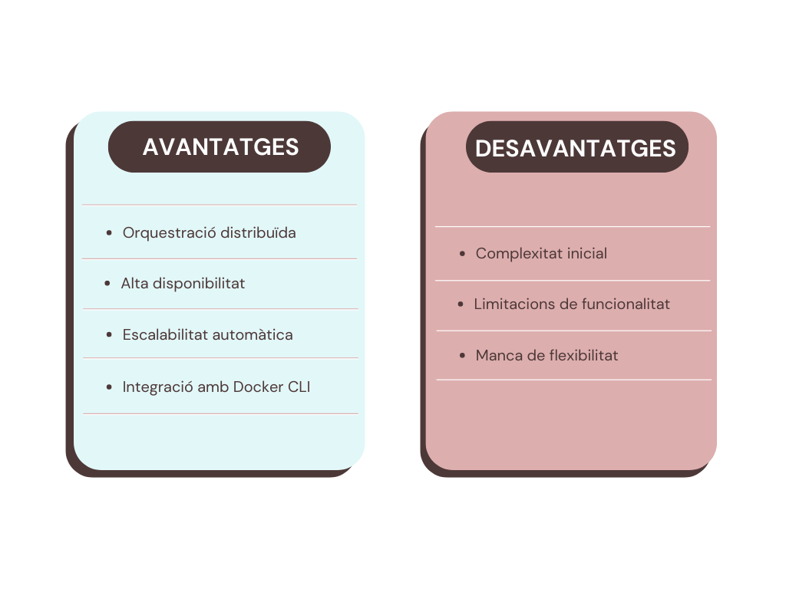

<br><br>

# Index

### Introducció
- [Descripció del projecte](#descripció-del-projecte)
- [Conceptes bàsics de Docker Compose](#conceptes-bàsics-de-docker-compose)
- [Avantatges i Desavantatges de Docker Compose](#avantatges-i-desavantatges-de-docker-compose)

### Desenvolupament del Projecte amb Docker Compose
- [Sintaxi](#sintaxi)
- [Comandes bàsiques](#comandes-bàsiques)
- [Procés d'Instal·lació i configuració](#procés-dinstallació-i-configuració)
- [Disseny i explicació d'un entorn multinivell](#disseny-i-explicació-dun-entorn-multinivell)

### Desenvolupament del Projecte amb Docker Swarm
- [Què és Docker Swarm?](#què-és-docker-swarm)
- [Avantatges i Desavantatges de Docker Swarm](#avantatges-i-desavantatges-de-docker-swarm)
- [Procés d'Instal·lació i configuració d'un clúster](#procés-dinstallació-i-configuració-dun-clúster)
- [Migració del projecte de multicontenidor de Docker Compose a Docker Swarm](#migració-del-projecte-de-multicontenidor-de-docker-compose-a-docker-swarm)
- [Millores al clúster i al desplegament](#millores-al-clúster-i-al-desplegament)

### Desenvolupament del Projecte amb Kubernetes
- [Què és Kubernetes?](#què-és-kubernetes)
- [Procés d'Instal·lació de Kubernetes](#procés-dinstallació-de-kubernetes)

### Conclusions
- [Resultats Obtinguts](#resultats-obtinguts)
- [Potencials Millores Futures](#potencials-millores-futures)
- [Conclusió final](#conclusió-final)

<br><br>

# INTRODUCCIÓ
## Descripció del projecte
En aquest apartat dins d'un Ubuntu server veurem els avantatges i inconvenients en gestió de múltiples contenidors, així com la seva instal·lació i configuració, seguit del disseny i explicació de l'entorn multinivell, i per finalitzar, una demostració de desplegament i funcionament d'un fitxer docker-compose.yaml per a un entorn multinivell

## Conceptes bàsics de Docker Compose
Docker Compose és una eina que facilita la gestió d'aplicacions que funcionen en múltiples contenidors de Docker. Amb Docker Compose, pots definir la configuració de tots els contenidors d'una aplicació en un fitxer YAML. Aquest fitxer inclou informació sobre quins contenidors necessita l'aplicació, com s'han de configurar, com s'han de connectar i quins recursos han de compartir-se entre ells.

## Avantatges i Desavantatges de Docker Compose

<br /><br />

# DESENVOLUPAMENT DEL PROJECTE AMB DOCKER COMPOSE
## Sintaxi
Per a utilitzar Docker Compose haurem de realitzar 3 coses:
1. Definir l’entorn en un Dockerfile
2. Crear l’arxiu .yml amb la configuració de l’entorn de l'aplicació.
3. Executar Docker Compose per iniciar un entorn o un servei.

## Comandes bàsiques
1. docker compose build  s’utilitza per a generar la imatge basada en les especificacions de l’arxiu .yml
2. docker compose up (amb el build fet) en cas de no existir la imatge, la descarrega, crea el contenidor i l’aixeca
3. docker compose start <nom> inicia el contenidor
4. docker compose stop<nom> atura el contenidor
5. docker compose down s’utilitza per eliminar els contenidors, xarxes i volums associats al projecte
6. docker  compose ps llista els contenidors
7. docker compose -f <arxius.yaml> logs veure els logs
8. docker compose.yaml arxiu on estaran les instruccions i configuracions pels serveis.

### Estructura bàsica dins d'un arxiu .yaml
```yaml
version: '3.8'
services:
  nombre_del_servicio:
    variable_de_configuracion:
      valores
    variable_de_configuracion:
      valores
  nombre_de_otro_servicio:
    variable_de_configuracion:
      valores
```
## Procés d'Instal·lació i configuració

En aquesta secció es descriurà detalladament el procés d'instal·lació i configuració de l'eina Docker Compose. S'explicaran pas a pas les instruccions necessàries per a una correcta implementació i configuració, assegurant que els usuaris puguin aprofitar al màxim les funcionalitats que ofereix Docker Compose.

**[Prem aquí per viatjar a l'instal·lació de Docker Compose](./Instal·lació/Docker_Desktop.md)**

## Disseny i explicació d'un entorn multinivell

El nostre entorn de contenidors estarà organitzat en diferents nivells per desplegar un lloc web de WordPress. Aquest lloc permetrà als usuaris crear i gestionar contingut, mentre també proporcionarem eines per administrar la base de dades associada.

1. Front-end (Contenidor de WordPress)
El front-end estarà representat pel contenidor de WordPress, que proporcionarà la interfície web perquè els usuaris accedeixin i administrin el seu contingut.

- Funcionalitats:
  Els usuaris podran interactuar directament amb el front-end per crear, editar i visualitzar publicacions, pàgines i altres continguts del lloc.

2. Back-end (Contenidors de MySQL i phpMyAdmin). El back-end estarà compost per dos contenidors:

- MySQL: Aquest contenidor allotjarà la base de dades de WordPress, on s'emmagatzemaran totes les dades del lloc, com ara publicacions, configuracions i usuaris.

- phpMyAdmin: Aquest contenidor proporcionarà una interfície gràfica d'usuari per administrar la base de dades MySQL de manera intuïtiva. El contenidor de MySQL serà responsable d'emmagatzemar de forma segura totes les dades del lloc web de WordPress.

Beneficis de la Separació de Nivells

Mitjançant la separació d'aquests nivells, podem mantenir una arquitectura clara i modular per al nostre entorn de contenidors:

### Demostració i funcionament de l'entorn multinivell amb el nostre projecte de WordPress

**[Prem aquí per viatjar a l'inicialització de Wordpress amb Docker Compose](./Instal·lació/Docker_Compose-Wordpress.md)**

# DESENVOLUPAMENT DEL PROJECTE AMB DOCKER SWARM
## Què és Docker Swarm?
Docker Swarm és una eina que facilita la gestió d'aplicacions distribuïdes a través de múltiples amfitrions de Docker. Amb Docker Swarm, pots definir i gestionar clústers de contenidors Docker, coordinant-los per a proporcionar serveis distribuïts.

## Avantatges i Desavantatges de Docker Swarm
<br /><br />

## Procés d'Instal·lació i configuració d'un clúster
Hem utilitzat l'eina Docker Swarm gestionada per una màquina Manager i un altre Worker per poder connectar-les i desplegar un Docker amb els arxius del projecte de Webs 1.

**[Prem aquí per viatjar a l'inicialització de Docker Swarm](./Instal·lació/Docker_Swarm.md)**

## Migració del projecte de multicontenidor de Docker Compose a Docker Swarm

Utilització de HAProxy per fer la migració a Docker Swarm.

Qué ès el HAProxy?

HAProxy és un software de codi obert que actua com a proxy invers i balancejador de càrrega per aplicacions webs i altres serveis. S'utilitza per implementar el rendiment, la disponibilitat i l'escalabilitat de la nostra pàgina web i els serveis en xarxa.

**[Prem aquí per viatjar a la migració del multicontenidor](./Instal·lació/Docker_Compose_Swarm.md)**

## Millores al clúster i al desplegament
En aquesta guia, hem abordat diverses mesures per millorar la seguretat i la gestió d'un clúster de Docker Swarm. Els passos que hem seguit són els següents:

- Activació de l'Autolock: Hem activat la funció d'autolock en Docker Swarm per protegir la clau de desencriptació de l'estat del node Manager. Això assegura que, després d'un reinici, només els administradors autoritzats puguin desbloquejar i accedir al clúster.

- Creació i Configuració de Contextos de Docker: Hem creat un context de Docker per gestionar de manera segura les connexions al daemon de Docker. Aquest context utilitza certificats TLS per assegurar la comunicació entre el client i el daemon.

- Renovació de Certificats TLS: Hem configurat el clúster per renovar automàticament els certificats TLS cada dos mesos, garantint que les comunicacions continuïn sent segures i actualitzades.

- Configuració de Claus Segures per als Workers: Hem actualitzat les claus d'unió per als nodes Worker, assegurant que només els nodes autoritzats puguin unir-se al clúster i contribuir a la càrrega de treball.

**[Prem aquí per viatjar a veure les millores](./Instal·lació/Docker_Millores.md)**

# DESENVOLUPAMENT DEL PROJECTE AMB KUBERNETES
## Què és Kubernetes?

Kubernetes és una plataforma de codi obert per a l'orquestració de contenidors que automatitza el desplegament, l'escalabilitat i la gestió d'aplicacions contenidoritzades.

### Funcionalitats Clau de Kubernetes
- Orquestració de Contenidors: Kubernetes coordina l'execució de contenidors en un clúster de màquines, assegurant que les aplicacions s'executin de manera fiable i eficient.

- Escalabilitat: Kubernetes permet escalar aplicacions de manera horitzontal (afegint més instàncies de contenidors) i vertical (assignant més recursos a cada contenidor) segons les necessitats de càrrega.

- Gestió Automàtica: Kubernetes gestiona el cicle de vida dels contenidors, assegurant que els contenidors que fallen siguin reemplaçats i que els recursos es distribueixin òptimament.

- Desplegaments i Actualitzacions: Kubernetes facilita els desplegaments continuats i les actualitzacions sense temps d'inactivitat mitjançant estratègies com rolling updates i deployments.

- Recuperació Automàtica: En cas de fallades, Kubernetes rellança automàticament els contenidors fallits, els reubica en altres nodes del clúster i assegura que l'aplicació es mantingui disponible.

## Procés d'Instal·lació de Kubernetes
En aquesta part veurem com instal·lar Kubernetes, la seva configuració, la creació de clústers i la unió dels nodes.

**[Prem aquí per viatjar a l'instal·lació de Kubernetes](./Instal·lació/Kubernetes.md)**

## Migració de Docker Compose a Kubernetes

**[Prem aquí per viatjar a la migració](./Instal·lació/Docker_Compose_Kubernetes.md)**

# CONCLUSIONS
## Resultats Obtinguts
Gràcies a Docker, hem pogut desplegar altres projectes com Webs 1 i Webs 2 WordPress en contenidors, facilitant així la seva distribució i implementació en màquines. A més, gràcies a Docker Compose, hem pogut migrar aquests projectes a altres eines com Docker Swarm i Kubernetes, que tenen el mateix objectiu final de simplificar i millorar la gestió de les aplicacions.

## Potencials Millores Futures
Tot i els èxits assolits, encara hi ha marge per a millores futures. Aquestes inclouen:

- Optimització del Rendiment: Investigant i implementant tècniques avançades de balanceig de càrrega i escalabilitat, es podria optimitzar encara més el rendiment dels nostres serveis.
- Monitorització i Alerta: Implementant solucions de monitorització més robustes com Prometheus i Grafana per Kubernetes, es podria obtenir una visibilitat més gran sobre l'estat i el rendiment dels contenidors, permetent una resposta més ràpida a possibles problemes.

## Conclusió final
Aquest projecte ha demostrat amb èxit la potència i la flexibilitat de les eines d'orquestració de contenidors com Docker Compose, Docker Swarm i Kubernetes. Hem après a desplegar aplicacions de manera eficient, gestionar clústers i migrar projectes entre diferents plataformes. Aquests coneixements ens permetran gestionar de manera més efectiva els recursos i oferir solucions tecnològiques més robustes i escalables en futurs projectes.
