### Introducció
- [Context del Projecte](#context-del-projecte)
- [Descripció del projecte](#descripció-del-projecte)
- [Objectius del Projecte](#objectius-del-projecte)
- [Avantatges i Desavantatges](#avantatges-i-desavantatges)
- [A què ho aplicarem?](#a-què-ho-aplicarem)
- [Linux Containers](#linux-containers)
- [Beneficis dels contenidors Linux](#beneficis-dels-contenidors-linux)
- [Com funciona Ansible?](#com-funciona-ansible)
- [Arquitectura d'Ansible](#arquitectura-dansible)


### Desenvolupament del Projecte
- [Instal·lació i configuració de Linux containers (LXC)](#installació-i-configuració-de-linux-containers-lxc)
- [Instal·lació d'ansible](#installació-dansible)
- [Hardening del sistema](#hardening-del-sistema)
- [Configuració bàsica d'ansible](#configuració-bàsica-dansible)
- [Escalar privilegis](#escalar-privilegis)
- [Filtratge per grups](#filtratge-per-grups)
- [Mode AdHoc](#mode-adhoc)
- [Introducció a playbooks](#introducció-a-playbooks)
- **[Projecte 1 --> Instal·lació i menteniment d'un servidor web Nginx](#projecte-bàsic----installació-i-menteniment-dun-servidor-web-nginx)**
    - [Fitxers de configuració que hem fet servir](#fitxers-de-configuració-que-hem-fet-servir)
    - [Execució del playbook i l'adhoc](#execució-del-playbook-i-ladhoc)
- **[Projecte gran --> Unió d'Ansible, Terraform, AWS i Kubernetes](#projecte-gran----unió-dansible-terraform-aws-i-kubernetes)**

### Conclusió
- [Conclusió](#conclusió-1)
- [Resultats Obtinguts](#resultats-obtinguts)

### Fitxa Tècnica
- [Fitxa Tècnica](#fitxa-tècnica-1)

<br><br>

# Introducció

## Context del projecte

En els darrers anys, la gestió i automatització d'infraestructures informàtiques ha esdevingut una necessitat fonamental per a moltes organitzacions. En aquest context, Ansible ha emergit com una de les eines més potents i flexibles per a la gestió de configuracions, desplegament d'aplicacions i automatització de tasques repetitives. Ansible té la capacitat d'administrar múltiples nodes, tant locals com remots i per provar la seva funcionalitat amb diverses màquines virtuals, hem optat per una solució eficient i segura.
Com que els nostres recursos són limitats, utilitzar VMware o VirtualBox per a la virtualització ens limitaria al nombre de màquines que podem aixecar. Per aquesta raó, hem triat utilitzar LXC i LXD.

## Descripció del projecte

Aquest projecte es centra en l'exploració i aplicació pràctica d'Ansible com a eina d'automatització. El treball inclou una visió general de les característiques clau d'Ansible, així com la descripció detallada de diversos casos d'ús pràctics. Aquests casos van complicant-se a mesura que avança el projecte fins que finalment deixem un enllaç al nostre projecte final. Per garantir la seguretat i eficiència en la gestió de les màquines, totes les màquines del projecte han estat configurades per permetre l'accés només mitjançant clau pública. Aquesta tècnica, coneguda com a hardening (enduriment), millora la seguretat del sistema en limitar les formes d'accés i reduir les vulnerabilitats. En aquest projecte, l'Ansible Tower és l'única màquina que ha distribuït la seva clau pública a tots els nodes gestionats, assegurant així un control centralitzat i segur.

## Objectius del projecte

Aquest treball té com a objectiu principal explorar les capacitats d'Ansible com a eina d'automatització. Els objectius específics inclouen:

- Aprendre a instal·lar i configurar Linux Containers (LXC) en Ubuntu Server.
- Proporcionar una visió general i comprensible d'Ansible, destacant les seves característiques i avantatges principals.
- Implementar diversos casos pràctics que demostrin la versatilitat i eficàcia d'Ansible en diferents contextos.
- Desenvolupar playbooks d'Ansible per a automatitzar la instal·lació i manteniment de serveis.
- Integrar Ansible amb altres eines com Terraform, AWS i Kubernetes en un projecte avançat.
    
## A què ho aplicarem?

En aquest projecte, aplicarem Ansible en l'administració i gestió de **contenidors Linux**. Els contenidors Linux són una tecnologia que permet executar aplicacions de manera aïllada, garantint que cada aplicació tingui el seu propi entorn, incloent-hi biblioteques i altres dependències. Això facilita la consistència entre entorns de desenvolupament, proves i producció.

### Linux Containers

Els contenidors Linux permeten a diverses aplicacions compartir el mateix sistema operatiu mentre s'executen de manera independent. A diferència de les màquines virtuals, que requereixen una hipervisor i un sistema operatiu complet per a cada instància, els contenidors són més lleugers i consumeixen menys recursos, ja que comparteixen el mateix nucli del sistema operatiu. Això ens permet treballar sobre varies instancies a l'hora sense consumir molts recursos.

### Beneficis dels contenidors Linux

- **Eficiència de recursos:** En ser més lleugers que les màquines virtuals, els contenidors permeten un ús més eficient dels recursos del sistema.
- **Portabilitat:** Els contenidors poden executar-se de manera consistent en diferents entorns, des de l'ordinador d'un desenvolupador fins a servidors de producció.
- **Aïllament:** Cada contenidor s'executa en el seu propi entorn aïllat, la qual cosa redueix els conflictes de dependències i millora la seguretat.

En aquest projecte, utilitzarem Ansible per automatitzar la creació, configuració i gestió de contenidors Linux, demostrant així la seva eficàcia en la gestió d'infraestructures modernes.

## Com funciona Ansible?

Ansible funciona mitjançant connexions SSH, eliminant la necessitat d'instal·lar qualsevol altre programari, excepte Python. 

Operarem amb dos tipus de màquines:

- El 'node de control', des d'on llançarem les tasques d'Ansible mitjançant Python. Aquest node central ens permet controlar els 'nodes gestionats'. 
- 'Nodes gestionats' que són les màquines que desitgem administrar de forma remota amb Ansible.

**Podem gestionar qualsevol màquina que estigui al núvol (AWS, Google Cloud….) sense problema.**

Esquema de la connexió que estableix Ansible.

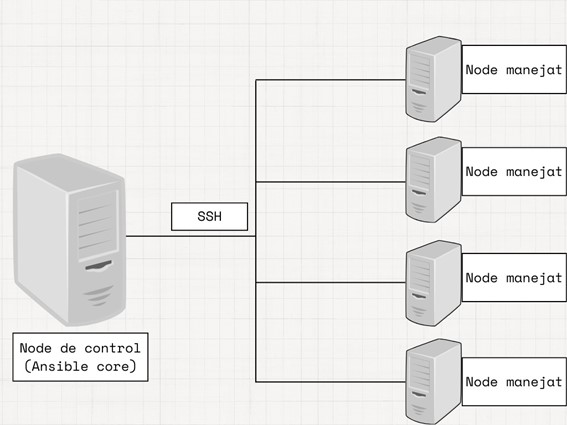

## Arquitectura d'Ansible

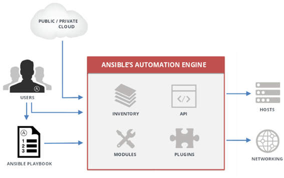

**Node de Control (Ansible Tower):** 

- Servidor o màquina des de la qual s'executen les ordres d'Ansible.

- Aquí és on s'escriuen els playbooks, s'emmagatzemen els inventaris i s'executen les ordres d'Ansible. 

- El node de control requereix una instal·lació d'Ansible i connexió SSH als nodes gestionats.

<br>

**Nodes Manejats:**
- Servidors o màquines que són gestionades per Ansible. 
- Ansible es connecta a aquests nodes mitjançant SSH per executar ordres i realitzar configuracions.

<br>

**Inventari (Inventory):**

- Fitxer o base de dades que conté una llista dels nodes gestionats per Ansible. 
- Pot ser un fitxer de text simple, o una font d'inventari més avançada com una base de dades o un servei al núvol.

**Mòduls (Mòduls):**

- Petits programes que Ansible executa als nodes gestionats per realitzar tasques específiques.
- Els mòduls poden estar escrits a Python o altres llenguatges i són la unitat bàsica d'automatització a Ansible.

**Playbooks:**

- Són fitxers YAML que defineixen una sèrie de tasques que Ansible ha de realitzar als nodes gestionats. 
- Utilitzen mòduls per executar ordres als nodes. 

**Plugins**

- Son millores de les funcionalitats base d'Ansible.
- Alertes per correu electronic serien un exemple.

# Desenvolupament del Projecte

## Instal·lació i configuració de Linux containers (LXC)

Enllaç on es documenta la instal·lació i configuració d'LXC.

[Instal·lació i configuració LXC](./instalacioLXC.md)

## Instal·lació d'ansible

Enllaç on es documenta l'instal·lació d'ansible

[Instal·lació d'ansible](./instalacioAnsible.md)

## Hardening del sistema

Configuració per permetre l'accés a les màquines només mitjançant clau pública i bloquejant totes les altres portes ssh. En aquest projecte, l'Ansible Tower és l'única màquina que ha distribuït la seva clau pública a tots els nodes gestionats, assegurant així un control centralitzat i segur. Per lo tant, solament l'ansible tower serà l'única màquina capaç d'accedir via ssh als nodes gestionats.

Enllaç on es documenta el procés de hardening realitzat al sistema. 

[Hardening del sistema](./hardening.md)

## Configuració bàsica d'ansible

Per defecte, ansible crea un directori a /etc/ansible que conté els seguents fitxers:


<br>

Al fitxer ansible.cfg indiquem on es mostre l'inventari


<br>

Al fitxer de hosts indiquem les ips amb els seus hostnames i al grup que pertany.

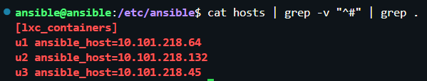

<br>

Comprovem que la sintaxi està ben feta, ens retorna un json on ens diu que ‘all’, te un fill que es diu ungrouped (perquè encara no hem creat el grup)i més abaix podem veure que ungrouped te els hosts de les nostres maquines manejades.

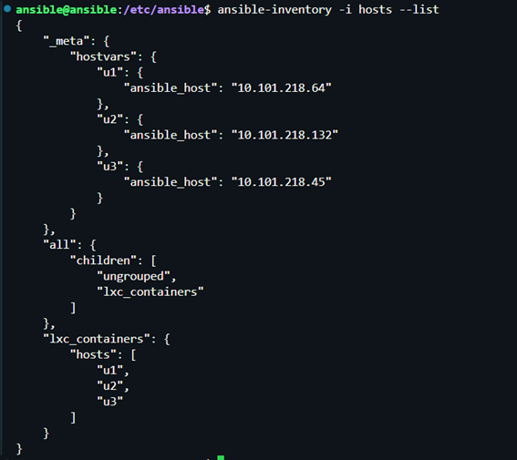

<br>

Fem ping per comprovar que podem comunicarnos des del ansible tower als nodes manejats via ansible.

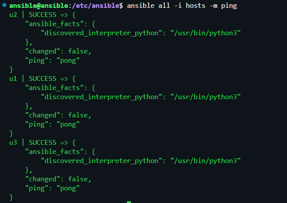

<br>

També podriem fer ping amb el grup que hem especificat.

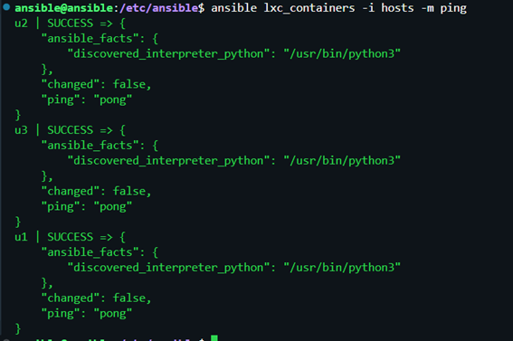

## Escalar privilegis

En aquest cas canviem l'arxiu de ansible.cfg per el seguent:

**'privilege_escalation'**

Aquest apartat configura la manera en què Ansible gestionarà l'escalat de privilegis.

```ini
[defaults]
inventory = ./hosts

[privilege_escalation]
become=True
become_method=sudo
become_user=root
become_ask_pass=True

```

- **become=True -->** Aquest paràmetre habilita l'ús de become, una característica d'Ansible que permet executar tasques amb privilegis elevats.
- **become_method=sudo -->** Especifica que sudo serà la metodologia utilitzada per a escalar privilegis. sudo permet a un usuari ordinari executar comandes amb privilegis de superusuari.
- **become_user=root -->** Indica que l'usuari a través del qual s'executaran les tasques amb privilegis elevats serà root. 
- **become_ask_pass=True -->** Aquest paràmetre fa que Ansible demani la contrasenya de sudo abans d'executar qualsevol tasca que requereixi privilegis elevats. 100% necesaria.

<br>

Ara si executem la comanda:     ```bash ansible lxc_containers -m ping``` ens demanarà la contrasenya de la màquina amb la que podrem escalar privilegis fins convertirnos en root.

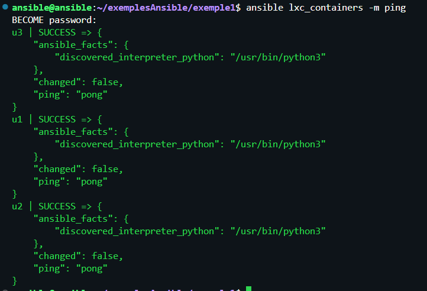

<br><br>

## Filtratge per grups

Creem inventory-groups i afegim lo seguent:

```ini
[all:children]
ubuntu
webservers

[ubuntu]
u1 ansible_host=10.101.218.64
u2 ansible_host=10.101.218.132
[webservers]
u3 ansible_host=10.101.218.45
```

Definim un grup de grups, és a dir, tots els grups que s'inclouen a sota d'aquest títol seran considerats fills del grup 'all'. En aquest cas, els grups 'ubuntu' i 'webservers' formen part del grup 'all'.

Dins de cada grup tenim diferents hosts marcat.

**ubuntu**
- u1 amb IP: 10.101.218.64
- u2 amb IP: 10.101.218.132

**webservers**
- u3 amb IP: 10.101.218.45

<br>

Resultats obtinguts amb filtratge per grup.

1. Filtratge de tots els grups

    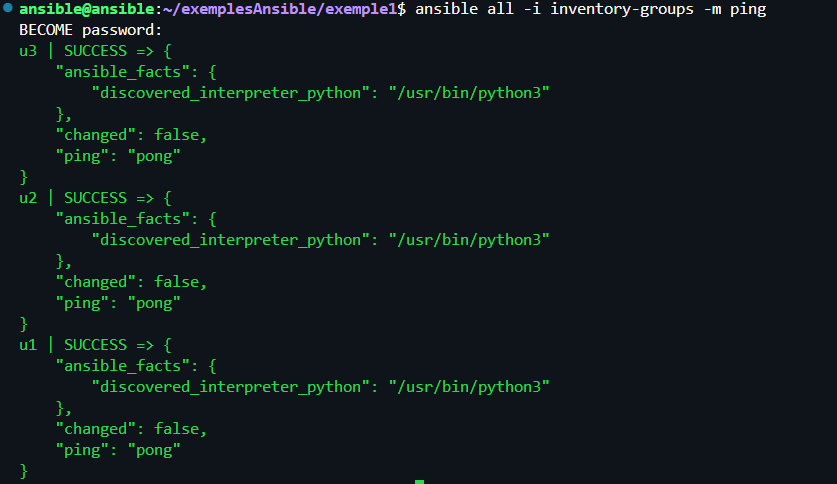

2. Filtratge del grup ubuntu.

    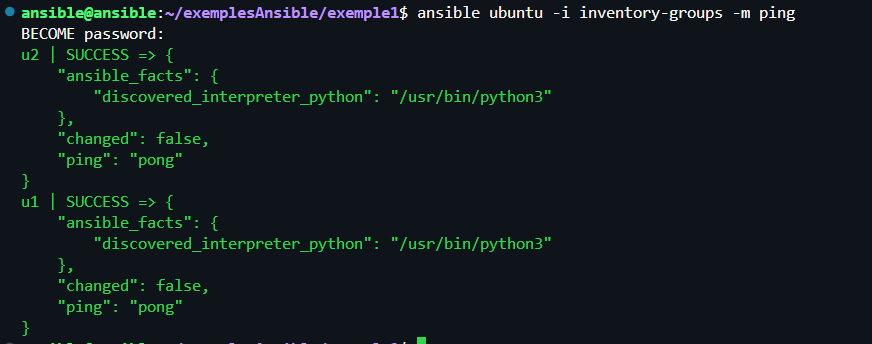

3. Filtratge del grup webservers.

    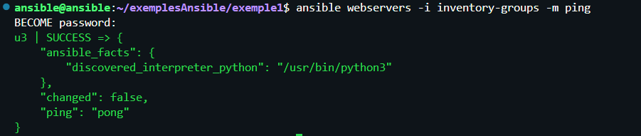

<br><br>

## Mode AdHoc

El mode AdHoc és una manera d'executar tasques. No és la de manera més potent d'executar tasques, la que més ens interesa és crear playbooks. 

Normalment solen fer ús d'algun mòdul per al seu funcionament. En totes les ordres haurem de trucar a l'executable d'ansible i seleccionar el grup que volem afectar.

Modifiquem el fitxer ansible.cfg i fem que llegeixi l'inventory-groups. Recordem que en el fitxer d'inventory-groups tenim 3 hosts i 2 estan al grup d'ubunutu.

```ini
[defaults]
inventory = ./inventory-groups
[privilege_escalation]
become=True
become_method=sudo
become_user=root
become_ask_pass=True
```

Fem la creació del fitxer AdHoc.sh que seran les tasques que volem executar, en aquest cas només executarà les tasques sobre les màquines del grup ubuntu. 

```bash
#!/bin/bash

# Mostrem el fitxer de configuració
cat ansible.cfg

# Mostrem el fitxer de inventory
cat inventory-groups

# Executem el mòdul ping 
ansible ubuntu -m ping

# Executem el mòdul copy sobre el grup ubuntu, li diem la ruta de destí i la ruta del fitxer que volem copiar
ansible ubuntu -m copy -a "dest=/tmp/hosts src=/etc/hosts"

# Executem el mòdul file sobre el grup ubuntu amb state=absent que significa eliminar i la ruta del fitxer que volem esborrar
ansible ubuntu -m file -a "state=absent path=/tmp/hosts"
```

Executem el fitxer AdHoc.sh i veurem que segueix l'script pas a pas. En totes les comandes a altres màquines ens demana autenticació.

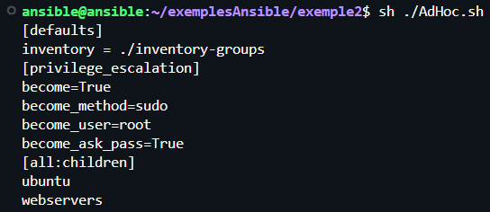


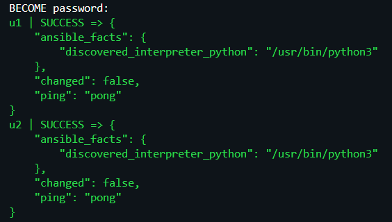

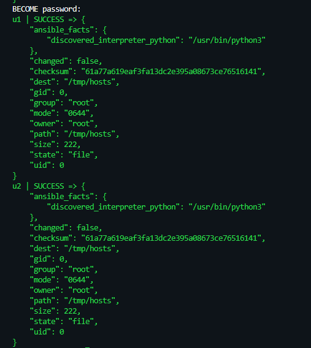

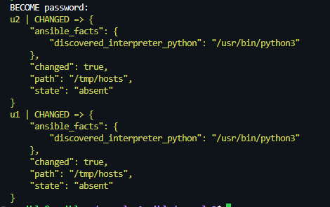

<br><br>

## Introducció a playbooks

Els playbooks són fixers escrits a YAML que ens permetran definir les tasques que volem executar.

[Característiques principals d'un fitxer yaml](./caracteristiquesYAML.md) com per exemple la sitaxi bàsica o fer comprovacions i execucions de diferents formes.

<br><br>

## Projecte bàsic --> Instal·lació i menteniment d'un servidor web Nginx

En aquest projecte farem l'instal·lació i manteniment d'un servidor **Nginx**.

Per la configuració del firewall farem servir UFW.

### Fitxers de configuració que hem fet servir

1. **[ansible.cfg](./ConfiguracioImantenimentNginx/ansible.cfg)**
    - El deixem exacte a l'última configuració.
2. **[inventory-groups](./ConfiguracioImantenimentNginx/inventory-groups)**
    - Afegim el grup: ``` [webservers-nginx] ```
    - Dintre del grup les màquines u2 i u3.
3. **[installacioNginx.yaml](./ConfiguracioImantenimentNginx/installacioNginx.yaml)**
    - En aquest fitxer que està configurat de manera molt llegible, es detalla el playbook que executarem per fer primer l'instal·lació de nginx i després habilitar el servei.
4. **[AdHoc_NginxStatus.sh](./ConfiguracioImantenimentNginx/AdHoc_NginxStatus.sh)**
    - En aquest fitxer executem un simple 'systemctl status nginx' per comprovar que el servei està actiu a les màquines que hem definit al inventory-groups.

<br>

### Execució del playbook i l'adhoc

**Execució del playbook 'installacioNginx.yaml'**

Aquest fitxer farà l'instal·lació d'nginx a les màquines definides a 'inventory-groups' que son u2 i u3 que pertanyen al grup 'webservers-nginx'.

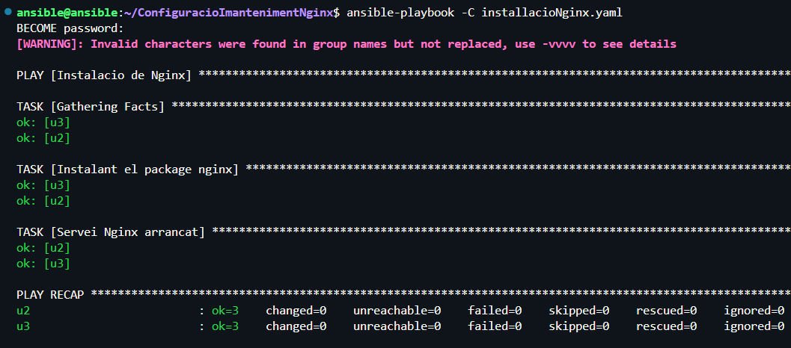

<br>

**Execució del AdHoc 'AdHoc_NginxStatus.sh'**

Aquest fitxer executarà la comanda:

 ```bash 
 ansible webservers-nginx -m shell -a "systemctl status nginx" -b 
 ```

Comprovarà que la instal·lació i l'activació del servei nginx s'ha fet correctament amb un status d'nginx.

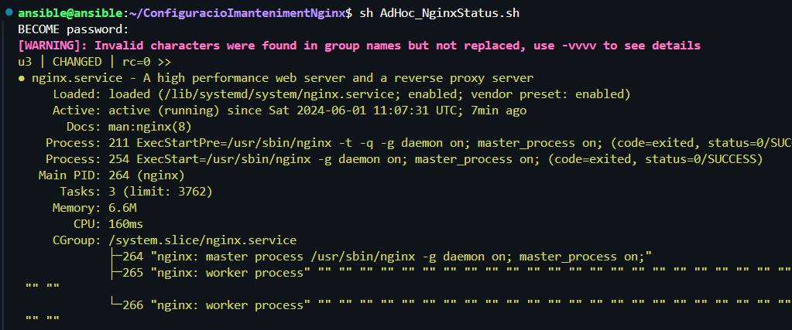

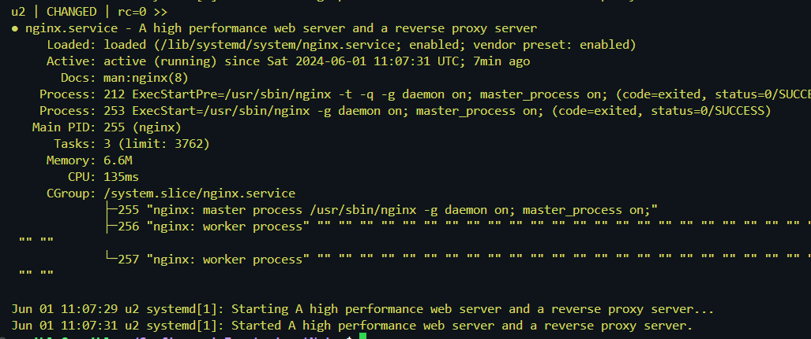

<br><br>

## Projecte gran --> Unió d'Ansible, Terraform, AWS i Kubernetes

Enllaç del projecte: [Unió d'Ansible, Terraform, AWS i Kubernetes](../0--AWS-TERRAFORM-ANSIBLE-KUBERNETES/README.md)

<br><br>

# Conclusió

Durant aquest projecte, hem explorat l'ús d'Ansible per a la gestió de configuracions i desplegaments en un entorn de Linux Containers (LXC) sobre Ubuntu Server 22.04 LTS. Els objectius principals han estat aprendre a instal·lar i configurar LXC, desplegar i mantenir serveis utilitzant Ansible, i integrar diverses tecnologies en un entorn avançat.

## Resultats Obtinguts

- Hem aconseguit desplegar un servidor web Nginx en diversos contenidors Linux de manera eficient i automatitzada.
- Hem après a utilitzar Ansible per a tasques de gestió de configuracions, escalant privilegis, executant comandes AdHoc i playbooks.
- Hem integrat Ansible amb altres tecnologies, demostrant la seva capacitat per gestionar infraestructures complexes.

<br><br>

# Fitxa tècnica

| **Component**                   | **Detalls**                                                                                                            |
| ------------------------------- | ---------------------------------------------------------------------------------------------------------------------- |
| **Nom del Projecte**            | Automatització de la Gestió de Configuracions amb Ansible                                                                  |
| **Empresa**                     | MASOps                                                                                                                 |
| **Sistema Operatiu**                    | Ubuntu Server 22.04 LTS                                                                                                |
| **Contenidors**                     | Linux Containers (LXC)                                                                                                                |
| **Eina d'Automatització**               | Ansible                                                                                                              | 
