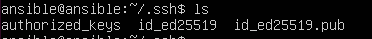
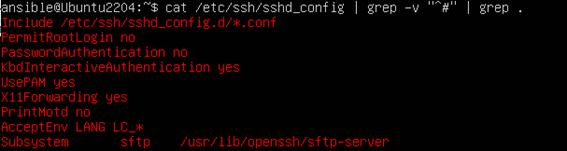

## HARDENING

Generem el conjunt de claus SSH utilitzant l'algoritme de codificació ed25519, el qual permet afegir una passphrase com a capa addicional de seguretat.


<br>

Mostrem el conjunt de claus creades.



<br>

La comanda eval "$(ssh-agent)" serveix per iniciar un nou procés de l'agent SSH i configurar l'entorn de la shell actual per a utilitzar-lo. L'agent SSH és un programa que manté les claus SSH a la memòria, facilitant l'autenticació amb servidors remots sense necessitat de reintroduir la passphrase cada vegada.

Carreguem les claus al agent ssh.

```bash
eval "$(ssh-agent -s)"
ssh-add /home/ansible/.ssh/id_ed25519
# introduim la passprhase per no estar autenticant-nos sempre i que la carregui automaticament l'agent ssh
```

Després de fer la configuració de lxc ([Enllaç d'instal·lació i configuració d'LXC](./instalacioLXC.md)) on hem creat la màquina Ubuntu2204, entrem dintre.

```bash
lxc exec Ubuntu2204 -- /bin/bash
```

Creem l'usuari ansible per tenir el mateix usuari que la ansible tower. A ansible es una bona praxis tenir els mateixos usuaris a totes les màquines.

```bash
adduser ansible

# Li donem permisos de sudo i actualitzem els paquets
usermod -aG sudo ansible
sudo apt update; sudo apt upgrade
```

Editem el fitxer de sshd_config en el node manejat. L'objectiu es poder passar la clau ssh per ssh amb autenticació per password. D’aquesta manera podrem pasarnos la clau pública del node de control  al node manejat.

Hauria de quedar aixì:


Reiniciem el sistema i fem un enable perquè aixì sempre que arrenquem el sistema estigui carregat per defecte.

```bash
sudo systemctl restart ssh; sudo systemctl enable ssh
```

<br>

Ara anirem al ansible tower i passarem la clau pública al node manejat. Com hem configurat el node manejat per aceptar peticions per password ens demanarà autenticarnos.


<br>

Anem al node manejat i comprovem que efectivament te la clau pública del node de control o ansible tower.


<br>

Ja hem arribat al punt desitjat. Ara tenim la clau pública de l'Ansible Tower al node gestionat. A continuació, al node gestionat, tancarem totes les portes via SSH, de manera que només es podrà establir un túnel SSH mitjançant la clau pública. Com que només el node de control disposarà d'aquesta clau, ningú més podrà accedir al node gestionat.



<br>

Ara ja no ens deixa autenticarnos per password, però comprovem que efectivament podem autenticarnos per clau pública.


<br>

Parem el contenidor i creem una imatge del contenidor que conté la clau publica del node de control, d'aquesta manera podrem replicarla tants cops com volguem i totes les màquines tindran el hardening aplicat.

```bash
# Parem màquina
lxc stop Ubuntu2204

# Creem una imatge de la nostra màquina Ubuntu2204
lxc publish Ubuntu2204 --alias=Ubuntu2204SSH description="Ubuntu 22.04LTS amb clau pública del ansible tower integrada i amb hardening per acceptar nomès autenticacions amb publickey"
```

Creem 3 màquines amb la imatge de la Ubuntu2204SSH.

```bash
lxc launch Ubuntu2204SSH u1
lxc launch Ubuntu2204SSH u2
lxc launch Ubuntu2204SSH u3
```

Comprovem que las tenim correctament.


Ara qualsevol de les màquines creades deixarà que ens autentiquem amb clau pública i ens demanarà la passphrase.


Tornem a carregar l'agent ssh.
Ara ja podrem entrar més comodament, ja que l’agent ja ens autentica automàticament.

```bash
eval "$(ssh-agent -s)"
ssh-add /home/ansible/.ssh/id_ed25519
# introduim la passprhase per no estar autenticant-nos sempre i que la carregui automaticament l'agent ssh
```

Hardening finalitzat