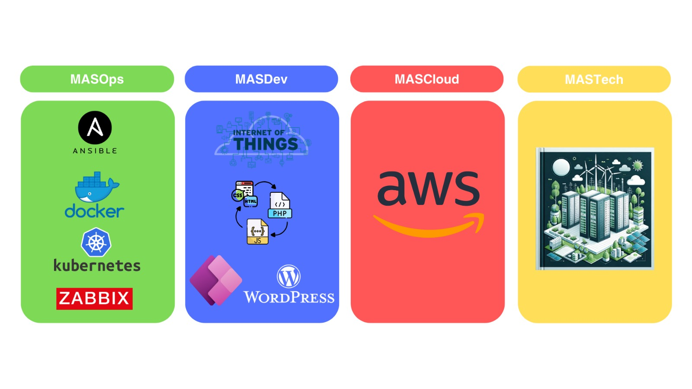

# PROJECTES MAS 2023-2024

## Que és MAS?

MAS és una empresa fictícia tecnològica creada per Mark Álvarez, Andreu Sánchez i Santiago Onieva com a part del nostre Treball de Fi de Grau (TFG). La nostra missió és proporcionar solucions tecnològiques avançades que ajudin a les empreses a optimitzar les seves operacions, desenvolupar aplicacions innovadores i adoptar tecnologies al núvol amb facilitat. Ens organitzem en diferents departaments especialitzats, cadascun amb un enfocament específic en projectes clau que impulsen el creixement i l'eficiència dels nostres clients.

## Departaments de MAS

 

 

### MASOps

El departament de MASOps se centra en l'automatització d'operacions, la gestió de contenidors i el monitoratge de sistemes. Els projectes principals inclouen:

- [**Ansible**](9--Ansible/README.md): Implementació de solucions d'automatització per a la gestió de configuracions i l'orquestració de tasques repetitives. Ansible ens permet simplificar tasques complexes i millorar l'eficiència operativa.
- [**Docker i Kubernetes**](8--Docker/README.md): Desenvolupament i manteniment de contenidors, i orquestració d'aquests amb Kubernetes per a garantir l'escalabilitat i la flexibilitat de les aplicacions. Aquests tecnologies ens permeten desplegar aplicacions de manera ràpida i consistent en diferents entorns.
- [**Zabbix**](5--Monitoritzacio-Zabbix/README.md): Implementació i gestió de sistemes de monitoratge per assegurar la disponibilitat i el rendiment òptim dels serveis. Amb Zabbix, podem detectar problemes abans que afectin els usuaris finals.

### MASDev

El departament de MASDev està dedicat al desenvolupament de programari innovador que atengui diferents necessitats del mercat. Els projectes principals inclouen:

- [**IoT (Internet de les Coses)**](7--IOT/README.md): Desenvolupament de solucions i dispositius connectats que permeten la recopilació i anàlisi de dades en temps real. Això facilita la creació de sistemes intel·ligents i eficients.
- [**Aplicació Web (WEBS 1)**](1--Webs1/README.md): Creació d'aplicacions web personalitzades i responsives que ofereixen una experiència d'usuari superior. Ens centrem en el disseny intuïtiu i la funcionalitat robusta.
- [**PowerApps (WEBS 2.1)**](3--Webs2-PowerApps/README.md): Desenvolupament d'aplicacions empresarials a mida mitjançant la plataforma PowerApps de Microsoft, que permet crear aplicacions de manera ràpida i eficient sense necessitat de coneixements avançats de programació.
- [**WordPress (WEBS 2.2)**](2--Webs2-WordPress/README.md): Desenvolupament i personalització de llocs web utilitzant WordPress per a empreses de totes les mides. Aquesta plataforma ens permet oferir solucions flexibles i escalables.

### MASCloud

El departament de MASCloud està especialitzat en solucions d'infraestructura al núvol, amb un enfocament particular en AWS (Amazon Web Services). Els projectes principals inclouen:

- [**AWS**](6--Cloud/README.md): Migració, gestió i optimització de serveis al núvol utilitzant la infraestructura robusta i flexible d'AWS. Això inclou serveis com EC2, S3, RDS i altres serveis gestionats per AWS. Ens assegurem que els nostres clients aprofitin al màxim les capacitats del núvol.

### MASTech
El departament de MASTech es centra en la infraestructura tecnològica física. Els projectes principals inclouen:

- [**CPD (Centre de Processament de Dades)**](4--CPD/README.md): Disseny, implementació i manteniment de centres de processament de dades que asseguren la disponibilitat, seguretat i eficiència dels recursos informàtics. Garantim que les dades i aplicacions dels nostres clients estan ben protegides i accessibles.

## Planificació del projecte

Adjuntem un PDF que detalla la planificacio del projecte

[Planificació](MAS_Project.pdf)

## Missió

La nostra missió és oferir solucions tecnològiques avançades que permetin a les empreses millorar la seva eficiència operativa, desenvolupar aplicacions innovadores i adoptar tecnologies al núvol de manera segura i efectiva.
